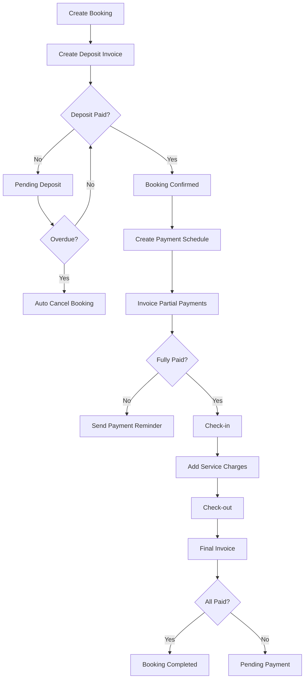
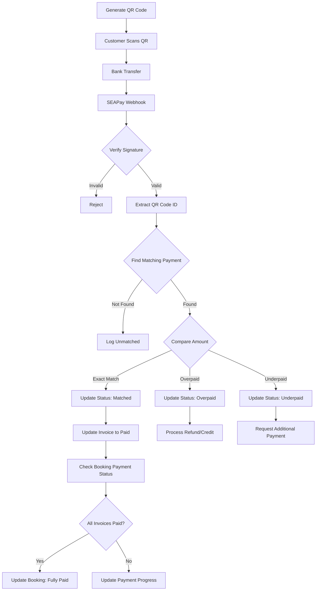

# BILLING MODULE - PAYMENT MANAGEMENT SYSTEM

## 1. OVERVIEW

### 1.1 Purpose
The Billing module manages the entire payment process for bookings, including:
- Initial deposit management
- Creating and managing partial payments
- Tracking booking payment status
- Processing final payments and booking completion
- Managing refunds

### 1.2 Operating Principles
- Every booking **MUST** have an initial deposit when created
- Multiple partial payment invoices can be created throughout the booking lifecycle
- Bookings only transition to `completed` status when 100% of the amount is paid
- Support for multiple payment methods

### 1.3 Payment Statuses
- `pending`: Not yet paid
- `partial`: Partially paid
- `paid`: Fully paid
- `overdue`: Payment overdue
- `refunded`: Refunded
- `cancelled`: Cancelled

---

## 2. DATA STRUCTURE

### 2.1 Database Schema

```sql
-- Main billing invoices table
CREATE TABLE billing_invoices (
    id UUID PRIMARY KEY DEFAULT gen_random_uuid(),
    invoice_number VARCHAR(50) UNIQUE NOT NULL,
    invoice_type VARCHAR(20) NOT NULL, 
    -- 'deposit', 'partial', 'final', 'additional'
    booking_id UUID REFERENCES bookings(id) NOT NULL,
    customer_id UUID REFERENCES customers(id),
    
    -- Amount information
    currency VARCHAR(3) DEFAULT 'VND',
    subtotal DECIMAL(12,2) NOT NULL,
    service_charge DECIMAL(12,2) DEFAULT 0,
    tax_rate DECIMAL(5,2) DEFAULT 10, -- VAT 10%
    tax_amount DECIMAL(12,2) DEFAULT 0,
    discount_amount DECIMAL(12,2) DEFAULT 0,
    discount_reason TEXT,
    total_amount DECIMAL(12,2) NOT NULL,
    
    -- Payment status
    paid_amount DECIMAL(12,2) DEFAULT 0,
    balance_due DECIMAL(12,2) GENERATED ALWAYS AS (total_amount - paid_amount) STORED,
    status VARCHAR(20) DEFAULT 'pending',
    
    -- Time information
    invoice_date DATE NOT NULL DEFAULT CURRENT_DATE,
    due_date DATE NOT NULL,
    paid_date TIMESTAMP,
    
    -- Metadata
    notes TEXT,
    internal_notes TEXT,
    payment_terms VARCHAR(200),
    created_by UUID REFERENCES users(id),
    created_at TIMESTAMP DEFAULT NOW(),
    updated_at TIMESTAMP DEFAULT NOW()
);

-- Invoice line items table
CREATE TABLE billing_invoice_items (
    id UUID PRIMARY KEY DEFAULT gen_random_uuid(),
    invoice_id UUID REFERENCES billing_invoices(id) ON DELETE CASCADE,
    item_type VARCHAR(20) NOT NULL,
    -- 'room', 'service', 'product', 'fee', 'custom'
    
    -- Item information
    reference_id UUID, -- Reference ID (room_id, product_id, etc.)
    description TEXT NOT NULL,
    quantity DECIMAL(10,2) NOT NULL DEFAULT 1,
    unit VARCHAR(50),
    unit_price DECIMAL(12,2) NOT NULL,
    
    -- Discounts and taxes
    discount_percent DECIMAL(5,2) DEFAULT 0,
    discount_amount DECIMAL(12,2) DEFAULT 0,
    tax_rate DECIMAL(5,2) DEFAULT 10,
    tax_amount DECIMAL(12,2) DEFAULT 0,
    
    -- Total amount
    total_amount DECIMAL(12,2) NOT NULL,
    
    -- Metadata
    service_date DATE,
    notes TEXT,
    sort_order INTEGER DEFAULT 0,
    created_at TIMESTAMP DEFAULT NOW()
);

-- Payment transactions table
CREATE TABLE billing_payments (
    id UUID PRIMARY KEY DEFAULT gen_random_uuid(),
    payment_code VARCHAR(50) UNIQUE NOT NULL,
    invoice_id UUID REFERENCES billing_invoices(id),
    booking_id UUID REFERENCES bookings(id) NOT NULL,
    
    -- Payment information
    amount DECIMAL(12,2) NOT NULL,
    currency VARCHAR(3) DEFAULT 'VND',
    payment_method VARCHAR(50) NOT NULL,
    -- 'cash', 'bank_transfer', 'credit_card', 'debit_card', 
    -- 'e_wallet', 'voucher', 'deposit_deduction'
    
    -- Payment method details
    payment_details JSONB,
    -- Example for credit_card:
    -- {
    --   "card_last_4": "1234",
    --   "card_type": "visa",
    --   "authorization_code": "AUTH123",
    --   "transaction_id": "TRX456"
    -- }
    -- Example for bank_transfer:
    -- {
    --   "bank_name": "Vietcombank",
    --   "account_number": "xxx789",
    --   "reference": "BK202401201234"
    -- }
    
    -- Transaction information
    reference_number VARCHAR(100),
    payment_date TIMESTAMP DEFAULT NOW(),
    payment_status VARCHAR(20) DEFAULT 'completed',
    -- 'pending', 'processing', 'completed', 'failed', 'refunded'
    
    -- Payment categorization
    payment_category VARCHAR(20) NOT NULL,
    -- 'deposit', 'partial', 'final', 'refund'
    is_deposit BOOLEAN DEFAULT false,
    is_refund BOOLEAN DEFAULT false,
    refund_reason TEXT,
    original_payment_id UUID REFERENCES billing_payments(id),
    
    -- Metadata
    received_by UUID REFERENCES users(id),
    notes TEXT,
    created_at TIMESTAMP DEFAULT NOW(),
    updated_at TIMESTAMP DEFAULT NOW()
);

-- Payment schedules table
CREATE TABLE billing_payment_schedules (
    id UUID PRIMARY KEY DEFAULT gen_random_uuid(),
    booking_id UUID REFERENCES bookings(id) NOT NULL,
    schedule_number INTEGER NOT NULL,
    
    -- Payment information
    description VARCHAR(200) NOT NULL,
    amount DECIMAL(12,2) NOT NULL,
    due_date DATE NOT NULL,
    
    -- Status
    status VARCHAR(20) DEFAULT 'scheduled',
    -- 'scheduled', 'invoiced', 'paid', 'overdue', 'cancelled'
    invoice_id UUID REFERENCES billing_invoices(id),
    paid_date TIMESTAMP,
    
    -- Reminders
    reminder_sent BOOLEAN DEFAULT false,
    reminder_sent_at TIMESTAMP,
    
    -- Metadata
    notes TEXT,
    created_by UUID REFERENCES users(id),
    created_at TIMESTAMP DEFAULT NOW(),
    updated_at TIMESTAMP DEFAULT NOW(),
    
    UNIQUE(booking_id, schedule_number)
);

-- Deposit rules configuration table
CREATE TABLE billing_deposit_rules (
    id UUID PRIMARY KEY DEFAULT gen_random_uuid(),
    name VARCHAR(100) NOT NULL,
    room_type_id UUID REFERENCES room_types(id),
    
    -- Deposit calculation rules
    calculation_type VARCHAR(20) NOT NULL,
    -- 'percentage', 'fixed_amount', 'nights_based'
    percentage_value DECIMAL(5,2), -- e.g., 30%
    fixed_amount DECIMAL(12,2),    -- e.g., 1,000,000 VND
    nights_count INTEGER,           -- e.g., first 2 nights
    
    -- Application conditions
    min_stay_nights INTEGER,
    max_stay_nights INTEGER,
    booking_window_days INTEGER, -- Apply for bookings made X days in advance
    
    -- Priority and status
    priority INTEGER DEFAULT 0,
    is_active BOOLEAN DEFAULT true,
    
    -- Validity period
    valid_from DATE,
    valid_to DATE,
    
    created_at TIMESTAMP DEFAULT NOW(),
    updated_at TIMESTAMP DEFAULT NOW()
);

-- Indexes for query optimization
CREATE INDEX idx_billing_invoices_booking ON billing_invoices(booking_id);
CREATE INDEX idx_billing_invoices_status ON billing_invoices(status);
CREATE INDEX idx_billing_invoices_due_date ON billing_invoices(due_date);
CREATE INDEX idx_billing_payments_booking ON billing_payments(booking_id);
CREATE INDEX idx_billing_payments_invoice ON billing_payments(invoice_id);
CREATE INDEX idx_billing_payment_schedules_booking ON billing_payment_schedules(booking_id);
CREATE INDEX idx_billing_payment_schedules_due ON billing_payment_schedules(due_date);
```

---

## 3. API ENDPOINTS

### 3.1 Invoice Management

#### `POST /api/billing/invoices/create-deposit`
**Description:** Create deposit invoice for new booking  
**Auto-triggered when:** Creating new booking
```json
{
  "booking_id": "uuid",
  "deposit_calculation": {
    "method": "percentage", // or "fixed", "nights_based"
    "value": 30, // 30% or fixed amount
    "override_amount": null // Allow manual override
  },
  "due_date": "2024-01-15",
  "payment_terms": "Payment required within 48 hours to secure reservation",
  "notes": "Deposit for Deluxe Room 101 booking"
}
```

**Business Logic:**
1. Verify booking doesn't already have deposit invoice
2. Calculate deposit amount based on rules:
   - Percentage: % of total booking amount
   - Fixed: Fixed amount
   - Nights_based: Amount for first X nights
3. Create invoice with type = 'deposit'
4. Create invoice_items for deposit
5. Update booking status = 'pending_deposit'
6. Send deposit payment notification email

#### `POST /api/billing/invoices/create-partial`
**Description:** Create partial payment invoice
```json
{
  "booking_id": "uuid",
  "invoice_type": "partial",
  "items": [
    {
      "description": "Second payment - 50% of remaining balance",
      "amount": 3000000,
      "item_type": "partial_payment"
    }
  ],
  "due_date": "2024-01-18",
  "notes": "Payment due 3 days before check-in"
}
```

**Business Logic:**
1. Verify total paid + new amount doesn't exceed booking total
2. Create new invoice with type = 'partial'
3. Create invoice_items
4. Update payment schedule if exists
5. Send notification to guest

#### `GET /api/billing/bookings/{booking_id}/payment-summary`
**Description:** Get booking payment overview
```json
{
  "booking": {
    "id": "uuid",
    "booking_code": "BK202401201234",
    "total_amount": 10000000,
    "status": "confirmed"
  },
  "payment_summary": {
    "total_booking_amount": 10000000,
    "total_invoiced": 7000000,
    "total_paid": 3000000,
    "total_pending": 4000000,
    "total_remaining": 3000000,
    "payment_progress_percentage": 30,
    "is_fully_paid": false
  },
  "invoices": [
    {
      "id": "uuid",
      "invoice_number": "INV-2024-0001",
      "invoice_type": "deposit",
      "total_amount": 3000000,
      "paid_amount": 3000000,
      "status": "paid",
      "due_date": "2024-01-15",
      "paid_date": "2024-01-14"
    },
    {
      "id": "uuid",
      "invoice_number": "INV-2024-0002",
      "invoice_type": "partial",
      "total_amount": 4000000,
      "paid_amount": 0,
      "status": "pending",
      "due_date": "2024-01-18"
    }
  ],
  "payments": [
    {
      "id": "uuid",
      "payment_code": "PAY-2024-0001",
      "amount": 3000000,
      "payment_method": "bank_transfer",
      "payment_category": "deposit",
      "payment_date": "2024-01-14",
      "status": "completed"
    }
  ],
  "payment_schedule": [
    {
      "schedule_number": 1,
      "description": "30% Deposit",
      "amount": 3000000,
      "due_date": "2024-01-15",
      "status": "paid"
    },
    {
      "schedule_number": 2,
      "description": "Second payment",
      "amount": 4000000,
      "due_date": "2024-01-18",
      "status": "invoiced"
    },
    {
      "schedule_number": 3,
      "description": "Final payment",
      "amount": 3000000,
      "due_date": "2024-01-25",
      "status": "scheduled"
    }
  ]
}
```

### 3.2 Payment Processing

#### `POST /api/billing/payments/process`
**Description:** Process payment for invoice
```json
{
  "invoice_id": "uuid",
  "booking_id": "uuid",
  "payments": [
    {
      "amount": 2000000,
      "payment_method": "cash"
    },
    {
      "amount": 1000000,
      "payment_method": "bank_transfer",
      "payment_details": {
        "bank_name": "Vietcombank",
        "reference": "TRX123456"
      }
    }
  ],
  "send_receipt": true
}
```

**Business Logic:**
1. Validate total payment doesn't exceed balance_due
2. Create payment records for each method
3. Update invoice paid_amount
4. If paid_amount = total_amount:
   - Update invoice status = 'paid'
   - Update invoice paid_date
5. Check entire booking:
   - If all invoices paid → booking status = 'fully_paid'
   - If booking fully_paid and checked out → booking status = 'completed'
6. Send receipt if requested

#### `POST /api/billing/payments/record-deposit`
**Description:** Record deposit payment
```json
{
  "booking_id": "uuid",
  "amount": 3000000,
  "payment_method": "bank_transfer",
  "reference_number": "VCB123456",
  "payment_details": {
    "bank_name": "Vietcombank",
    "account_holder": "John Doe",
    "transaction_date": "2024-01-14"
  },
  "notes": "30% deposit via bank transfer"
}
```

**Business Logic:**
1. Find booking's deposit invoice
2. Create payment with category = 'deposit'
3. Update invoice status and paid_amount
4. Update booking status = 'confirmed' if deposit sufficient
5. Send payment confirmation

### 3.3 Payment Schedules

#### `POST /api/billing/payment-schedules/create`
**Description:** Create payment schedule for booking
```json
{
  "booking_id": "uuid",
  "auto_generate": true,
  "schedule_config": {
    "deposit_percentage": 30,
    "installments": 2,
    "final_payment_on_checkout": true
  },
  "custom_schedule": [
    {
      "description": "Deposit",
      "percentage": 30,
      "days_from_booking": 2
    },
    {
      "description": "Second payment",
      "percentage": 40,
      "days_before_checkin": 5
    },
    {
      "description": "Final payment",
      "percentage": 30,
      "on_checkout": true
    }
  ]
}
```

#### `PUT /api/billing/payment-schedules/{id}/update`
**Description:** Update payment schedule
```json
{
  "amount": 3500000,
  "due_date": "2024-01-19",
  "notes": "Adjusted per customer request"
}
```

### 3.4 Refunds

#### `POST /api/billing/payments/{id}/refund`
**Description:** Process refund
```json
{
  "refund_amount": 1500000,
  "refund_reason": "Booking cancelled due to personal reasons",
  "refund_method": "original", // or specify different method
  "approval": {
    "approved_by": "Manager Name",
    "approval_code": "MGR456"
  }
}
```

**Business Logic:**
1. Validate refund_amount <= original payment
2. Check approval if amount > threshold
3. Create payment record with is_refund = true
4. Link to original_payment_id
5. Update invoice and booking status
6. Process refund via payment gateway if needed
7. Send refund confirmation

### 3.5 Reports and Analytics

#### `GET /api/billing/reports/revenue`
**Description:** Revenue report
```json
{
  "period": {
    "from": "2024-01-01",
    "to": "2024-01-31"
  },
  "summary": {
    "total_invoiced": 150000000,
    "total_collected": 120000000,
    "total_pending": 25000000,
    "total_overdue": 5000000,
    "collection_rate": 80
  },
  "by_payment_method": {
    "cash": 40000000,
    "bank_transfer": 60000000,
    "credit_card": 20000000
  },
  "by_invoice_type": {
    "deposit": 45000000,
    "partial": 35000000,
    "final": 40000000
  },
  "outstanding_bookings": [
    {
      "booking_code": "BK202401201234",
      "customer_name": "John Doe",
      "total_amount": 10000000,
      "paid_amount": 3000000,
      "balance_due": 7000000,
      "days_overdue": 3
    }
  ]
}
```

---

## 4. BUSINESS RULES & WORKFLOWS

### 4.1 Booking Payment Workflow



### 4.2 Deposit Calculation Rules

1. **Default:** 30% of total booking value
2. **Long-term stay (>7 nights):** First 2 nights
3. **Last minute (<48h):** 100% upfront payment
4. **Large groups (>5 rooms):** 50% deposit
5. **VIP customers:** Deposit may be reduced or waived

### 4.3 Partial Payment Rules

1. **Maximum payment installments:** 5 per booking
2. **Minimum interval:** 3 days between payments
3. **Final payment:** Must complete before checkout
4. **Overdue handling:**
   - 3 days: Send reminder
   - 7 days: Send warning
   - 10 days: Escalate to manager
   - 14 days: Consider cancellation

### 4.4 Refund Rules

1. **Cancel > 7 days before check-in:** 100% refund
2. **Cancel 3-7 days:** 50% refund
3. **Cancel < 3 days:** No refund (keep deposit)
4. **No-show:** Forfeit entire deposit
5. **Force majeure:** Case-by-case review

---

## 5. INTEGRATION POINTS

### 5.1 With Booking Module
- Trigger deposit invoice creation on booking creation
- Update booking status based on payment status
- Block check-in if deposit not paid
- Complete booking when fully paid

### 5.2 With Room Module
- Check room availability before confirming deposit
- Update room revenue statistics
- Track room-based charges

### 5.3 With Customer Module
- Link payments to customer profile
- Update customer payment history
- Calculate customer lifetime value
- Apply loyalty discounts

### 5.4 With POS Module
- Add POS charges to guest folio
- Process immediate payments
- Generate combined invoices

### 5.5 With External Systems
- Payment Gateway integration (Stripe, PayPal, VNPay)
- SEAPay integration for automatic bank transfer reconciliation
- Accounting software sync
- Email service for invoices/receipts
- SMS gateway for payment reminders

---

## 6. SEAPAY INTEGRATION FOR BANK TRANSFERS

### 6.1 Overview
SEAPay integration enables automatic bank transfer reconciliation by:
- Generating unique QR codes for each payment
- Automatically matching incoming transfers via webhook
- Real-time payment status updates

### 6.2 Database Schema Extension

```sql
-- QR Code payment tracking table
CREATE TABLE billing_qr_payments (
    id UUID PRIMARY KEY DEFAULT gen_random_uuid(),
    invoice_id UUID REFERENCES billing_invoices(id),
    booking_id UUID REFERENCES bookings(id),
    
    -- QR Code information
    qr_code_id VARCHAR(50) UNIQUE NOT NULL, -- Unique identifier in QR
    qr_code_url TEXT, -- Generated QR code image URL
    bank_account VARCHAR(50) NOT NULL,
    bank_name VARCHAR(100) NOT NULL,
    account_holder VARCHAR(200) NOT NULL,
    
    -- Payment expectations
    expected_amount DECIMAL(12,2) NOT NULL,
    currency VARCHAR(3) DEFAULT 'VND',
    
    -- Actual payment received
    received_amount DECIMAL(12,2),
    amount_difference DECIMAL(12,2) GENERATED ALWAYS AS (received_amount - expected_amount) STORED,
    
    -- Transaction details from SEAPay webhook
    bank_transaction_id VARCHAR(100),
    transaction_content TEXT, -- Full transfer description
    matched_code VARCHAR(50), -- Extracted matching code
    sender_account VARCHAR(50),
    sender_name VARCHAR(200),
    
    -- Status tracking
    status VARCHAR(20) DEFAULT 'pending',
    -- 'pending', 'matched', 'overpaid', 'underpaid', 'failed', 'expired'
    
    -- Timestamps
    qr_generated_at TIMESTAMP DEFAULT NOW(),
    payment_received_at TIMESTAMP,
    expires_at TIMESTAMP,
    
    -- Metadata
    webhook_payload JSONB, -- Store full webhook response
    notes TEXT,
    created_at TIMESTAMP DEFAULT NOW(),
    updated_at TIMESTAMP DEFAULT NOW()
);

-- SEAPay webhook logs for auditing
CREATE TABLE billing_seapay_webhooks (
    id UUID PRIMARY KEY DEFAULT gen_random_uuid(),
    webhook_id VARCHAR(100) UNIQUE,
    event_type VARCHAR(50),
    
    -- Transaction information
    transaction_id VARCHAR(100),
    account_number VARCHAR(50),
    amount DECIMAL(12,2),
    transaction_content TEXT,
    transaction_date TIMESTAMP,
    
    -- Processing status
    processed BOOLEAN DEFAULT false,
    matched_payment_id UUID REFERENCES billing_qr_payments(id),
    processing_notes TEXT,
    
    -- Raw data
    payload JSONB NOT NULL,
    headers JSONB,
    signature VARCHAR(500),
    is_valid_signature BOOLEAN,
    
    -- Timestamps
    received_at TIMESTAMP DEFAULT NOW(),
    processed_at TIMESTAMP
);

CREATE INDEX idx_qr_payments_code ON billing_qr_payments(qr_code_id);
CREATE INDEX idx_qr_payments_status ON billing_qr_payments(status);
CREATE INDEX idx_seapay_webhooks_transaction ON billing_seapay_webhooks(transaction_id);
CREATE INDEX idx_seapay_webhooks_processed ON billing_seapay_webhooks(processed);
```

### 6.3 API Endpoints for SEAPay Integration

#### `POST /api/billing/payments/generate-qr`
**Description:** Generate VietQR code for bank transfer payment
```json
{
  "invoice_id": "uuid",
  "booking_id": "uuid",
  "amount": 3000000,
  "expiry_minutes": 30 // Optional, default 30 minutes
}
```

**Response:**
```json
{
  "qr_payment_id": "uuid",
  "qr_code_url": "https://api.vietqr.io/image/...",
  "qr_code_data": "00020101021238530010A00000072701240006970436011412345678901234020812345678...",
  "payment_info": {
    "bank": "Vietcombank",
    "account_number": "1234567890",
    "account_holder": "HOMESTAY ABC",
    "amount": 3000000,
    "transfer_content": "BK202401201234-QR789456", // Booking code + unique QR ID
    "qr_code_id": "QR789456"
  },
  "expires_at": "2024-01-14T10:30:00Z"
}
```

**Business Logic:**
1. Generate unique QR code ID (e.g., QR789456)
2. Create transfer content: `{booking_code}-{qr_code_id}`
3. Call VietQR API to generate QR code
4. Store QR payment record with pending status
5. Set expiration time for QR code
6. Return QR code data to client

#### `POST /api/billing/webhooks/seapay`
**Description:** Webhook endpoint for SEAPay transaction notifications
**Headers Required:**
```
X-Webhook-Signature: {signature}
Content-Type: application/json
```

**Request Body (from SEAPay):**
```json
{
  "id": "webhook_123456",
  "event": "transaction.received",
  "data": {
    "transaction_id": "TRX20240114123456",
    "account_number": "1234567890",
    "amount": 3000000,
    "content": "CK tu NGUYEN VAN A - BK202401201234-QR789456 thanh toan phong",
    "sender_account": "9876543210",
    "sender_name": "NGUYEN VAN A",
    "transaction_date": "2024-01-14T09:15:30Z",
    "bank_code": "VCB"
  },
  "signature": "hmac_sha256_signature"
}
```

**Business Logic:**
```python
def process_seapay_webhook(webhook_data):
    # 1. Verify webhook signature
    if not verify_seapay_signature(webhook_data, signature):
        return {"error": "Invalid signature"}, 401
    
    # 2. Log webhook for auditing
    webhook_log = create_webhook_log(webhook_data)
    
    # 3. Extract QR code ID from transfer content
    transfer_content = webhook_data['data']['content']
    qr_code_id = extract_qr_code(transfer_content)
    # Use regex to find pattern: ".*([A-Z]{2}[0-9]{6}).*"
    
    # 4. Find matching QR payment
    qr_payment = find_qr_payment_by_code(qr_code_id)
    if not qr_payment:
        webhook_log.processing_notes = "No matching QR code found"
        return {"status": "no_match"}, 200
    
    # 5. Validate amount
    received_amount = webhook_data['data']['amount']
    expected_amount = qr_payment.expected_amount
    
    if received_amount == expected_amount:
        # Exact match - mark as successful
        qr_payment.status = 'matched'
        process_successful_payment(qr_payment, webhook_data)
        
    elif received_amount > expected_amount:
        # Overpayment
        qr_payment.status = 'overpaid'
        process_overpayment(qr_payment, webhook_data)
        
    elif received_amount < expected_amount:
        # Underpayment
        qr_payment.status = 'underpaid'
        process_underpayment(qr_payment, webhook_data)
    
    # 6. Update records
    qr_payment.received_amount = received_amount
    qr_payment.bank_transaction_id = webhook_data['data']['transaction_id']
    qr_payment.transaction_content = transfer_content
    qr_payment.matched_code = qr_code_id
    qr_payment.payment_received_at = now()
    qr_payment.webhook_payload = webhook_data
    
    # 7. Update invoice and booking
    update_invoice_payment_status(qr_payment)
    
    # 8. Send notifications
    notify_payment_received(qr_payment)
    
    return {"status": "processed"}, 200
```

#### `GET /api/billing/payments/qr-status/{qr_payment_id}`
**Description:** Check QR payment status
**Response:**
```json
{
  "qr_payment_id": "uuid",
  "status": "matched", // or "pending", "overpaid", "underpaid", "expired"
  "payment_details": {
    "expected_amount": 3000000,
    "received_amount": 3000000,
    "amount_difference": 0,
    "is_exact_match": true
  },
  "transaction": {
    "bank_transaction_id": "TRX20240114123456",
    "sender_name": "NGUYEN VAN A",
    "payment_received_at": "2024-01-14T09:15:30Z"
  },
  "invoice_status": "paid"
}
```

### 6.4 QR Code Generation Service

```python
import requests
import hashlib
import json
from datetime import datetime, timedelta

class VietQRService:
    def __init__(self, config):
        self.api_url = "https://api.vietqr.io/v2/generate"
        self.client_id = config.VIETQR_CLIENT_ID
        self.api_key = config.VIETQR_API_KEY
        
    def generate_qr_code(self, payment_info):
        """
        Generate VietQR code for bank transfer
        Reference: https://docs.sepay.vn/tao-qr-code-vietqr-dong.html
        """
        # Generate unique QR code ID
        qr_code_id = self.generate_qr_id()
        
        # Create transfer content with identifiable code
        transfer_content = f"{payment_info['booking_code']}-{qr_code_id}"
        
        # Prepare QR code data
        qr_data = {
            "accountNo": payment_info['account_number'],
            "accountName": payment_info['account_holder'],
            "acqId": payment_info['bank_code'],  # Bank code (e.g., "970436" for VCB)
            "amount": payment_info['amount'],
            "addInfo": transfer_content,
            "format": "text",
            "template": "print"
        }
        
        # Call VietQR API
        headers = {
            "x-client-id": self.client_id,
            "x-api-key": self.api_key,
            "Content-Type": "application/json"
        }
        
        response = requests.post(
            self.api_url,
            json=qr_data,
            headers=headers
        )
        
        if response.status_code == 200:
            result = response.json()
            return {
                "qr_code_id": qr_code_id,
                "qr_code_url": result['data']['qrDataURL'],
                "qr_code_data": result['data']['qrCode'],
                "transfer_content": transfer_content
            }
        else:
            raise Exception(f"Failed to generate QR code: {response.text}")
    
    def generate_qr_id(self):
        """Generate unique 8-character QR code ID"""
        timestamp = datetime.now().strftime("%Y%m%d%H%M%S")
        hash_obj = hashlib.md5(timestamp.encode())
        return f"QR{hash_obj.hexdigest()[:6].upper()}"
```

### 6.5 SEAPay Webhook Service

```python
import hmac
import hashlib
import re
from typing import Optional

class SEAPayWebhookService:
    def __init__(self, config):
        self.webhook_secret = config.SEAPAY_WEBHOOK_SECRET
        
    def verify_signature(self, payload: dict, signature: str) -> bool:
        """
        Verify SEAPay webhook signature
        Reference: https://docs.sepay.vn/tich-hop-webhooks.html
        """
        # Create signature from payload
        payload_str = json.dumps(payload, separators=(',', ':'))
        expected_signature = hmac.new(
            self.webhook_secret.encode(),
            payload_str.encode(),
            hashlib.sha256
        ).hexdigest()
        
        return hmac.compare_digest(expected_signature, signature)
    
    def extract_qr_code_from_content(self, content: str) -> Optional[str]:
        """
        Extract QR code ID from transfer content
        Handles various formats with extra characters
        """
        # Pattern to match QR code format: QR + 6 alphanumeric characters
        patterns = [
            r'QR[A-Z0-9]{6}',  # Standard format
            r'-([A-Z]{2}[0-9]{6})',  # With prefix separator
            r'([A-Z]{2}[0-9]{6})[\s\-]',  # With suffix separator
        ]
        
        for pattern in patterns:
            match = re.search(pattern, content.upper())
            if match:
                return match.group(1) if match.groups() else match.group(0)
        
        return None
    
    def process_payment_matching(self, webhook_data: dict):
        """Process and match incoming payment"""
        transaction_content = webhook_data['data']['content']
        amount = webhook_data['data']['amount']
        
        # Extract QR code from content
        qr_code = self.extract_qr_code_from_content(transaction_content)
        
        if not qr_code:
            # Try to match by booking code if QR code not found
            booking_code = self.extract_booking_code(transaction_content)
            if booking_code:
                return self.match_by_booking_code(booking_code, amount)
            return None
        
        # Find QR payment record
        qr_payment = QRPayment.find_by_code(qr_code)
        
        if not qr_payment:
            return None
            
        # Validate payment
        validation_result = {
            'qr_payment': qr_payment,
            'expected_amount': qr_payment.expected_amount,
            'received_amount': amount,
            'difference': amount - qr_payment.expected_amount,
            'status': self.determine_payment_status(
                amount, 
                qr_payment.expected_amount
            )
        }
        
        return validation_result
    
    def determine_payment_status(self, received: float, expected: float) -> str:
        """Determine payment status based on amounts"""
        if received == expected:
            return 'matched'
        elif received > expected:
            return 'overpaid'
        elif received < expected:
            return 'underpaid'
        else:
            return 'failed'
```

### 6.6 Configuration Requirements

```python
# Environment variables for SEAPay integration
SEAPAY_CONFIG = {
    # VietQR API credentials
    'VIETQR_CLIENT_ID': 'your_client_id',
    'VIETQR_API_KEY': 'your_api_key',
    
    # Bank account information
    'BANK_CODE': '970436',  # Vietcombank
    'BANK_ACCOUNT': '1234567890',
    'ACCOUNT_HOLDER': 'HOMESTAY ABC',
    
    # SEAPay webhook configuration
    'SEAPAY_WEBHOOK_SECRET': 'your_webhook_secret',
    'WEBHOOK_ENDPOINT': 'https://yourdomain.com/api/billing/webhooks/seapay',
    
    # QR code settings
    'QR_CODE_EXPIRY_MINUTES': 30,
    'MAX_QR_ATTEMPTS': 3,
    
    # Payment tolerance (for minor differences)
    'PAYMENT_TOLERANCE_AMOUNT': 1000,  # Accept ±1000 VND difference
}
```

---

## 7. NOTIFICATIONS & AUTOMATION

### 6.1 Email Templates

#### Deposit Invoice
```
Subject: [URGENT] Booking Confirmation - Deposit Payment #{invoice_number}

Dear {customer_name},

Thank you for booking with {property_name}.

Booking details:
- Booking code: {booking_code}
- Check-in: {check_in_date}
- Check-out: {check_out_date}
- Total amount: {total_amount}

Please make deposit payment:
- Amount: {deposit_amount}
- Due date: {due_date}

[Payment Instructions]

Your booking will be automatically cancelled if payment is not received by the due date.
```

### 6.2 Automated Reminders

1. **T-2 days:** Payment due soon reminder
2. **T-0:** Payment due today notification
3. **T+1:** Overdue warning
4. **T+3:** Escalation notice
5. **T+7:** Final warning

### 6.7 Payment Status Update Workflow



### 6.8 Error Handling for Bank Transfers

```python
class PaymentReconciliation:
    def handle_payment_discrepancy(self, qr_payment, received_amount):
        """Handle payment amount discrepancies"""
        expected = qr_payment.expected_amount
        difference = received_amount - expected
        
        if abs(difference) <= PAYMENT_TOLERANCE_AMOUNT:
            # Within tolerance - accept as matched
            qr_payment.status = 'matched'
            qr_payment.notes = f"Accepted with minor difference: {difference}"
            self.create_adjustment_record(qr_payment, difference)
            
        elif difference > 0:
            # Overpayment
            qr_payment.status = 'overpaid'
            self.handle_overpayment(qr_payment, difference)
            
        else:
            # Underpayment
            qr_payment.status = 'underpaid'
            self.handle_underpayment(qr_payment, abs(difference))
    
    def handle_overpayment(self, qr_payment, excess_amount):
        """Process overpayment scenarios"""
        options = []
        
        # Option 1: Apply as credit to booking
        if qr_payment.booking.has_pending_invoices():
            options.append({
                'action': 'apply_credit',
                'description': 'Apply to next invoice'
            })
        
        # Option 2: Process refund
        options.append({
            'action': 'refund',
            'description': 'Refund excess amount',
            'amount': excess_amount
        })
        
        # Notify finance team for decision
        self.notify_finance_team(qr_payment, options)
    
    def handle_underpayment(self, qr_payment, shortage_amount):
        """Process underpayment scenarios"""
        # Create additional invoice for shortage
        additional_invoice = self.create_shortage_invoice(
            qr_payment.booking_id,
            shortage_amount,
            f"Payment shortage for invoice {qr_payment.invoice_id}"
        )
        
        # Send notification to customer
        self.send_shortage_notification(
            qr_payment.booking,
            shortage_amount,
            additional_invoice
        )
        
        # Update original invoice as partially paid
        self.update_invoice_partial_payment(
            qr_payment.invoice_id,
            qr_payment.received_amount
        )
```

### 6.9 Integration Testing Checklist

1. **QR Code Generation**
   - [ ] Verify unique QR code ID generation
   - [ ] Test QR code expiration
   - [ ] Validate transfer content format

2. **Webhook Processing**
   - [ ] Test signature verification
   - [ ] Test QR code extraction from various content formats
   - [ ] Test amount matching logic

3. **Payment Reconciliation**
   - [ ] Test exact amount match
   - [ ] Test overpayment handling
   - [ ] Test underpayment handling
   - [ ] Test tolerance amount acceptance

4. **Status Updates**
   - [ ] Verify invoice status updates
   - [ ] Verify booking status updates
   - [ ] Test notification triggers

5. **Edge Cases**
   - [ ] Duplicate webhook handling
   - [ ] Expired QR code payments
   - [ ] Multiple partial payments for same invoice
   - [ ] Network timeout handling

---

## 7. REPORTING & ANALYTICS

### 7.1 Key Metrics

1. **Revenue Metrics**
   - Daily/Monthly/Yearly revenue
   - Average transaction value
   - Revenue per available room (RevPAR)

2. **Payment Metrics**
   - Collection rate
   - Average days to payment
   - Overdue percentage
   - Payment method distribution

3. **Operational Metrics**
   - Invoices generated per day
   - Refund rate
   - Partial payment frequency
   - Deposit conversion rate

### 7.2 Dashboard Components

```javascript
// Real-time metrics for billing dashboard
{
  "today_summary": {
    "total_collected": 25000000,
    "pending_payments": 5000000,
    "overdue_amount": 2000000,
    "invoices_generated": 15
  },
  "payment_trend": {
    "last_7_days": [...],
    "last_30_days": [...]
  },
  "top_pending": [
    {
      "booking": "BK202401201234",
      "amount": 5000000,
      "days_overdue": 2
    }
  ]
}
```

---

## 8. ERROR HANDLING & EDGE CASES

### 8.1 Common Scenarios

1. **Payment Gateway Timeout**
   - Implement retry mechanism
   - Store pending status
   - Manual reconciliation option

2. **Duplicate Payment**
   - Check existing payments before processing
   - Auto-refund duplicate amounts
   - Alert finance team

3. **Partial Payment Excess**
   - Prevent total payments > booking amount
   - Auto-calculate remaining balance
   - Suggest refund for overpayment

4. **Currency Conversion**
   - Store original currency and amount
   - Apply daily exchange rates
   - Display both currencies on invoice

### 8.2 Validation Rules

```python
# Payment validation
def validate_payment(booking, payment_amount):
    errors = []
    
    # Check doesn't exceed remaining balance
    if payment_amount > booking.balance_due:
        errors.append("Payment exceeds balance due")
    
    # Check booking status
    if booking.status == 'cancelled':
        errors.append("Cannot process payment for cancelled booking")
    
    # Check payment method
    if payment_method not in ALLOWED_METHODS:
        errors.append("Invalid payment method")
    
    return errors
```

---

## 9. PERFORMANCE OPTIMIZATION

### 9.1 Database Optimization
- Index on frequently queried columns
- Partition tables by date for historical data
- Archive old payment records
- Use materialized views for reports

### 9.2 Caching Strategy
- Cache exchange rates (TTL: 1 hour)
- Cache payment gateway configs
- Cache frequently accessed invoices
- Redis for payment session management

### 9.3 Async Processing
- Queue email notifications
- Background job for overdue checks
- Async payment gateway calls
- Batch processing for reports

---

## 10. SECURITY & COMPLIANCE

### 10.1 Data Security
- Encrypt sensitive payment data
- PCI DSS compliance for card data
- Audit trail for all transactions
- Role-based access control

### 10.2 Compliance Requirements
- VAT invoice requirements (Vietnam)
- Sequential invoice numbering
- Digital signature for e-invoices
- Data retention policy (7 years)

### 10.3 Fraud Prevention
- Velocity checks for payments
- Blacklist suspicious cards
- Manual review for large amounts
- Integration with fraud detection services