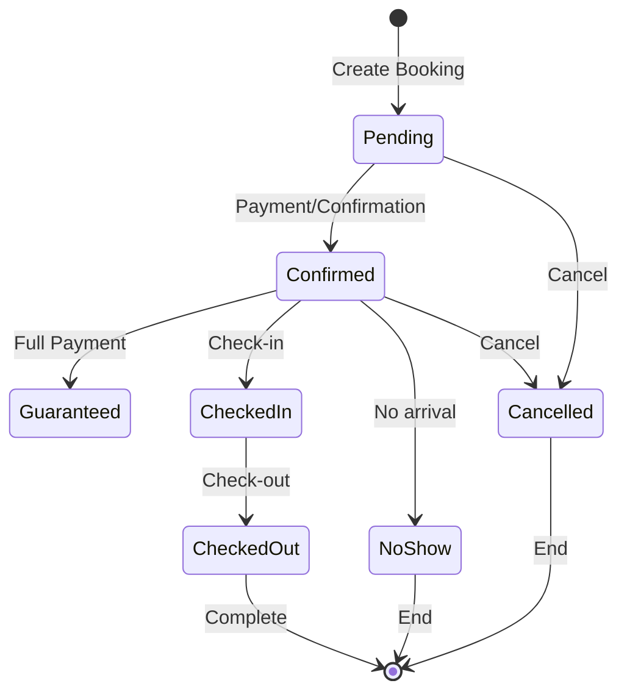

# Booking Management Module Specification

## 1. Overview

The Booking Management module is the core of the hotel operation system, handling all reservation processes from initial inquiry to checkout. It integrates with room management, customer management, pricing, and financial modules to provide a comprehensive booking solution.

### Key Features:
- **Multi-channel booking support** (Direct, OTA, Phone, Walk-in)
- **Real-time availability checking**
- **Dynamic pricing integration**
- **Deposit and payment tracking**
- **Guest preference management**
- **Automated communications**
- **Group and corporate bookings**
- **Modification and cancellation handling**

---

## 2. Database Schema

### 2.1 Main Bookings Table

```

### 5.2 React Components

#### Booking List Component

```tsx
import React, { useState } from 'react';
import { useQuery } from '@tanstack/react-query';
import {
  Table,
  TableBody,
  TableCell,
  TableHead,
  TableHeader,
  TableRow,
} from '@/components/ui/table';
import { Badge } from '@/components/ui/badge';
import { Button } from '@/components/ui/button';
import { Input } from '@/components/ui/input';
import {
  Select,
  SelectContent,
  SelectItem,
  SelectTrigger,
  SelectValue,
} from '@/components/ui/select';
import { DateRangePicker } from '@/components/ui/date-range-picker';
import { formatCurrency, formatDate } from '@/lib/utils';

export function BookingList() {
  const [filters, setFilters] = useState({
    search: '',
    status: 'all',
    dateRange: { from: null, to: null },
  });

  const { data, isLoading } = useQuery({
    queryKey: ['bookings', filters],
    queryFn: () => fetchBookings(filters),
  });

  const getStatusColor = (status: BookingStatus) => {
    const colors = {
      pending: 'bg-yellow-100 text-yellow-800',
      confirmed: 'bg-green-100 text-green-800',
      checked_in: 'bg-blue-100 text-blue-800',
      checked_out: 'bg-gray-100 text-gray-800',
      cancelled: 'bg-red-100 text-red-800',
      no_show: 'bg-orange-100 text-orange-800',
    };
    return colors[status] || 'bg-gray-100';
  };

  const getPaymentStatusIcon = (status: PaymentStatus) => {
    switch (status) {
      case 'fully_paid':
        return '✓';
      case 'deposit_paid':
        return '◐';
      case 'pending':
        return '○';
      default:
        return '?';
    }
  };

  return (
    <div className="space-y-4">
      {/* Filters */}
      <div className="flex gap-4 p-4 bg-white rounded-lg shadow">
        <Input
          placeholder="Search by code, name, email..."
          value={filters.search}
          onChange={(e) => setFilters({ ...filters, search: e.target.value })}
          className="max-w-xs"
        />
        
        <Select
          value={filters.status}
          onValueChange={(value) => setFilters({ ...filters, status: value })}
        >
          <SelectTrigger className="w-[180px]">
            <SelectValue placeholder="All Status" />
          </SelectTrigger>
          <SelectContent>
            <SelectItem value="all">All Status</SelectItem>
            <SelectItem value="pending">Pending</SelectItem>
            <SelectItem value="confirmed">Confirmed</SelectItem>
            <SelectItem value="checked_in">Checked In</SelectItem>
            <SelectItem value="checked_out">Checked Out</SelectItem>
            <SelectItem value="cancelled">Cancelled</SelectItem>
          </SelectContent>
        </Select>

        <DateRangePicker
          value={filters.dateRange}
          onChange={(range) => setFilters({ ...filters, dateRange: range })}
        />

        <Button variant="outline" onClick={() => exportBookings(filters)}>
          Export
        </Button>
      </div>

      {/* Booking Table */}
      <div className="bg-white rounded-lg shadow">
        <Table>
          <TableHeader>
            <TableRow>
              <TableHead>Booking Code</TableHead>
              <TableHead>Guest</TableHead>
              <TableHead>Room</TableHead>
              <TableHead>Check-in</TableHead>
              <TableHead>Check-out</TableHead>
              <TableHead>Status</TableHead>
              <TableHead>Payment</TableHead>
              <TableHead>Total</TableHead>
              <TableHead>Actions</TableHead>
            </TableRow>
          </TableHeader>
          <TableBody>
            {data?.bookings.map((booking) => (
              <TableRow key={booking.id}>
                <TableCell className="font-medium">
                  {booking.bookingCode}
                </TableCell>
                <TableCell>
                  <div>
                    <div className="font-medium">{booking.guestName}</div>
                    <div className="text-sm text-gray-500">
                      {booking.guestEmail}
                    </div>
                  </div>
                </TableCell>
                <TableCell>
                  <div>
                    <div>{booking.roomType}</div>
                    <div className="text-sm text-gray-500">
                      {booking.roomNumber || 'Not assigned'}
                    </div>
                  </div>
                </TableCell>
                <TableCell>{formatDate(booking.checkInDate)}</TableCell>
                <TableCell>{formatDate(booking.checkOutDate)}</TableCell>
                <TableCell>
                  <Badge className={getStatusColor(booking.status)}>
                    {booking.status}
                  </Badge>
                </TableCell>
                <TableCell>
                  <div className="flex items-center gap-1">
                    <span>{getPaymentStatusIcon(booking.paymentStatus)}</span>
                    <span className="text-sm">{booking.paymentStatus}</span>
                  </div>
                </TableCell>
                <TableCell>{formatCurrency(booking.totalAmount)}</TableCell>
                <TableCell>
                  <BookingActions booking={booking} />
                </TableCell>
              </TableRow>
            ))}
          </TableBody>
        </Table>
      </div>
    </div>
  );
}

function BookingActions({ booking }: { booking: Booking }) {
  return (
    <div className="flex gap-2">
      {booking.status === 'pending' && (
        <Button size="sm" onClick={() => confirmBooking(booking.id)}>
          Confirm
        </Button>
      )}
      {booking.status === 'confirmed' && (
        <Button size="sm" onClick={() => checkIn(booking.id)}>
          Check-in
        </Button>
      )}
      {booking.status === 'checked_in' && (
        <Button size="sm" onClick={() => checkOut(booking.id)}>
          Check-out
        </Button>
      )}
      <Button size="sm" variant="outline" onClick={() => viewBooking(booking.id)}>
        View
      </Button>
    </div>
  );
}
```

#### Booking Calendar Component

```tsx
import React, { useState } from 'react';
import FullCalendar from '@fullcalendar/react';
import resourceTimelinePlugin from '@fullcalendar/resource-timeline';
import interactionPlugin from '@fullcalendar/interaction';
import { Card } from '@/components/ui/card';
import { useQuery } from '@tanstack/react-query';

interface CalendarBooking {
  id: string;
  resourceId: string;
  title: string;
  start: string;
  end: string;
  color: string;
  extendedProps: {
    booking: Booking;
    status: BookingStatus;
  };
}

export function BookingCalendar() {
  const [dateRange, setDateRange] = useState({
    start: new Date(),
    end: new Date(Date.now() + 30 * 24 * 60 * 60 * 1000), // 30 days
  });

  const { data: rooms } = useQuery({
    queryKey: ['rooms'],
    queryFn: fetchRooms,
  });

  const { data: bookings } = useQuery({
    queryKey: ['calendar-bookings', dateRange],
    queryFn: () => fetchCalendarBookings(dateRange),
  });

  const resources = rooms?.map((room) => ({
    id: room.id,
    title: `${room.roomNumber} - ${room.roomType.name}`,
    building: room.building,
    floor: room.floor,
  }));

  const events: CalendarBooking[] = bookings?.map((booking) => ({
    id: booking.id,
    resourceId: booking.roomId,
    title: booking.guestName,
    start: booking.checkInDate,
    end: booking.checkOutDate,
    color: getBookingColor(booking.status),
    extendedProps: {
      booking: booking,
      status: booking.status,
    },
  }));

  const handleEventClick = (info: any) => {
    const booking = info.event.extendedProps.booking;
    openBookingModal(booking);
  };

  const handleEventDrop = async (info: any) => {
    const booking = info.event.extendedProps.booking;
    const newRoom = info.newResource;
    const newStart = info.event.start;
    const newEnd = info.event.end;

    try {
      await updateBooking(booking.id, {
        roomId: newRoom.id,
        checkInDate: newStart,
        checkOutDate: newEnd,
      });
    } catch (error) {
      info.revert();
      showError('Failed to update booking');
    }
  };

  const getBookingColor = (status: BookingStatus) => {
    const colors = {
      pending: '#FCD34D',
      confirmed: '#34D399',
      checked_in: '#60A5FA',
      checked_out: '#9CA3AF',
      cancelled: '#F87171',
      no_show: '#FB923C',
    };
    return colors[status] || '#9CA3AF';
  };

  return (
    <Card className="p-6">
      <FullCalendar
        plugins={[resourceTimelinePlugin, interactionPlugin]}
        headerToolbar={{
          left: 'prev,next today',
          center: 'title',
          right: 'resourceTimelineDay,resourceTimelineWeek,resourceTimelineMonth',
        }}
        initialView="resourceTimelineWeek"
        resources={resources}
        events={events}
        resourceAreaWidth="200px"
        resourceAreaColumns={[
          {
            field: 'title',
            headerContent: 'Room',
          },
          {
            field: 'floor',
            headerContent: 'Floor',
          },
        ]}
        slotMinTime="00:00"
        slotMaxTime="24:00"
        height="600px"
        editable={true}
        droppable={true}
        eventClick={handleEventClick}
        eventDrop={handleEventDrop}
        eventResize={handleEventDrop}
        eventContent={(arg) => (
          <div className="p-1 text-xs">
            <div className="font-semibold">{arg.event.title}</div>
            <div>{arg.event.extendedProps.status}</div>
          </div>
        )}
      />
    </Card>
  );
}
```

#### Check-in Modal Component

```tsx
import React, { useState } from 'react';
import {
  Dialog,
  DialogContent,
  DialogDescription,
  DialogFooter,
  DialogHeader,
  DialogTitle,
} from '@/components/ui/dialog';
import { Button } from '@/components/ui/button';
import { Input } from '@/components/ui/input';
import { Label } from '@/components/ui/label';
import {
  Select,
  SelectContent,
  SelectItem,
  SelectTrigger,
  SelectValue,
} from '@/components/ui/select';
import { Checkbox } from '@/components/ui/checkbox';
import { useQuery, useMutation } from '@tanstack/react-query';

interface CheckInModalProps {
  booking: Booking;
  open: boolean;
  onClose: () => void;
  onSuccess: () => void;
}

export function CheckInModal({
  booking,
  open,
  onClose,
  onSuccess,
}: CheckInModalProps) {
  const [formData, setFormData] = useState({
    roomId: booking.roomId || '',
    guests: [
      {
        title: '',
        firstName: '',
        lastName: '',
        idType: 'passport',
        idNumber: '',
        nationality: '',
        isPrimary: true,
      },
    ],
    keyCards: ['', ''],
    depositAmount: booking.depositRequired - booking.depositPaid,
    paymentMethod: 'credit_card',
    registrationFormSigned: false,
    earlyCheckIn: false,
  });

  const { data: availableRooms } = useQuery({
    queryKey: ['available-rooms', booking.roomTypeId, booking.checkInDate],
    queryFn: () =>
      fetchAvailableRooms({
        roomTypeId: booking.roomTypeId,
        checkIn: booking.checkInDate,
        checkOut: booking.checkOutDate,
      }),
    enabled: !booking.roomId,
  });

  const checkInMutation = useMutation({
    mutationFn: (data: any) => processCheckIn(booking.id, data),
    onSuccess: () => {
      onSuccess();
      onClose();
    },
  });

  const handleAddGuest = () => {
    setFormData({
      ...formData,
      guests: [
        ...formData.guests,
        {
          title: '',
          firstName: '',
          lastName: '',
          idType: 'passport',
          idNumber: '',
          nationality: '',
          isPrimary: false,
        },
      ],
    });
  };

  const handleGuestChange = (index: number, field: string, value: string) => {
    const updatedGuests = [...formData.guests];
    updatedGuests[index] = { ...updatedGuests[index], [field]: value };
    setFormData({ ...formData, guests: updatedGuests });
  };

  const handleSubmit = () => {
    checkInMutation.mutate(formData);
  };

  return (
    <Dialog open={open} onOpenChange={onClose}>
      <DialogContent className="max-w-4xl max-h-[90vh] overflow-y-auto">
        <DialogHeader>
          <DialogTitle>Check-in: {booking.bookingCode}</DialogTitle>
          <DialogDescription>
            Guest: {booking.guestName} | {booking.nights} nights
          </DialogDescription>
        </DialogHeader>

        <div className="space-y-6 py-4">
          {/* Room Assignment */}
          {!booking.roomId && (
            <div>
              <Label>Assign Room</Label>
              <Select
                value={formData.roomId}
                onValueChange={(value) =>
                  setFormData({ ...formData, roomId: value })
                }
              >
                <SelectTrigger>
                  <SelectValue placeholder="Select a room" />
                </SelectTrigger>
                <SelectContent>
                  {availableRooms?.map((room) => (
                    <SelectItem key={room.id} value={room.id}>
                      Room {room.roomNumber} - Floor {room.floor}
                      {room.view && ` - ${room.view} view`}
                    </SelectItem>
                  ))}
                </SelectContent>
              </Select>
            </div>
          )}

          {/* Guest Registration */}
          <div>
            <div className="flex justify-between items-center mb-3">
              <Label>Guest Registration</Label>
              <Button
                type="button"
                variant="outline"
                size="sm"
                onClick={handleAddGuest}
              >
                Add Guest
              </Button>
            </div>
            
            {formData.guests.map((guest, index) => (
              <div
                key={index}
                className="grid grid-cols-6 gap-3 p-4 border rounded-lg mb-3"
              >
                <div>
                  <Label>Title</Label>
                  <Select
                    value={guest.title}
                    onValueChange={(value) =>
                      handleGuestChange(index, 'title', value)
                    }
                  >
                    <SelectTrigger>
                      <SelectValue />
                    </SelectTrigger>
                    <SelectContent>
                      <SelectItem value="Mr">Mr</SelectItem>
                      <SelectItem value="Mrs">Mrs</SelectItem>
                      <SelectItem value="Ms">Ms</SelectItem>
                      <SelectItem value="Dr">Dr</SelectItem>
                    </SelectContent>
                  </Select>
                </div>
                
                <div>
                  <Label>First Name</Label>
                  <Input
                    value={guest.firstName}
                    onChange={(e) =>
                      handleGuestChange(index, 'firstName', e.target.value)
                    }
                  />
                </div>
                
                <div>
                  <Label>Last Name</Label>
                  <Input
                    value={guest.lastName}
                    onChange={(e) =>
                      handleGuestChange(index, 'lastName', e.target.value)
                    }
                  />
                </div>
                
                <div>
                  <Label>ID Type</Label>
                  <Select
                    value={guest.idType}
                    onValueChange={(value) =>
                      handleGuestChange(index, 'idType', value)
                    }
                  >
                    <SelectTrigger>
                      <SelectValue />
                    </SelectTrigger>
                    <SelectContent>
                      <SelectItem value="passport">Passport</SelectItem>
                      <SelectItem value="national_id">National ID</SelectItem>
                      <SelectItem value="driver_license">
                        Driver License
                      </SelectItem>
                    </SelectContent>
                  </Select>
                </div>
                
                <div>
                  <Label>ID Number</Label>
                  <Input
                    value={guest.idNumber}
                    onChange={(e) =>
                      handleGuestChange(index, 'idNumber', e.target.value)
                    }
                  />
                </div>
                
                <div>
                  <Label>Nationality</Label>
                  <Input
                    value={guest.nationality}
                    onChange={(e) =>
                      handleGuestChange(index, 'nationality', e.target.value)
                    }
                  />
                </div>
              </div>
            ))}
          </div>

          {/* Key Cards */}
          <div>
            <Label>Key Cards</Label>
            <div className="flex gap-3">
              {formData.keyCards.map((card, index) => (
                <Input
                  key={index}
                  placeholder={`Card ${index + 1}`}
                  value={card}
                  onChange={(e) => {
                    const updatedCards = [...formData.keyCards];
                    updatedCards[index] = e.target.value;
                    setFormData({ ...formData, keyCards: updatedCards });
                  }}
                />
              ))}
            </div>
          </div>

          {/* Deposit */}
          {formData.depositAmount > 0 && (
            <div className="grid grid-cols-2 gap-4">
              <div>
                <Label>Deposit Amount</Label>
                <Input
                  type="number"
                  value={formData.depositAmount}
                  onChange={(e) =>
                    setFormData({
                      ...formData,
                      depositAmount: parseFloat(e.target.value),
                    })
                  }
                />
              </div>
              <div>
                <Label>Payment Method</Label>
                <Select
                  value={formData.paymentMethod}
                  onValueChange={(value) =>
                    setFormData({ ...formData, paymentMethod: value })
                  }
                >
                  <SelectTrigger>
                    <SelectValue />
                  </SelectTrigger>
                  <SelectContent>
                    <SelectItem value="cash">Cash</SelectItem>
                    <SelectItem value="credit_card">Credit Card</SelectItem>
                    <SelectItem value="bank_transfer">Bank Transfer</SelectItem>
                  </SelectContent>
                </Select>
              </div>
            </div>
          )}

          {/* Confirmations */}
          <div className="space-y-3">
            <div className="flex items-center space-x-2">
              <Checkbox
                id="registration"
                checked={formData.registrationFormSigned}
                onCheckedChange={(checked) =>
                  setFormData({
                    ...formData,
                    registrationFormSigned: checked as boolean,
                  })
                }
              />
              <Label htmlFor="registration">
                Registration form signed by guest
              </Label>
            </div>
            
            {new Date() < new Date(booking.checkInDate) && (
              <div className="flex items-center space-x-2">
                <Checkbox
                  id="early"
                  checked={formData.earlyCheckIn}
                  onCheckedChange={(checked) =>
                    setFormData({
                      ...formData,
                      earlyCheckIn: checked as boolean,
                    })
                  }
                />
                <Label htmlFor="early">
                  Early check-in (additional charges may apply)
                </Label>
              </div>
            )}
          </div>
        </div>

        <DialogFooter>
          <Button variant="outline" onClick={onClose}>
            Cancel
          </Button>
          <Button
            onClick={handleSubmit}
            disabled={
              !formData.roomId ||
              !formData.registrationFormSigned ||
              checkInMutation.isPending
            }
          >
            {checkInMutation.isPending ? 'Processing...' : 'Complete Check-in'}
          </Button>
        </DialogFooter>
      </DialogContent>
    </Dialog>
  );
}
```

#### Booking Creation Form

```tsx
import React, { useState } from 'react';
import { useForm } from 'react-hook-form';
import { zodResolver } from '@hookform/resolvers/zod';
import * as z from 'zod';
import { Card, CardContent, CardHeader, CardTitle } from '@/components/ui/card';
import { Button } from '@/components/ui/button';
import { Input } from '@/components/ui/input';
import { Label } from '@/components/ui/label';
import { Textarea } from '@/components/ui/textarea';
import { DatePicker } from '@/components/ui/date-picker';
import { useQuery, useMutation } from '@tanstack/react-query';
import { useNavigate } from 'react-router-dom';

const bookingSchema = z.object({
  guestName: z.string().min(2, 'Name is required'),
  guestEmail: z.string().email('Invalid email'),
  guestPhone: z.string().min(10, 'Phone is required'),
  roomTypeId: z.string().uuid('Select a room type'),
  checkInDate: z.date(),
  checkOutDate: z.date(),
  adults: z.number().min(1).max(10),
  children: z.number().min(0).max(10),
  specialRequests: z.string().optional(),
});

type BookingFormData = z.infer<typeof bookingSchema>;

export function BookingCreationForm() {
  const navigate = useNavigate();
  const [step, setStep] = useState(1);
  const [pricing, setPricing] = useState<any>(null);

  const {
    register,
    handleSubmit,
    watch,
    setValue,
    formState: { errors },
  } = useForm<BookingFormData>({
    resolver: zodResolver(bookingSchema),
    defaultValues: {
      adults: 1,
      children: 0,
    },
  });

  const watchedFields = watch(['roomTypeId', 'checkInDate', 'checkOutDate', 'adults', 'children']);

  // Fetch room types
  const { data: roomTypes } = useQuery({
    queryKey: ['room-types'],
    queryFn: fetchRoomTypes,
  });

  // Check availability and calculate price
  const availabilityQuery = useQuery({
    queryKey: ['availability', ...watchedFields],
    queryFn: () =>
      checkAvailabilityAndPrice({
        roomTypeId: watchedFields[0],
        checkIn: watchedFields[1],
        checkOut: watchedFields[2],
        adults: watchedFields[3],
        children: watchedFields[4],
      }),
    enabled: !!(
      watchedFields[0] &&
      watchedFields[1] &&
      watchedFields[2] &&
      watchedFields[1] < watchedFields[2]
    ),
  });

  const createBookingMutation = useMutation({
    mutationFn: createBooking,
    onSuccess: (data) => {
      navigate(`/bookings/${data.bookingId}`);
    },
  });

  const onSubmit = (data: BookingFormData) => {
    createBookingMutation.mutate({
      ...data,
      source: 'direct',
    });
  };

  return (
    <div className="max-w-4xl mx-auto">
      <form onSubmit={handleSubmit(onSubmit)}>
        {/* Step 1: Guest Information */}
        {step === 1 && (
          <Card>
            <CardHeader>
              <CardTitle>Guest Information</CardTitle>
            </CardHeader>
            <CardContent className="space-y-4">
              <div className="grid grid-cols-2 gap-4">
                <div>
                  <Label htmlFor="guestName">Full Name</Label>
                  <Input
                    id="guestName"
                    {...register('guestName')}
                    placeholder="John Doe"
                  />
                  {errors.guestName && (
                    <p className="text-sm text-red-500">
                      {errors.guestName.message}
                    </p>
                  )}
                </div>
                
                <div>
                  <Label htmlFor="guestEmail">Email</Label>
                  <Input
                    id="guestEmail"
                    type="email"
                    {...register('guestEmail')}
                    placeholder="john@example.com"
                  />
                  {errors.guestEmail && (
                    <p className="text-sm text-red-500">
                      {errors.guestEmail.message}
                    </p>
                  )}
                </div>
                
                <div>
                  <Label htmlFor="guestPhone">Phone</Label>
                  <Input
                    id="guestPhone"
                    {...register('guestPhone')}
                    placeholder="+84 90 123 4567"
                  />
                  {errors.guestPhone && (
                    <p className="text-sm text-red-500">
                      {errors.guestPhone.message}
                    </p>
                  )}
                </div>
                
                <div>
                  <Label htmlFor="guestCountry">Country</Label>
                  <Input
                    id="guestCountry"
                    {...register('guestCountry')}
                    placeholder="Vietnam"
                  />
                </div>
              </div>
              
              <div className="flex justify-end">
                <Button type="button" onClick={() => setStep(2)}>
                  Next: Room Selection
                </Button>
              </div>
            </CardContent>
          </Card>
        )}

        {/* Step 2: Room Selection */}
        {step === 2 && (
          <Card>
            <CardHeader>
              <CardTitle>Room Selection</CardTitle>
            </CardHeader>
            <CardContent className="space-y-4">
              <div className="grid grid-cols-2 gap-4">
                <div>
                  <Label>Check-in Date</Label>
                  <DatePicker
                    value={watch('checkInDate')}
                    onChange={(date) => setValue('checkInDate', date)}
                    minDate={new Date()}
                  />
                </div>
                
                <div>
                  <Label>Check-out Date</Label>
                  <DatePicker
                    value={watch('checkOutDate')}
                    onChange={(date) => setValue('checkOutDate', date)}
                    minDate={watch('checkInDate') || new Date()}
                  />
                </div>
                
                <div>
                  <Label>Adults</Label>
                  <Input
                    type="number"
                    {...register('adults', { valueAsNumber: true })}
                    min="1"
                    max="10"
                  />
                </div>
                
                <div>
                  <Label>Children</Label>
                  <Input
                    type="number"
                    {...register('children', { valueAsNumber: true })}
                    min="0"
                    max="10"
                  />
                </div>
              </div>

              {/* Room Type Selection */}
              <div>
                <Label>Room Type</Label>
                <div className="grid grid-cols-1 md:grid-cols-2 gap-4 mt-2">
                  {roomTypes?.map((roomType) => (
                    <Card
                      key={roomType.id}
                      className={`cursor-pointer transition-all ${
                        watch('roomTypeId') === roomType.id
                          ? 'ring-2 ring-primary'
                          : ''
                      }`}
                      onClick={() => setValue('roomTypeId', roomType.id)}
                    >
                      <CardContent className="p-4">
                        <h4 className="font-semibold">{roomType.name}</h4>
                        <p className="text-sm text-gray-600">
                          Max {roomType.maxOccupancy} guests
                        </p>
                        <p className="text-lg font-bold mt-2">
                          {formatCurrency(roomType.basePrice)}/night
                        </p>
                      </CardContent>
                    </Card>
                  ))}
                </div>
              </div>

              {/* Special Requests */}
              <div>
                <Label htmlFor="specialRequests">Special Requests</Label>
                <Textarea
                  id="specialRequests"
                  {...register('specialRequests')}
                  placeholder="Any special requirements or preferences..."
                />
              </div>

              <div className="flex justify-between">
                <Button type="button" variant="outline" onClick={() => setStep(1)}>
                  Previous
                </Button>
                <Button type="button" onClick={() => setStep(3)}>
                  Next: Review & Confirm
                </Button>
              </div>
            </CardContent>
          </Card>
        )}

        {/* Step 3: Review and Confirm */}
        {step === 3 && (
          <Card>
            <CardHeader>
              <CardTitle>Review & Confirm</CardTitle>
            </CardHeader>
            <CardContent className="space-y-4">
              {/* Booking Summary */}
              <div className="bg-gray-50 p-4 rounded-lg">
                <h4 className="font-semibold mb-3">Booking Summary</h4>
                <div className="space-y-2 text-sm">
                  <div className="flex justify-between">
                    <span>Guest:</span>
                    <span>{watch('guestName')}</span>
                  </div>
                  <div className="flex justify-between">
                    <span>Check-in:</span>
                    <span>{formatDate(watch('checkInDate'))}</span>
                  </div>
                  <div className="flex justify-between">
                    <span>Check-out:</span>
                    <span>{formatDate(watch('checkOutDate'))}</span>
                  </div>
                  <div className="flex justify-between">
                    <span>Guests:</span>
                    <span>
                      {watch('adults')} Adults
                      {watch('children') > 0 && `, ${watch('children')} Children`}
                    </span>
                  </div>
                </div>
              </div>

              {/* Pricing Details */}
              {availabilityQuery.data && (
                <div className="bg-blue-50 p-4 rounded-lg">
                  <h4 className="font-semibold mb-3">Pricing Details</h4>
                  <div className="space-y-2 text-sm">
                    <div className="flex justify-between">
                      <span>Room charges:</span>
                      <span>{formatCurrency(availabilityQuery.data.roomCharges)}</span>
                    </div>
                    <div className="flex justify-between">
                      <span>Taxes:</span>
                      <span>{formatCurrency(availabilityQuery.data.tax)}</span>
                    </div>
                    <div className="flex justify-between font-semibold pt-2 border-t">
                      <span>Total:</span>
                      <span>{formatCurrency(availabilityQuery.data.total)}</span>
                    </div>
                    <div className="flex justify-between text-blue-600">
                      <span>Deposit required:</span>
                      <span>{formatCurrency(availabilityQuery.data.deposit)}</span>
                    </div>
                  </div>
                </div>
              )}

              <div className="flex justify-between">
                <Button type="button" variant="outline" onClick={() => setStep(2)}>
                  Previous
                </Button>
                <Button
                  type="submit"
                  disabled={createBookingMutation.isPending}
                >
                  {createBookingMutation.isPending
                    ? 'Creating Booking...'
                    : 'Confirm Booking'}
                </Button>
              </div>
            </CardContent>
          </Card>
        )}
      </form>
    </div>
  );
}
```

---

## 6. Reports and Analytics

### 6.1 Booking Analytics Queries

```sql
-- Daily booking summary
SELECT 
    DATE(created_at) as booking_date,
    COUNT(*) as total_bookings,
    COUNT(CASE WHEN status = 'confirmed' THEN 1 END) as confirmed,
    COUNT(CASE WHEN status = 'cancelled' THEN 1 END) as cancelled,
    SUM(total_amount) as total_value,
    AVG(nights) as avg_stay_length,
    COUNT(DISTINCT customer_id) as unique_customers
FROM bookings
WHERE created_at >= :start_date
    AND created_at <= :end_date
GROUP BY DATE(created_at)
ORDER BY booking_date DESC;

-- Source performance analysis
SELECT 
    source,
    channel,
    COUNT(*) as bookings,
    SUM(total_amount) as revenue,
    AVG(total_amount) as avg_booking_value,
    AVG(nights) as avg_nights,
    SUM(commission_amount) as total_commission,
    COUNT(CASE WHEN status = 'cancelled' THEN 1 END) as cancellations,
    ROUND(COUNT(CASE WHEN status = 'cancelled' THEN 1 END)::DECIMAL / COUNT(*) * 100, 2) as cancellation_rate
FROM bookings
WHERE check_in_date >= :start_date
    AND check_in_date <= :end_date
GROUP BY source, channel
ORDER BY revenue DESC;

-- Guest demographics
SELECT 
    guest_country,
    COUNT(DISTINCT customer_id) as unique_guests,
    COUNT(*) as total_bookings,
    SUM(total_amount) as total_revenue,
    AVG(total_amount) as avg_spend,
    AVG(nights) as avg_stay,
    COUNT(CASE WHEN adults + children > 2 THEN 1 END) as family_bookings
FROM bookings
WHERE status IN ('checked_out', 'checked_in')
    AND check_in_date >= :start_date
GROUP BY guest_country
ORDER BY total_revenue DESC
LIMIT 20;

-- Booking lead time analysis
SELECT 
    CASE 
        WHEN days_in_advance <= 0 THEN 'Same day'
        WHEN days_in_advance <= 3 THEN '1-3 days'
        WHEN days_in_advance <= 7 THEN '4-7 days'
        WHEN days_in_advance <= 14 THEN '8-14 days'
        WHEN days_in_advance <= 30 THEN '15-30 days'
        WHEN days_in_advance <= 60 THEN '31-60 days'
        ELSE '60+ days'
    END as lead_time_category,
    COUNT(*) as bookings,
    AVG(total_amount) as avg_value,
    AVG(nights) as avg_nights
FROM (
    SELECT 
        *,
        (check_in_date - DATE(created_at)) as days_in_advance
    FROM bookings
    WHERE status != 'cancelled'
) b
GROUP BY lead_time_category
ORDER BY 
    CASE lead_time_category
        WHEN 'Same day' THEN 1
        WHEN '1-3 days' THEN 2
        WHEN '4-7 days' THEN 3
        WHEN '8-14 days' THEN 4
        WHEN '15-30 days' THEN 5
        WHEN '31-60 days' THEN 6
        ELSE 7
    END;
```

### 6.2 Revenue Analysis

```sql
-- Revenue breakdown by category
WITH revenue_details AS (
    SELECT 
        b.id,
        b.check_in_date,
        b.total_room_charge as room_revenue,
        COALESCE(SUM(c.amount), 0) as service_revenue,
        b.tax_amount as tax_revenue,
        b.discount_amount as discounts,
        b.total_amount as total_revenue
    FROM bookings b
    LEFT JOIN charges c ON c.booking_id = b.id
    WHERE b.status IN ('checked_out', 'checked_in')
        AND b.check_in_date >= :start_date
        AND b.check_in_date <= :end_date
    GROUP BY b.id
)
SELECT 
    DATE_TRUNC('month', check_in_date) as month,
    SUM(room_revenue) as room_revenue,
    SUM(service_revenue) as service_revenue,
    SUM(tax_revenue) as tax_revenue,
    SUM(discounts) as total_discounts,
    SUM(total_revenue) as total_revenue,
    COUNT(*) as booking_count
FROM revenue_details
GROUP BY DATE_TRUNC('month', check_in_date)
ORDER BY month;

-- Payment collection status
SELECT 
    payment_status,
    COUNT(*) as bookings,
    SUM(total_amount) as total_value,
    SUM(total_paid) as collected,
    SUM(balance_due) as outstanding
FROM bookings
WHERE status IN ('confirmed', 'checked_in', 'checked_out')
GROUP BY payment_status;
```

---

## 7. Integration Points

### 7.1 Channel Manager Integration

```python
class ChannelManagerIntegration:
    """
    Integration with OTA channel managers.
    """
    
    def sync_availability(self, date_range):
        """Push availability to all connected channels."""
        
        availability = calculate_availability(date_range)
        
        for channel in self.active_channels:
            try:
                channel.update_availability(availability)
                log_sync(channel.name, 'availability', 'success')
            except Exception as e:
                log_sync(channel.name, 'availability', 'failed', str(e))
    
    def receive_booking(self, channel_data):
        """Process incoming booking from OTA."""
        
        # Map channel data to our format
        booking_data = self.map_channel_booking(channel_data)
        
        # Create booking
        booking = create_booking(booking_data)
        
        # Send confirmation back to channel
        self.confirm_channel_booking(
            channel_data['channel'],
            channel_data['booking_id'],
            booking.booking_code
        )
        
        return booking
    
    def update_rates(self, room_type_id, rates):
        """Push rate updates to channels."""
        
        for channel in self.active_channels:
            mapped_rates = self.map_rates_for_channel(channel, rates)
            channel.update_rates(room_type_id, mapped_rates)
```

### 7.2 Payment Gateway Integration

```python
class PaymentGatewayIntegration:
    """
    Payment processing integration.
    """
    
    def process_payment(self, booking_id, amount, payment_method, details):
        """Process payment through gateway."""
        
        if payment_method == 'credit_card':
            return self.process_card_payment(amount, details)
        elif payment_method == 'e_wallet':
            return self.process_ewallet_payment(amount, details)
        elif payment_method == 'bank_transfer':
            return self.initiate_bank_transfer(amount, details)
        else:
            return self.record_cash_payment(amount, details)
    
    def process_card_payment(self, amount, card_details):
        """Process credit card payment."""
        
        # Tokenize card
        token = self.gateway.tokenize_card(card_details)
        
        # Charge card
        result = self.gateway.charge(
            amount=amount,
            token=token,
            currency='VND',
            description=f'Booking payment'
        )
        
        return {
            'success': result.success,
            'transaction_id': result.transaction_id,
            'authorization_code': result.auth_code,
            'message': result.message
        }
    
    def process_refund(self, original_transaction_id, amount):
        """Process refund for a payment."""
        
        result = self.gateway.refund(
            transaction_id=original_transaction_id,
            amount=amount
        )
        
        return {
            'success': result.success,
            'refund_id': result.refund_id,
            'message': result.message
        }
```

---

## 8. Email Templates

### 8.1 Booking Confirmation Template

```html
<!DOCTYPE html>
<html>
<head>
    <style>
        .container { max-width: 600px; margin: 0 auto; font-family: Arial, sans-serif; }
        .header { background: #2563eb; color: white; padding: 20px; text-align: center; }
        .content { padding: 20px; }
        .booking-details { background: #f3f4f6; padding: 15px; border-radius: 8px; }
        .footer { text-align: center; padding: 20px; color: #6b7280; }
    </style>
</head>
<body>
    <div class="container">
        <div class="header">
            <h1>Booking Confirmation</h1>
            <p>Thank you for choosing {{hotel_name}}</p>
        </div>
        
        <div class="content">
            <h2>Hi {{guest_name}},</h2>
            <p>Your booking has been confirmed! We look forward to welcoming you.</p>
            
            <div class="booking-details">
                <h3>Booking Details</h3>
                <p><strong>Confirmation Code:</strong> {{booking_code}}</p>
                <p><strong>Check-in:</strong> {{check_in_date}} (after {{check_in_time}})</p>
                <p><strong>Check-out:</strong> {{check_out_date}} (before {{check_out_time}})</p>
                <p><strong>Room Type:</strong> {{room_type}}</p>
                <p><strong>Guests:</strong> {{adults}} Adults{{#if children}}, {{children}} Children{{/if}}</p>
                <p><strong>Total Amount:</strong> {{total_amount}}</p>
                <p><strong>Deposit Paid:</strong> {{deposit_paid}}</p>
                <p><strong>Balance Due:</strong> {{balance_due}}</p>
            </div>
            
            {{#if special_requests}}
            <div style="margin-top: 20px;">
                <h3>Special Requests</h3>
                <p>{{special_requests}}</p>
                <p><em>Note: Special requests are subject to availability and cannot be guaranteed.</em></p>
            </div>
            {{/if}}
            
            <div style="margin-top: 20px;">
                <h3>Cancellation Policy</h3>
                <p>Free cancellation up to 7 days before check-in. 
                50% charge for cancellations 3-7 days before check-in. 
                No refund for cancellations less than 3 days before check-in.</p>
            </div>
            
            <div style="margin-top: 20px; text-align: center;">
                <a href="{{booking_link}}" style="background: #2563eb; color: white; padding: 12px 24px; text-decoration: none; border-radius: 6px;">
                    View Booking
                </a>
            </div>
        </div>
        
        <div class="footer">
            <p>{{hotel_name}}</p>
            <p>{{hotel_address}}</p>
            <p>{{hotel_phone}} | {{hotel_email}}</p>
        </div>
    </div>
</body>
</html>
```

---

## 9. Error Handling and Validation

### 9.1 Booking Validation Rules

```python
class BookingValidator:
    """
    Comprehensive booking validation.
    """
    
    def validate_booking(self, booking_data):
        errors = []
        
        # Date validations
        if booking_data['check_in_date'] <= date.today():
            if not booking_data.get('allow_past_checkin'):
                errors.append("Check-in date must be in the future")
        
        if booking_data['check_out_date'] <= booking_data['check_in_date']:
            errors.append("Check-out must be after check-in")
        
        nights = (booking_data['check_out_date'] - booking_data['check_in_date']).days
        if nights > 30:
            errors.append("Maximum stay is 30 nights")
        
        # Guest validations
        total_guests = booking_data['adults'] + booking_data.get('children', 0)
        room_type = get_room_type(booking_data['room_type_id'])
        
        if total_guests > room_type.max_occupancy:
            errors.append(f"Maximum occupancy is {room_type.max_occupancy}")
        
        if booking_data['adults'] < 1:
            errors.append("At least one adult is required")
        
        # Availability check
        if not self.check_availability(booking_data):
            errors.append("No rooms available for selected dates")
        
        # Customer validation
        if booking_data.get('customer_id'):
            customer = get_customer(booking_data['customer_id'])
            if customer.is_blacklisted:
                errors.append("Customer is blacklisted")
        
        # Payment validation
        if booking_data.get('payment_method') == 'credit_card':
            if not self.validate_card(booking_data.get('card_details')):
                errors.append("Invalid credit card details")
        
        if errors:
            raise ValidationError(errors)
        
        return True
```

---

## 10. Best Practices and Guidelines

### 10.1 Performance Optimization
- Use database indexes on frequently queried columns
- Implement Redis caching for availability checks
- Batch process email notifications
- Use pagination for large booking lists
- Optimize calendar queries with date ranges

### 10.2 Security Considerations
- PCI compliance for payment data
- Encrypt sensitive guest information
- Audit log all booking modifications
- Implement rate limiting on booking APIs
- Validate all input data

### 10.3 User Experience
- Real-time availability updates
- Clear booking status indicators
- Mobile-responsive booking forms
- Quick action buttons for common tasks
- Comprehensive search and filtering

### 10.4 Data Integrity
- Use database transactions for multi-table updates
- Implement soft deletes for audit trail
- Maintain booking history
- Regular data validation checks
- Automated backup procedures

---

*Document Version: 1.0*  
*Last Updated: [Current Date]*  
*Module: Booking Management*  
*System: Homestay/Hotel Management System*sql
CREATE TABLE bookings (
    id UUID PRIMARY KEY DEFAULT gen_random_uuid(),
    booking_code VARCHAR(20) UNIQUE NOT NULL, -- Format: BK20240001
    booking_type VARCHAR(20) DEFAULT 'individual', -- 'individual', 'group', 'corporate'
    
    -- Customer Information
    customer_id UUID REFERENCES customers(id),
    guest_name VARCHAR(200) NOT NULL, -- Primary guest name
    guest_email VARCHAR(200),
    guest_phone VARCHAR(20),
    guest_country VARCHAR(100),
    
    -- Room Assignment
    room_type_id UUID REFERENCES room_types(id) NOT NULL,
    room_id UUID REFERENCES rooms(id), -- NULL until room assigned
    room_rate_type VARCHAR(50), -- 'standard', 'weekend', 'seasonal', 'contracted'
    
    -- Dates and Times
    booking_date TIMESTAMP DEFAULT NOW(),
    check_in_date DATE NOT NULL,
    check_out_date DATE NOT NULL,
    check_in_time TIME DEFAULT '14:00',
    check_out_time TIME DEFAULT '12:00',
    actual_check_in TIMESTAMP,
    actual_check_out TIMESTAMP,
    early_check_in BOOLEAN DEFAULT false,
    late_check_out BOOLEAN DEFAULT false,
    
    -- Guest Count
    adults INTEGER NOT NULL DEFAULT 1,
    children INTEGER DEFAULT 0,
    infants INTEGER DEFAULT 0,
    total_guests INTEGER GENERATED ALWAYS AS (adults + children) STORED,
    
    -- Pricing
    nights INTEGER GENERATED ALWAYS AS (check_out_date - check_in_date) STORED,
    room_rate DECIMAL(10,2) NOT NULL, -- Rate per night
    total_room_charge DECIMAL(10,2) NOT NULL,
    extra_person_charge DECIMAL(10,2) DEFAULT 0,
    extra_bed_charge DECIMAL(10,2) DEFAULT 0,
    
    -- Additional Charges
    service_charges DECIMAL(10,2) DEFAULT 0,
    tax_amount DECIMAL(10,2) DEFAULT 0,
    discount_amount DECIMAL(10,2) DEFAULT 0,
    discount_reason TEXT,
    commission_amount DECIMAL(10,2) DEFAULT 0, -- For OTA bookings
    commission_rate DECIMAL(5,2) DEFAULT 0,
    
    -- Totals
    subtotal DECIMAL(10,2) NOT NULL,
    total_amount DECIMAL(10,2) NOT NULL,
    deposit_required DECIMAL(10,2) DEFAULT 0,
    deposit_paid DECIMAL(10,2) DEFAULT 0,
    total_paid DECIMAL(10,2) DEFAULT 0,
    balance_due DECIMAL(10,2) GENERATED ALWAYS AS (total_amount - total_paid) STORED,
    
    -- Status
    status VARCHAR(20) DEFAULT 'pending',
    -- 'pending', 'confirmed', 'guaranteed', 'checked_in', 'checked_out', 'cancelled', 'no_show'
    payment_status VARCHAR(20) DEFAULT 'pending',
    -- 'pending', 'deposit_paid', 'partially_paid', 'fully_paid', 'refunded'
    confirmation_sent BOOLEAN DEFAULT false,
    confirmation_sent_at TIMESTAMP,
    
    -- Source and Channel
    source VARCHAR(50) NOT NULL, -- 'direct', 'website', 'phone', 'email', 'walk_in', 'ota'
    channel VARCHAR(100), -- 'booking.com', 'agoda', 'expedia', etc.
    channel_booking_id VARCHAR(100), -- External booking reference
    
    -- Special Requests and Notes
    special_requests TEXT,
    dietary_requirements TEXT,
    arrival_method VARCHAR(50), -- 'car', 'taxi', 'bus', 'flight', 'train'
    arrival_details TEXT, -- Flight number, train details, etc.
    purpose_of_visit VARCHAR(50), -- 'leisure', 'business', 'event', 'other'
    
    -- Internal Notes
    internal_notes JSONB,
    /* {
        "reception": "VIP guest, provide welcome drink",
        "housekeeping": "Extra towels and pillows",
        "f&b": "Allergic to peanuts",
        "management": "Repeat customer, 5th stay"
    } */
    
    -- Preferences
    preferences JSONB,
    /* {
        "bed_type": "king",
        "floor": "high",
        "room_location": "quiet",
        "newspaper": "NYT",
        "wake_up_call": "07:00",
        "do_not_disturb": ["14:00-16:00"]
    } */
    
    -- Cancellation
    is_cancelled BOOLEAN DEFAULT false,
    cancelled_at TIMESTAMP,
    cancelled_by UUID REFERENCES users(id),
    cancellation_reason TEXT,
    cancellation_charge DECIMAL(10,2) DEFAULT 0,
    refund_amount DECIMAL(10,2) DEFAULT 0,
    refund_status VARCHAR(20), -- 'pending', 'processed', 'completed'
    
    -- Group Booking Reference
    group_booking_id UUID REFERENCES group_bookings(id),
    is_group_leader BOOLEAN DEFAULT false,
    
    -- Corporate/Contract
    company_id UUID REFERENCES companies(id),
    corporate_rate_id UUID REFERENCES corporate_rates(id),
    billing_instructions TEXT,
    
    -- Metadata
    created_by UUID REFERENCES users(id),
    updated_by UUID REFERENCES users(id),
    created_at TIMESTAMP DEFAULT NOW(),
    updated_at TIMESTAMP DEFAULT NOW()
);

-- Indexes for performance
CREATE INDEX idx_bookings_dates ON bookings(check_in_date, check_out_date);
CREATE INDEX idx_bookings_customer ON bookings(customer_id);
CREATE INDEX idx_bookings_room ON bookings(room_id);
CREATE INDEX idx_bookings_room_type ON bookings(room_type_id);
CREATE INDEX idx_bookings_status ON bookings(status);
CREATE INDEX idx_bookings_source ON bookings(source);
CREATE INDEX idx_bookings_code ON bookings(booking_code);
CREATE INDEX idx_bookings_created ON bookings(created_at);
```

### 2.2 Group Bookings

```sql
CREATE TABLE group_bookings (
    id UUID PRIMARY KEY DEFAULT gen_random_uuid(),
    group_code VARCHAR(20) UNIQUE NOT NULL,
    group_name VARCHAR(200) NOT NULL,
    organization VARCHAR(200),
    contact_person VARCHAR(200),
    contact_email VARCHAR(200),
    contact_phone VARCHAR(20),
    
    -- Group Details
    total_rooms INTEGER NOT NULL,
    total_guests INTEGER NOT NULL,
    arrival_date DATE NOT NULL,
    departure_date DATE NOT NULL,
    
    -- Pricing
    negotiated_rate DECIMAL(10,2),
    discount_percentage DECIMAL(5,2),
    total_amount DECIMAL(12,2),
    deposit_required DECIMAL(12,2),
    deposit_paid DECIMAL(12,2),
    
    -- Room Allocation
    room_allocation JSONB,
    /* {
        "room_types": [
            {"type_id": "uuid", "count": 10, "rate": 2000000},
            {"type_id": "uuid", "count": 5, "rate": 3000000}
        ]
    } */
    
    -- Special Arrangements
    meal_plan VARCHAR(50), -- 'room_only', 'breakfast', 'half_board', 'full_board'
    meeting_rooms JSONB, -- Meeting room requirements
    special_arrangements TEXT,
    
    -- Status
    status VARCHAR(20) DEFAULT 'inquiry',
    -- 'inquiry', 'tentative', 'confirmed', 'in_house', 'checked_out', 'cancelled'
    
    -- Rooming List
    rooming_list_received BOOLEAN DEFAULT false,
    rooming_list_deadline DATE,
    
    created_by UUID REFERENCES users(id),
    created_at TIMESTAMP DEFAULT NOW(),
    updated_at TIMESTAMP DEFAULT NOW()
);
```

### 2.3 Booking Guests

```sql
CREATE TABLE booking_guests (
    id UUID PRIMARY KEY DEFAULT gen_random_uuid(),
    booking_id UUID REFERENCES bookings(id) ON DELETE CASCADE,
    guest_type VARCHAR(20) DEFAULT 'adult', -- 'adult', 'child', 'infant'
    
    -- Guest Information
    title VARCHAR(20), -- 'Mr', 'Mrs', 'Ms', 'Dr', etc.
    first_name VARCHAR(100),
    last_name VARCHAR(100),
    full_name VARCHAR(200) NOT NULL,
    date_of_birth DATE,
    age INTEGER,
    gender VARCHAR(20),
    nationality VARCHAR(100),
    
    -- Identification
    id_type VARCHAR(50), -- 'passport', 'national_id', 'driver_license'
    id_number VARCHAR(100),
    id_issue_date DATE,
    id_expiry_date DATE,
    id_issuing_country VARCHAR(100),
    id_front_image TEXT, -- URL to R2 storage
    id_back_image TEXT,
    
    -- Contact
    email VARCHAR(200),
    phone VARCHAR(20),
    address TEXT,
    city VARCHAR(100),
    country VARCHAR(100),
    
    -- Room Assignment
    room_id UUID REFERENCES rooms(id),
    bed_type VARCHAR(50), -- For twin rooms
    
    -- Special Requirements
    special_needs TEXT,
    dietary_requirements TEXT,
    allergies TEXT,
    
    -- Check-in Status
    is_checked_in BOOLEAN DEFAULT false,
    checked_in_at TIMESTAMP,
    checked_in_by UUID REFERENCES users(id),
    
    -- Metadata
    is_primary BOOLEAN DEFAULT false, -- Primary guest for the booking
    share_contact_allowed BOOLEAN DEFAULT false,
    created_at TIMESTAMP DEFAULT NOW()
);

-- Index for quick lookup
CREATE INDEX idx_booking_guests_booking ON booking_guests(booking_id);
CREATE INDEX idx_booking_guests_room ON booking_guests(room_id);
```

### 2.4 Booking Payments and Deposits

```sql
CREATE TABLE booking_payments (
    id UUID PRIMARY KEY DEFAULT gen_random_uuid(),
    booking_id UUID REFERENCES bookings(id) ON DELETE CASCADE,
    payment_type VARCHAR(20) NOT NULL, -- 'deposit', 'payment', 'refund'
    
    -- Amount
    amount DECIMAL(10,2) NOT NULL,
    currency VARCHAR(3) DEFAULT 'VND',
    exchange_rate DECIMAL(10,4) DEFAULT 1,
    amount_in_base_currency DECIMAL(10,2),
    
    -- Payment Method
    payment_method VARCHAR(50) NOT NULL,
    -- 'cash', 'bank_transfer', 'credit_card', 'debit_card', 'e_wallet', 'company_account'
    
    -- Payment Details
    payment_details JSONB,
    /* {
        "card_last_4": "1234",
        "card_type": "visa",
        "bank_name": "VCB",
        "transaction_ref": "TRX123456",
        "approval_code": "AUTH789"
    } */
    
    -- Reference
    reference_number VARCHAR(100),
    receipt_number VARCHAR(50),
    
    -- Status
    status VARCHAR(20) DEFAULT 'pending',
    -- 'pending', 'processing', 'completed', 'failed', 'cancelled'
    
    -- Refund Information (if applicable)
    is_refund BOOLEAN DEFAULT false,
    refund_reason TEXT,
    original_payment_id UUID REFERENCES booking_payments(id),
    
    -- Processing
    processed_at TIMESTAMP,
    processed_by UUID REFERENCES users(id),
    
    -- Metadata
    notes TEXT,
    created_at TIMESTAMP DEFAULT NOW(),
    created_by UUID REFERENCES users(id)
);

-- Indexes
CREATE INDEX idx_booking_payments_booking ON booking_payments(booking_id);
CREATE INDEX idx_booking_payments_status ON booking_payments(status);
CREATE INDEX idx_booking_payments_method ON booking_payments(payment_method);
```

### 2.5 Booking Status History

```sql
CREATE TABLE booking_status_history (
    id UUID PRIMARY KEY DEFAULT gen_random_uuid(),
    booking_id UUID REFERENCES bookings(id) ON DELETE CASCADE,
    
    -- Status Change
    old_status VARCHAR(20),
    new_status VARCHAR(20) NOT NULL,
    
    -- Reason and Notes
    change_reason TEXT,
    notes TEXT,
    
    -- Notification
    notification_sent BOOLEAN DEFAULT false,
    notification_type VARCHAR(50), -- 'email', 'sms', 'none'
    
    -- Metadata
    changed_by UUID REFERENCES users(id),
    changed_at TIMESTAMP DEFAULT NOW(),
    ip_address INET,
    user_agent TEXT
);

-- Index for quick lookup
CREATE INDEX idx_booking_status_history_booking ON booking_status_history(booking_id);
CREATE INDEX idx_booking_status_history_date ON booking_status_history(changed_at);
```

### 2.6 Booking Modifications

```sql
CREATE TABLE booking_modifications (
    id UUID PRIMARY KEY DEFAULT gen_random_uuid(),
    booking_id UUID REFERENCES bookings(id) ON DELETE CASCADE,
    modification_type VARCHAR(50) NOT NULL,
    -- 'date_change', 'room_change', 'guest_change', 'rate_change', 'add_service', 'remove_service'
    
    -- Changed Fields (JSON for flexibility)
    old_values JSONB,
    new_values JSONB,
    
    -- Financial Impact
    charge_amount DECIMAL(10,2) DEFAULT 0, -- Modification fee
    refund_amount DECIMAL(10,2) DEFAULT 0,
    rate_difference DECIMAL(10,2) DEFAULT 0,
    
    -- Approval
    requires_approval BOOLEAN DEFAULT false,
    approved_by UUID REFERENCES users(id),
    approved_at TIMESTAMP,
    approval_notes TEXT,
    
    -- Metadata
    reason TEXT,
    requested_by VARCHAR(50), -- 'guest', 'staff', 'system'
    created_by UUID REFERENCES users(id),
    created_at TIMESTAMP DEFAULT NOW()
);

-- Indexes
CREATE INDEX idx_booking_modifications_booking ON booking_modifications(booking_id);
CREATE INDEX idx_booking_modifications_type ON booking_modifications(modification_type);
```

### 2.7 Booking Communications

```sql
CREATE TABLE booking_communications (
    id UUID PRIMARY KEY DEFAULT gen_random_uuid(),
    booking_id UUID REFERENCES bookings(id) ON DELETE CASCADE,
    
    -- Communication Details
    type VARCHAR(50) NOT NULL,
    -- 'confirmation', 'reminder', 'modification', 'cancellation', 'pre_arrival', 'post_stay'
    channel VARCHAR(50) NOT NULL, -- 'email', 'sms', 'whatsapp', 'phone'
    
    -- Recipients
    recipient_type VARCHAR(20), -- 'guest', 'company', 'agent'
    recipient_email VARCHAR(200),
    recipient_phone VARCHAR(20),
    recipient_name VARCHAR(200),
    
    -- Content
    subject VARCHAR(500),
    content TEXT,
    attachments JSONB, -- Array of attachment URLs
    
    -- Template Used
    template_id UUID REFERENCES communication_templates(id),
    template_variables JSONB, -- Variables used to fill template
    
    -- Status
    status VARCHAR(20) DEFAULT 'pending',
    -- 'pending', 'sending', 'sent', 'delivered', 'failed', 'bounced'
    
    -- Tracking
    sent_at TIMESTAMP,
    delivered_at TIMESTAMP,
    opened_at TIMESTAMP,
    clicked_at TIMESTAMP,
    bounced_at TIMESTAMP,
    failed_reason TEXT,
    
    -- Response
    response_received BOOLEAN DEFAULT false,
    response_content TEXT,
    response_date TIMESTAMP,
    
    -- Metadata
    created_by UUID REFERENCES users(id),
    created_at TIMESTAMP DEFAULT NOW()
);

-- Indexes
CREATE INDEX idx_booking_communications_booking ON booking_communications(booking_id);
CREATE INDEX idx_booking_communications_type ON booking_communications(type);
CREATE INDEX idx_booking_communications_status ON booking_communications(status);
```

---

## 3. API Endpoints

### 3.1 Booking Creation and Management

#### POST /api/bookings
Create a new booking with availability validation.

**Request Body:**
```json
{
  "customer_id": "550e8400-e29b-41d4-a716-446655440000",
  "guest_name": "John Doe",
  "guest_email": "john.doe@email.com",
  "guest_phone": "+84901234567",
  "guest_country": "USA",
  
  "room_type_id": "660e8400-e29b-41d4-a716-446655440000",
  "check_in_date": "2024-02-15",
  "check_out_date": "2024-02-20",
  "check_in_time": "15:00",
  
  "adults": 2,
  "children": 1,
  "children_ages": [8],
  
  "source": "website",
  "special_requests": "High floor, quiet room, vegetarian breakfast",
  
  "preferences": {
    "bed_type": "king",
    "floor": "high",
    "newspaper": "NYT"
  },
  
  "extras": {
    "airport_transfer": true,
    "early_check_in": true,
    "extra_bed": false
  },
  
  "payment_method": "credit_card",
  "newsletter_consent": true
}
```

**Business Logic:**
1. **Customer Validation**
   - If customer_id provided, verify exists
   - If new customer, create profile
   - Check blacklist status

2. **Availability Check**
   ```python
   def check_availability(room_type_id, check_in, check_out, guests):
       # Get rooms of requested type
       available_rooms = query("""
           SELECT r.* FROM rooms r
           WHERE r.room_type_id = :room_type_id
           AND r.is_active = true
           AND r.status = 'available'
           AND NOT EXISTS (
               SELECT 1 FROM bookings b
               WHERE b.room_id = r.id
               AND b.status IN ('confirmed', 'checked_in')
               AND b.check_out_date > :check_in
               AND b.check_in_date < :check_out
           )
       """)
       
       # Check capacity
       room_type = get_room_type(room_type_id)
       if guests > room_type.max_occupancy:
           raise ValidationError("Guest count exceeds room capacity")
       
       return len(available_rooms) > 0
   ```

3. **Price Calculation**
   ```python
   def calculate_booking_price(booking_data):
       room_type = get_room_type(booking_data['room_type_id'])
       nights = (check_out - check_in).days
       
       # Base calculation
       room_charges = calculate_room_charges(
           room_type, 
           check_in, 
           check_out,
           booking_data['adults'] + booking_data['children']
       )
       
       # Apply discounts
       discounts = apply_pricing_rules(
           room_type_id=room_type.id,
           booking_date=datetime.now(),
           check_in=check_in,
           nights=nights,
           source=booking_data['source']
       )
       
       # Add extras
       extras = calculate_extras(booking_data.get('extras', {}))
       
       # Calculate totals
       subtotal = room_charges + extras
       tax = subtotal * TAX_RATE
       total = subtotal + tax - discounts
       
       # Deposit calculation
       deposit = calculate_deposit(total, nights, booking_data['source'])
       
       return {
           'room_charges': room_charges,
           'extras': extras,
           'subtotal': subtotal,
           'discount': discounts,
           'tax': tax,
           'total': total,
           'deposit_required': deposit
       }
   ```

4. **Booking Code Generation**
   ```python
   def generate_booking_code():
       # Format: BK + YYYYMMDD + 4 digits
       today = datetime.now().strftime('%Y%m%d')
       
       # Get today's booking count
       count = query("""
           SELECT COUNT(*) FROM bookings
           WHERE DATE(created_at) = CURRENT_DATE
       """).count
       
       sequence = str(count + 1).zfill(4)
       return f"BK{today}{sequence}"
   ```

5. **Confirmation Process**
   - Generate booking record
   - Send confirmation email
   - Create calendar events
   - Notify relevant departments

**Response:**
```json
{
  "booking_id": "770e8400-e29b-41d4-a716-446655440000",
  "booking_code": "BK202402150001",
  "status": "confirmed",
  "room_type": "Deluxe Ocean View",
  "check_in": "2024-02-15",
  "check_out": "2024-02-20",
  "nights": 5,
  "total_amount": 12500000,
  "deposit_required": 2500000,
  "deposit_due_date": "2024-02-10",
  "confirmation_sent": true,
  "payment_link": "https://payment.hotel.com/secure/BK202402150001"
}
```

#### GET /api/bookings
Retrieve bookings with advanced filtering.

**Query Parameters:**
- `status` (string): Filter by booking status
- `check_in_from` (date): Check-in date from
- `check_in_to` (date): Check-in date to
- `customer_id` (UUID): Filter by customer
- `room_id` (UUID): Filter by specific room
- `room_type_id` (UUID): Filter by room type
- `source` (string): Filter by booking source
- `search` (string): Search in booking code, guest name, email, phone
- `page` (integer): Page number
- `limit` (integer): Items per page
- `sort_by` (string): Sort field
- `order` (string): Sort order (asc/desc)

**Response:**
```json
{
  "data": [
    {
      "id": "770e8400-e29b-41d4-a716-446655440000",
      "booking_code": "BK202402150001",
      "guest_name": "John Doe",
      "room_type": "Deluxe Ocean View",
      "room_number": "201",
      "check_in_date": "2024-02-15",
      "check_out_date": "2024-02-20",
      "nights": 5,
      "adults": 2,
      "children": 1,
      "total_amount": 12500000,
      "paid_amount": 2500000,
      "balance_due": 10000000,
      "status": "confirmed",
      "source": "website",
      "created_at": "2024-01-20T10:30:00Z"
    }
  ],
  "pagination": {
    "page": 1,
    "limit": 20,
    "total": 150,
    "total_pages": 8
  },
  "summary": {
    "total_bookings": 150,
    "confirmed": 120,
    "pending": 20,
    "cancelled": 10,
    "total_revenue": 450000000
  }
}
```

#### GET /api/bookings/{id}
Get detailed booking information.

**Response:**
```json
{
  "booking": {
    "id": "770e8400-e29b-41d4-a716-446655440000",
    "booking_code": "BK202402150001",
    "status": "confirmed",
    "payment_status": "deposit_paid",
    
    "guest": {
      "customer_id": "550e8400-e29b-41d4-a716-446655440000",
      "name": "John Doe",
      "email": "john.doe@email.com",
      "phone": "+84901234567",
      "country": "USA",
      "is_returning": true,
      "total_stays": 5
    },
    
    "accommodation": {
      "room_type": "Deluxe Ocean View",
      "room_number": "201",
      "floor": 2,
      "view": "sea",
      "check_in_date": "2024-02-15",
      "check_out_date": "2024-02-20",
      "check_in_time": "15:00",
      "check_out_time": "12:00",
      "nights": 5
    },
    
    "occupancy": {
      "adults": 2,
      "children": 1,
      "total_guests": 3,
      "extra_bed": true
    },
    
    "pricing": {
      "room_rate": 2500000,
      "total_room_charge": 12500000,
      "extra_bed_charge": 500000,
      "service_charges": 0,
      "tax_amount": 1300000,
      "discount_amount": 1000000,
      "subtotal": 13000000,
      "total_amount": 12300000,
      "deposit_required": 2500000,
      "deposit_paid": 2500000,
      "balance_due": 9800000
    },
    
    "payments": [
      {
        "id": "880e8400-e29b-41d4-a716-446655440000",
        "amount": 2500000,
        "type": "deposit",
        "method": "credit_card",
        "status": "completed",
        "date": "2024-01-20T10:45:00Z"
      }
    ],
    
    "special_requests": "High floor, quiet room, vegetarian breakfast",
    "internal_notes": {
      "reception": "VIP guest, provide welcome drink",
      "housekeeping": "Extra towels and pillows"
    },
    
    "history": [
      {
        "action": "created",
        "date": "2024-01-20T10:30:00Z",
        "by": "Online Booking"
      },
      {
        "action": "payment_received",
        "date": "2024-01-20T10:45:00Z",
        "amount": 2500000
      },
      {
        "action": "confirmed",
        "date": "2024-01-20T10:46:00Z",
        "by": "System"
      }
    ]
  }
}
```

### 3.2 Booking Modifications

#### PUT /api/bookings/{id}
Update booking details.

**Request Body:**
```json
{
  "check_in_date": "2024-02-16",
  "check_out_date": "2024-02-21",
  "room_type_id": "660e8400-e29b-41d4-a716-446655440000",
  "adults": 2,
  "children": 2,
  "special_requests": "Need connecting rooms",
  "modification_reason": "Guest requested date change"
}
```

**Business Logic:**
```python
def modify_booking(booking_id, updates, user_id):
    booking = get_booking(booking_id)
    
    # Check if modification is allowed
    if booking.status in ['checked_in', 'checked_out', 'cancelled']:
        raise ValidationError(f"Cannot modify booking with status {booking.status}")
    
    # Check if dates are changing
    date_changed = (
        updates.get('check_in_date') != booking.check_in_date or
        updates.get('check_out_date') != booking.check_out_date
    )
    
    if date_changed:
        # Check new availability
        new_check_in = updates.get('check_in_date', booking.check_in_date)
        new_check_out = updates.get('check_out_date', booking.check_out_date)
        
        if not check_availability_for_modification(booking_id, new_check_in, new_check_out):
            raise ValidationError("Room not available for new dates")
        
        # Calculate rate difference
        old_total = booking.total_amount
        new_total = calculate_new_total(booking, updates)
        rate_difference = new_total - old_total
        
        # Apply modification fee if applicable
        modification_fee = calculate_modification_fee(booking, updates)
        
        # Record modification
        create_modification_record(
            booking_id=booking_id,
            old_values=booking.to_dict(),
            new_values=updates,
            charge_amount=modification_fee,
            rate_difference=rate_difference,
            created_by=user_id
        )
    
    # Update booking
    update_booking(booking_id, updates)
    
    # Send modification confirmation
    send_modification_email(booking_id)
    
    return {"success": true, "new_total": new_total}
```

#### POST /api/bookings/{id}/cancel
Cancel a booking.

**Request Body:**
```json
{
  "reason": "Change of travel plans",
  "cancellation_type": "guest_request",
  "waive_charges": false
}
```

**Business Logic:**
```python
def cancel_booking(booking_id, reason, waive_charges=False):
    booking = get_booking(booking_id)
    
    # Calculate cancellation charges
    days_before_checkin = (booking.check_in_date - date.today()).days
    
    cancellation_charge = 0
    refund_amount = booking.total_paid
    
    if not waive_charges:
        if days_before_checkin <= 0:
            # No show or same day cancellation
            cancellation_charge = booking.total_amount
            refund_amount = 0
        elif days_before_checkin <= 3:
            # 100% charge
            cancellation_charge = booking.total_amount
            refund_amount = 0
        elif days_before_checkin <= 7:
            # 50% charge
            cancellation_charge = booking.total_amount * 0.5
            refund_amount = max(0, booking.total_paid - cancellation_charge)
        elif days_before_checkin <= 14:
            # 25% charge
            cancellation_charge = booking.total_amount * 0.25
            refund_amount = max(0, booking.total_paid - cancellation_charge)
        else:
            # No charge
            cancellation_charge = 0
            refund_amount = booking.total_paid
    
    # Update booking
    update_booking(booking_id, {
        'status': 'cancelled',
        'is_cancelled': True,
        'cancelled_at': datetime.now(),
        'cancellation_reason': reason,
        'cancellation_charge': cancellation_charge,
        'refund_amount': refund_amount,
        'refund_status': 'pending' if refund_amount > 0 else None
    })
    
    # Release room
    if booking.room_id:
        release_room(booking.room_id, booking.check_in_date, booking.check_out_date)
    
    # Process refund
    if refund_amount > 0:
        process_refund(booking_id, refund_amount)
    
    # Send cancellation confirmation
    send_cancellation_email(booking_id)
    
    return {
        'cancellation_charge': cancellation_charge,
        'refund_amount': refund_amount,
        'refund_status': 'processing' if refund_amount > 0 else 'no_refund'
    }
```

### 3.3 Check-in/Check-out Process

#### POST /api/bookings/{id}/check-in
Process guest check-in.

**Request Body:**
```json
{
  "room_id": "990e8400-e29b-41d4-a716-446655440000",
  "guests": [
    {
      "title": "Mr",
      "first_name": "John",
      "last_name": "Doe",
      "id_type": "passport",
      "id_number": "A12345678",
      "nationality": "USA",
      "is_primary": true
    },
    {
      "title": "Mrs",
      "first_name": "Jane",
      "last_name": "Doe",
      "id_type": "passport",
      "id_number": "A12345679",
      "nationality": "USA"
    }
  ],
  "key_cards": ["201-A", "201-B"],
  "registration_form_signed": true,
  "deposit_collected": 2000000,
  "payment_method": "credit_card",
  "early_check_in": false
}
```

**Business Logic:**
```python
def process_check_in(booking_id, check_in_data, user_id):
    booking = get_booking(booking_id)
    
    # Validations
    if booking.status != 'confirmed':
        raise ValidationError(f"Cannot check in booking with status {booking.status}")
    
    if date.today() < booking.check_in_date:
        if not check_in_data.get('early_check_in'):
            raise ValidationError("Early check-in not authorized")
        # Apply early check-in charges if applicable
    
    # Assign room if not already assigned
    if not booking.room_id:
        room_id = check_in_data['room_id']
        if not is_room_available(room_id):
            raise ValidationError("Selected room is not available")
        assign_room(booking_id, room_id)
    
    # Register guests
    for guest_data in check_in_data['guests']:
        register_guest(booking_id, guest_data)
    
    # Collect deposit if not already paid
    if check_in_data.get('deposit_collected'):
        record_payment(
            booking_id=booking_id,
            amount=check_in_data['deposit_collected'],
            payment_type='deposit',
            payment_method=check_in_data['payment_method']
        )
    
    # Update booking status
    update_booking(booking_id, {
        'status': 'checked_in',
        'actual_check_in': datetime.now(),
        'room_id': room_id
    })
    
    # Update room status
    update_room_status(room_id, 'occupied')
    
    # Record key cards
    record_key_cards(booking_id, check_in_data['key_cards'])
    
    # Send welcome message
    send_welcome_message(booking_id)
    
    # Notify housekeeping and F&B
    notify_departments(booking_id, 'check_in')
    
    return {
        'success': True,
        'room_number': get_room(room_id).room_number,
        'message': 'Check-in completed successfully'
    }
```

#### POST /api/bookings/{id}/check-out
Process guest checkout.

**Request Body:**
```json
{
  "minibar_charges": [
    {"item": "Coca Cola", "quantity": 2, "amount": 50000},
    {"item": "Snickers", "quantity": 1, "amount": 30000}
  ],
  "damage_charges": 0,
  "late_checkout": false,
  "feedback": {
    "rating": 5,
    "cleanliness": 5,
    "comfort": 5,
    "location": 5,
    "service": 5,
    "value": 4,
    "comments": "Excellent stay, will come back!"
  },
  "payment": {
    "method": "credit_card",
    "amount": 10080000,
    "card_details": {
      "last_4": "1234",
      "authorization": "AUTH456"
    }
  },
  "invoice_required": true,
  "invoice_details": {
    "company_name": "ABC Corporation",
    "tax_id": "0123456789",
    "address": "123 Business St, City"
  }
}
```

**Business Logic:**
```python
def process_checkout(booking_id, checkout_data, user_id):
    booking = get_booking(booking_id)
    
    # Validate
    if booking.status != 'checked_in':
        raise ValidationError("Booking is not checked in")
    
    # Check late checkout
    if datetime.now().time() > booking.check_out_time:
        if not checkout_data.get('late_checkout'):
            # Apply late checkout charges
            late_fee = calculate_late_checkout_fee(booking)
            add_charge(booking_id, 'Late checkout fee', late_fee)
    
    # Add minibar charges
    for charge in checkout_data.get('minibar_charges', []):
        add_charge(booking_id, f"Minibar - {charge['item']}", charge['amount'])
    
    # Add damage charges if any
    if checkout_data.get('damage_charges'):
        add_charge(booking_id, 'Damage charges', checkout_data['damage_charges'])
    
    # Calculate final bill
    final_bill = calculate_final_bill(booking_id)
    
    # Process payment
    if final_bill['balance_due'] > 0:
        payment_result = process_payment(
            booking_id=booking_id,
            amount=final_bill['balance_due'],
            method=checkout_data['payment']['method'],
            details=checkout_data['payment'].get('card_details')
        )
        
        if not payment_result['success']:
            raise PaymentError("Payment failed")
    
    # Generate invoice
    invoice_id = None
    if checkout_data.get('invoice_required'):
        invoice_id = generate_invoice(
            booking_id=booking_id,
            invoice_details=checkout_data.get('invoice_details')
        )
    
    # Update booking status
    update_booking(booking_id, {
        'status': 'checked_out',
        'actual_check_out': datetime.now(),
        'payment_status': 'fully_paid'
    })
    
    # Update room status
    update_room_status(booking.room_id, 'cleaning')
    
    # Save feedback
    if checkout_data.get('feedback'):
        save_feedback(booking_id, checkout_data['feedback'])
    
    # Send thank you email with invoice
    send_checkout_email(booking_id, invoice_id)
    
    # Notify housekeeping
    notify_housekeeping(booking.room_id, 'checkout')
    
    return {
        'success': True,
        'invoice_id': invoice_id,
        'total_paid': final_bill['total_amount'],
        'message': 'Checkout completed successfully'
    }
```

### 3.4 Calendar and Availability

#### GET /api/bookings/calendar
Get bookings in calendar format.

**Query Parameters:**
- `start_date` (date, required): Calendar period start
- `end_date` (date, required): Calendar period end
- `view` (string): 'month', 'week', 'day'
- `room_type_id` (UUID): Filter by room type
- `floor` (integer): Filter by floor

**Response:**
```json
{
  "period": {
    "start": "2024-02-01",
    "end": "2024-02-29"
  },
  "rooms": [
    {
      "id": "990e8400-e29b-41d4-a716-446655440000",
      "room_number": "201",
      "room_type": "Deluxe Ocean View",
      "floor": 2
    }
  ],
  "bookings": [
    {
      "id": "770e8400-e29b-41d4-a716-446655440000",
      "booking_code": "BK202402150001",
      "room_id": "990e8400-e29b-41d4-a716-446655440000",
      "guest_name": "John Doe",
      "start": "2024-02-15",
      "end": "2024-02-20",
      "status": "confirmed",
      "color": "#4CAF50",
      "nights": 5,
      "total_guests": 3
    }
  ],
  "statistics": {
    "total_bookings": 45,
    "confirmed": 40,
    "pending": 5,
    "occupancy_rate": 75.5,
    "average_stay_length": 4.2
  },
  "daily_occupancy": [
    {
      "date": "2024-02-01",
      "occupied": 15,
      "available": 5,
      "rate": 75
    }
  ]
}
```

#### POST /api/bookings/availability/check
Check availability for specific criteria.

**Request Body:**
```json
{
  "check_in": "2024-02-15",
  "check_out": "2024-02-20",
  "adults": 2,
  "children": 1,
  "room_type_id": "660e8400-e29b-41d4-a716-446655440000",
  "preferences": {
    "view": "sea",
    "floor": "high",
    "connecting_rooms": false
  }
}
```

**Response:**
```json
{
  "available": true,
  "rooms_available": 3,
  "room_options": [
    {
      "room_id": "990e8400-e29b-41d4-a716-446655440000",
      "room_number": "201",
      "floor": 2,
      "view": "sea",
      "features": ["Balcony", "Corner room"],
      "total_price": 12500000,
      "average_rate": 2500000,
      "availability_score": 95
    }
  ],
  "alternative_dates": [
    {
      "check_in": "2024-02-14",
      "check_out": "2024-02-19",
      "discount": 10
    }
  ],
  "upgrade_options": [
    {
      "room_type": "Suite",
      "additional_cost": 7500000,
      "available": true
    }
  ]
}
```

### 3.5 Payment and Deposits

#### POST /api/bookings/{id}/payments
Record a payment for booking.

**Request Body:**
```json
{
  "amount": 5000000,
  "payment_type": "payment",
  "payment_method": "bank_transfer",
  "reference_number": "TRX20240215001",
  "notes": "Partial payment for booking"
}
```

**Response:**
```json
{
  "payment_id": "110e8400-e29b-41d4-a716-446655440000",
  "receipt_number": "RCP20240215001",
  "amount": 5000000,
  "new_balance": 5000000,
  "payment_status": "partially_paid",
  "receipt_url": "https://hotel.com/receipts/RCP20240215001.pdf"
}
```

#### GET /api/bookings/{id}/folio
Get complete guest folio.

**Response:**
```json
{
  "booking": {
    "booking_code": "BK202402150001",
    "guest_name": "John Doe",
    "room": "201",
    "check_in": "2024-02-15",
    "check_out": "2024-02-20"
  },
  "charges": [
    {
      "date": "2024-02-15",
      "description": "Room Charge - Deluxe Ocean View",
      "amount": 2500000,
      "type": "room"
    },
    {
      "date": "2024-02-16",
      "description": "Laundry Service",
      "amount": 150000,
      "type": "service"
    },
    {
      "date": "2024-02-17",
      "description": "Minibar - Coca Cola x2",
      "amount": 50000,
      "type": "minibar"
    }
  ],
  "payments": [
    {
      "date": "2024-01-20",
      "description": "Deposit - Credit Card",
      "amount": 2500000,
      "reference": "AUTH123"
    }
  ],
  "summary": {
    "total_charges": 12700000,
    "total_payments": 2500000,
    "balance_due": 10200000
  }
}
```

### 3.6 Group Bookings

#### POST /api/bookings/groups
Create group booking.

**Request Body:**
```json
{
  "group_name": "Tech Conference 2024",
  "organization": "Tech Corp",
  "contact_person": "Jane Smith",
  "contact_email": "jane@techcorp.com",
  "contact_phone": "+84909876543",
  
  "arrival_date": "2024-03-01",
  "departure_date": "2024-03-05",
  
  "room_requirements": [
    {
      "room_type_id": "660e8400-e29b-41d4-a716-446655440000",
      "quantity": 20,
      "rate": 2000000
    },
    {
      "room_type_id": "770e8400-e29b-41d4-a716-446655440000",
      "quantity": 5,
      "rate": 3500000
    }
  ],
  
  "meal_plan": "breakfast",
  "meeting_rooms": [
    {
      "date": "2024-03-02",
      "room": "Conference Hall A",
      "setup": "theater",
      "capacity": 100,
      "equipment": ["projector", "microphone", "whiteboard"]
    }
  ],
  
  "special_arrangements": "Welcome banner in lobby, coffee breaks at 10:30 and 15:30",
  
  "payment_terms": "50% deposit, balance on arrival",
  "rooming_list_deadline": "2024-02-25"
}
```

**Response:**
```json
{
  "group_id": "220e8400-e29b-41d4-a716-446655440000",
  "group_code": "GRP20240301001",
  "total_rooms": 25,
  "total_amount": 47500000,
  "deposit_required": 23750000,
  "status": "tentative",
  "expires_at": "2024-02-01T23:59:59Z",
  "confirmation_link": "https://hotel.com/groups/GRP20240301001"
}
```

#### POST /api/bookings/groups/{id}/rooming-list
Upload rooming list for group.

**Request Body:**
```json
{
  "rooms": [
    {
      "room_type_id": "660e8400-e29b-41d4-a716-446655440000",
      "guest_name": "John Doe",
      "guest_email": "john@techcorp.com",
      "special_requests": "Quiet room"
    },
    {
      "room_type_id": "660e8400-e29b-41d4-a716-446655440000",
      "guest_name": "Jane Smith",
      "guest_email": "jane@techcorp.com",
      "special_requests": "High floor"
    }
  ]
}
```

---

## 4. Business Logic and Workflows

### 4.1 Booking Lifecycle



### 4.2 Pricing Calculation Flow

```python
def calculate_booking_total(booking_data):
    """
    Complete pricing calculation for a booking.
    """
    
    # 1. Get base room rates
    room_type = get_room_type(booking_data['room_type_id'])
    check_in = booking_data['check_in_date']
    check_out = booking_data['check_out_date']
    nights = (check_out - check_in).days
    
    # 2. Calculate room charges per night
    room_charges = 0
    breakdown = []
    
    for date in date_range(check_in, check_out - timedelta(days=1)):
        # Determine rate type for the date
        if is_weekend(date):
            base_rate = room_type.weekend_price or room_type.base_price
            rate_type = 'weekend'
        elif is_holiday(date):
            base_rate = room_type.holiday_price or room_type.base_price
            rate_type = 'holiday'
        else:
            base_rate = room_type.base_price
            rate_type = 'standard'
        
        # Apply seasonal rates
        seasonal_rate = get_seasonal_rate(room_type.id, date)
        if seasonal_rate:
            base_rate = apply_seasonal_adjustment(base_rate, seasonal_rate)
            rate_type = f"{rate_type}_seasonal"
        
        # Apply dynamic pricing rules
        pricing_rules = get_applicable_pricing_rules(
            room_type_id=room_type.id,
            booking_date=datetime.now(),
            stay_date=date,
            total_nights=nights,
            booking_source=booking_data.get('source', 'direct')
        )
        
        for rule in pricing_rules:
            base_rate = apply_pricing_rule(base_rate, rule)
        
        room_charges += base_rate
        breakdown.append({
            'date': date,
            'rate': base_rate,
            'type': rate_type
        })
    
    # 3. Calculate extra person charges
    extra_person_charge = 0
    total_guests = booking_data['adults'] + booking_data.get('children', 0)
    
    if total_guests > room_type.standard_occupancy:
        extra_persons = total_guests - room_type.standard_occupancy
        extra_person_charge = extra_persons * room_type.extra_person_charge * nights
    
    # 4. Calculate additional services
    extras = 0
    if booking_data.get('extras'):
        if booking_data['extras'].get('airport_transfer'):
            extras += get_service_price('airport_transfer')
        if booking_data['extras'].get('extra_bed'):
            extras += get_service_price('extra_bed') * nights
        if booking_data['extras'].get('breakfast') and room_type.meal_plan != 'breakfast':
            extras += get_service_price('breakfast') * total_guests * nights
    
    # 5. Apply discounts
    discount = 0
    subtotal = room_charges + extra_person_charge + extras
    
    # Long stay discount
    if nights >= 7:
        discount += subtotal * 0.10  # 10% for 7+ nights
    elif nights >= 14:
        discount += subtotal * 0.15  # 15% for 14+ nights
    
    # Early bird discount
    days_in_advance = (check_in - date.today()).days
    if days_in_advance >= 30:
        discount += subtotal * 0.05  # 5% for 30+ days advance
    
    # Returning guest discount
    if booking_data.get('customer_id'):
        customer = get_customer(booking_data['customer_id'])
        if customer.total_stays >= 5:
            discount += subtotal * 0.05  # 5% for loyal customers
    
    # 6. Calculate taxes
    taxable_amount = subtotal - discount
    tax = taxable_amount * TAX_RATE  # 10% VAT
    
    # 7. Calculate commission (for OTA bookings)
    commission = 0
    if booking_data.get('source') in ['booking.com', 'agoda', 'expedia']:
        commission_rate = get_ota_commission_rate(booking_data['source'])
        commission = taxable_amount * commission_rate
    
    # 8. Calculate final total
    total = taxable_amount + tax
    
    # 9. Calculate deposit required
    deposit = calculate_deposit_amount(
        total=total,
        nights=nights,
        source=booking_data.get('source', 'direct'),
        days_until_checkin=days_in_advance
    )
    
    return {
        'nights': nights,
        'room_charges': room_charges,
        'extra_person_charge': extra_person_charge,
        'extras': extras,
        'subtotal': subtotal,
        'discount': discount,
        'tax': tax,
        'commission': commission,
        'total': total,
        'deposit_required': deposit,
        'breakdown': breakdown
    }
```

### 4.3 Room Assignment Algorithm

```python
def auto_assign_room_for_booking(booking_id):
    """
    Automatically assign the best available room for a booking.
    """
    
    booking = get_booking(booking_id)
    
    # Get all available rooms of the booked type
    available_rooms = query("""
        SELECT r.*, 
               COUNT(pb.id) as previous_stays,
               AVG(f.rating) as avg_rating
        FROM rooms r
        LEFT JOIN bookings pb ON pb.room_id = r.id 
            AND pb.customer_id = :customer_id
            AND pb.status = 'checked_out'
        LEFT JOIN feedback f ON f.room_id = r.id
        WHERE r.room_type_id = :room_type_id
        AND r.is_active = true
        AND r.status = 'available'
        AND NOT EXISTS (
            SELECT 1 FROM bookings b
            WHERE b.room_id = r.id
            AND b.status IN ('confirmed', 'checked_in')
            AND b.check_out_date > :check_in
            AND b.check_in_date < :check_out
        )
        GROUP BY r.id
    """, {
        'room_type_id': booking.room_type_id,
        'customer_id': booking.customer_id,
        'check_in': booking.check_in_date,
        'check_out': booking.check_out_date
    })
    
    if not available_rooms:
        raise NoRoomAvailableError("No rooms available for the selected dates")
    
    # Score each room
    room_scores = []
    
    for room in available_rooms:
        score = 0
        
        # 1. Previous stay preference (highest weight)
        if room.previous_stays > 0:
            score += 100 * room.previous_stays
        
        # 2. Guest preferences matching
        if booking.preferences:
            prefs = booking.preferences
            
            # Floor preference
            if prefs.get('floor'):
                if prefs['floor'] == 'high' and room.floor >= 5:
                    score += 50
                elif prefs['floor'] == 'low' and room.floor <= 2:
                    score += 50
                elif prefs['floor'] == str(room.floor):
                    score += 75
            
            # View preference
            if prefs.get('view') and room.view_type == prefs['view']:
                score += 60
            
            # Room location preference
            if prefs.get('room_location'):
                if prefs['room_location'] == 'quiet' and room.noise_level == 'quiet':
                    score += 40
                elif prefs['room_location'] == 'elevator' and room.near_elevator:
                    score += 30
        
        # 3. Room condition and rating
        if room.condition_score:
            score += room.condition_score * 5
        
        if room.avg_rating:
            score += room.avg_rating * 10
        
        # 4. Special features
        if room.special_features:
            if 'Balcony' in room.special_features:
                score += 20
            if 'Corner room' in room.special_features:
                score += 15
            if 'Renovated' in room.special_features:
                score += 25
        
        # 5. Accessibility needs
        if booking.special_requests and 'wheelchair' in booking.special_requests.lower():
            if room.is_accessible:
                score += 200  # High priority for accessibility
        
        # 6. Connecting rooms for families
        if booking.total_guests >= 4 and room.connecting_room_id:
            # Check if connecting room is also available
            connecting_available = check_room_availability(
                room.connecting_room_id,
                booking.check_in_date,
                booking.check_out_date
            )
            if connecting_available:
                score += 80
        
        room_scores.append((room, score))
    
    # Sort by score and select the best room
    room_scores.sort(key=lambda x: x[1], reverse=True)
    best_room = room_scores[0][0]
    
    # Assign the room
    update_booking(booking_id, {'room_id': best_room.id})
    
    # Log the assignment
    log_room_assignment(
        booking_id=booking_id,
        room_id=best_room.id,
        score=room_scores[0][1],
        reason='auto_assigned'
    )
    
    return best_room
```

### 4.4 Overbooking Management

```python
def handle_overbooking(date_range):
    """
    Manage overbooking situations.
    """
    
    # Get overbooking data
    overbooked_dates = query("""
        SELECT 
            d.date,
            rt.id as room_type_id,
            rt.name as room_type,
            COUNT(DISTINCT r.id) as total_rooms,
            COUNT(DISTINCT b.id) as bookings,
            COUNT(DISTINCT b.id) - COUNT(DISTINCT r.id) as overbooked_by
        FROM generate_series(:start_date, :end_date, '1 day') d(date)
        CROSS JOIN room_types rt
        LEFT JOIN rooms r ON r.room_type_id = rt.id AND r.is_active = true
        LEFT JOIN bookings b ON b.room_type_id = rt.id
            AND b.status IN ('confirmed', 'guaranteed')
            AND d.date >= b.check_in_date
            AND d.date < b.check_out_date
        GROUP BY d.date, rt.id, rt.name
        HAVING COUNT(DISTINCT b.id) > COUNT(DISTINCT r.id)
    """, date_range)
    
    for overbooked in overbooked_dates:
        # Priority-based resolution
        affected_bookings = get_overbooked_bookings(
            overbooked.date,
            overbooked.room_type_id
        )
        
        # Sort by priority (VIP, direct booking, early booking, etc.)
        prioritized = prioritize_bookings(affected_bookings)
        
        # Process lowest priority bookings
        for booking in prioritized[-overbooked.overbooked_by:]:
            # Try to upgrade
            upgrade = find_upgrade_option(booking)
            if upgrade:
                offer_free_upgrade(booking, upgrade)
            else:
                # Try to relocate
                alternative = find_alternative_hotel(booking)
                if alternative:
                    relocate_booking(booking, alternative)
                else:
                    # Worst case: cancel with compensation
                    cancel_with_compensation(booking)
```

---

## 5. Frontend Components

### 5.1 TypeScript Interfaces

```typescript
// Booking interfaces
interface Booking {
  id: string;
  bookingCode: string;
  status: BookingStatus;
  paymentStatus: PaymentStatus;
  
  // Guest information
  customerId?: string;
  guestName: string;
  guestEmail?: string;
  guestPhone?: string;
  guestCountry?: string;
  
  // Accommodation
  roomTypeId: string;
  roomType?: RoomType;
  roomId?: string;
  room?: Room;
  
  // Dates
  bookingDate: Date;
  checkInDate: Date;
  checkOutDate: Date;
  checkInTime: string;
  checkOutTime: string;
  actualCheckIn?: Date;
  actualCheckOut?: Date;
  nights: number;
  
  // Occupancy
  adults: number;
  children: number;
  infants: number;
  totalGuests: number;
  
  // Pricing
  roomRate: number;
  totalRoomCharge: number;
  extraCharges: number;
  serviceCharges: number;
  taxAmount: number;
  discountAmount: number;
  totalAmount: number;
  depositRequired: number;
  depositPaid: number;
  totalPaid: number;
  balanceDue: number;
  
  // Source
  source: BookingSource;
  channel?: string;
  channelBookingId?: string;
  
  // Requests and notes
  specialRequests?: string;
  internalNotes?: BookingNotes;
  preferences?: GuestPreferences;
  
  // Metadata
  createdAt: Date;
  updatedAt: Date;
  createdBy?: string;
}

enum BookingStatus {
  PENDING = 'pending',
  CONFIRMED = 'confirmed',
  GUARANTEED = 'guaranteed',
  CHECKED_IN = 'checked_in',
  CHECKED_OUT = 'checked_out',
  CANCELLED = 'cancelled',
  NO_SHOW = 'no_show'
}

enum PaymentStatus {
  PENDING = 'pending',
  DEPOSIT_PAID = 'deposit_paid',
  PARTIALLY_PAID = 'partially_paid',
  FULLY_PAID = 'fully_paid',
  REFUNDED = 'refunded'
}

enum BookingSource {
  DIRECT = 'direct',
  WEBSITE = 'website',
  PHONE = 'phone',
  EMAIL = 'email',
  WALK_IN = 'walk_in',
  OTA = 'ota'
}

interface BookingNotes {
  reception?: string;
  housekeeping?: string;
  fb?: string;
  management?: string;
}

interface GuestPreferences {
  bedType?: 'king' | 'queen' | 'twin';
  floor?: 'high' | 'low' | string;
  roomLocation?: 'quiet' | 'elevator' | 'stairs';
  view?: string;
  newspaper?: string;
  wakeUpCall?: string;
  doNotDisturb?: string[];
}

interface BookingGuest {
  id: string;
  bookingId: string;
  guestType: 'adult' | 'child' | 'infant';
  title?: string;
  firstName?: string;
  lastName?: string;
  fullName: string;
  dateOfBirth?: Date;
  nationality?: string;
  idType?: string;
  idNumber?: string;
  email?: string;
  phone?: string;
  specialNeeds?: string;
  isCheckedIn: boolean;
  isPrimary: boolean;
}

interface BookingPayment {
  id: string;
  bookingId: string;
  paymentType: 'deposit' | 'payment' | 'refund';
  amount: number;
  currency: string;
  paymentMethod: PaymentMethod;
  paymentDetails?: any;
  referenceNumber?: string;
  status: 'pending' | 'processing' | 'completed' | 'failed';
  processedAt?: Date;
  createdAt: Date;
}

interface GroupBooking {
  id: string;
  groupCode: string;
  groupName: string;
  organization?: string;
  contactPerson: string;
  contactEmail: string;
  contactPhone: string;
  totalRooms: number;
  totalGuests: number;
  arrivalDate: Date;
  departureDate: Date;
  status: GroupBookingStatus;
  roomAllocation: RoomAllocation[];
  mealPlan?: string;
  totalAmount: number;
  depositRequired: number;
  depositPaid: number;
}

interface RoomAllocation {
  roomTypeId: string;
  roomType?: RoomType;
  quantity: number;
  rate: number;
}

enum GroupBookingStatus {
  INQUIRY = 'inquiry',
  TENTATIVE = 'tentative',
  CONFIRMED = 'confirmed',
  IN_HOUSE = 'in_house',
  CHECKED_OUT = 'checked_out',
  CANCELLED = 'cancelled'
}

// API Response Types
interface BookingCreateResponse {
  bookingId: string;
  bookingCode: string;
  status: BookingStatus;
  totalAmount: number;
  depositRequired: number;
  confirmationSent: boolean;
  paymentLink?: string;
}

interface AvailabilityCheckResponse {
  available: boolean;
  roomsAvailable: number;
  roomOptions: AvailableRoom[];
  alternativeDates?: AlternativeDate[];
  upgradeOptions?: UpgradeOption[];
}

interface AvailableRoom {
  roomId: string;
  roomNumber: string;
  floor: number;
  view?: string;
  features: string[];
  totalPrice: number;
  averageRate: number;
  availabilityScore: number;
}

interface AlternativeDate {
  checkIn: Date;
  checkOut: Date;
  discount: number;
}

interface UpgradeOption {
  roomType: string;
  roomTypeId: string;
  additionalCost: number;
  available: boolean;
}