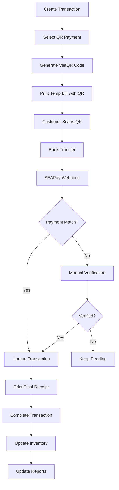

# POS MODULE - POINT OF SALE SYSTEM

## 1. BUSINESS OVERVIEW

### 1.1 Purpose
The POS module manages all point-of-sale transactions for the homestay, supporting both immediate payments and room charges for in-house guests, with integrated QR code payment and thermal printing capabilities.

### 1.2 Key Business Requirements
- **Dual Payment Mode**: Support immediate payment or charge to room (post-payment)
- **QR Code Integration**: Generate QR codes for bank transfer payments
- **Thermal Printing**: 80mm thermal printer support with customizable templates
- **Daily Reconciliation**: End-of-day cash register closing with detailed reports
- **Multi-payment Methods**: Cash, bank transfer, credit card, room charge

### 1.3 Transaction Types
- `immediate`: Direct payment at point of sale
- `room_charge`: Add to guest folio for later payment
- `temp_bill`: Pending QR payment confirmation
- `completed`: Finalized and printed
- `void`: Cancelled transaction

---

## 2. DATA STRUCTURE

### 2.1 Database Schema

```sql
-- POS transactions table
CREATE TABLE pos_transactions (
    id UUID PRIMARY KEY DEFAULT gen_random_uuid(),
    transaction_code VARCHAR(50) UNIQUE NOT NULL,
    transaction_type VARCHAR(20) NOT NULL,
    -- 'immediate', 'room_charge', 'temp_bill'
    
    -- Session information
    shift_id UUID REFERENCES pos_shifts(id),
    terminal_id VARCHAR(50),
    cashier_id UUID REFERENCES users(id) NOT NULL,
    
    -- Customer information
    customer_type VARCHAR(20) NOT NULL,
    -- 'walk_in', 'guest', 'staff', 'external'
    booking_id UUID REFERENCES bookings(id), -- If room charge
    customer_name VARCHAR(200),
    customer_phone VARCHAR(20),
    room_number VARCHAR(10), -- For quick reference
    
    -- Transaction amounts
    subtotal DECIMAL(12,2) NOT NULL,
    discount_amount DECIMAL(12,2) DEFAULT 0,
    discount_type VARCHAR(20), -- 'percentage', 'fixed', 'voucher'
    discount_reason TEXT,
    tax_rate DECIMAL(5,2) DEFAULT 10,
    tax_amount DECIMAL(12,2) DEFAULT 0,
    service_charge DECIMAL(12,2) DEFAULT 0,
    total_amount DECIMAL(12,2) NOT NULL,
    
    -- Payment information
    payment_status VARCHAR(20) DEFAULT 'pending',
    -- 'pending', 'partial', 'completed', 'void'
    payment_method VARCHAR(50),
    -- 'cash', 'bank_transfer', 'credit_card', 'room_charge', 'qr_code'
    
    -- QR payment tracking
    qr_code_id VARCHAR(50) UNIQUE,
    qr_code_url TEXT,
    qr_generated_at TIMESTAMP,
    qr_paid_at TIMESTAMP,
    
    -- Receipt information
    receipt_number VARCHAR(50) UNIQUE,
    receipt_printed BOOLEAN DEFAULT false,
    receipt_printed_at TIMESTAMP,
    receipt_print_count INTEGER DEFAULT 0,
    
    -- Status and timestamps
    status VARCHAR(20) DEFAULT 'active',
    -- 'active', 'completed', 'void', 'refunded'
    void_reason TEXT,
    void_by UUID REFERENCES users(id),
    void_at TIMESTAMP,
    
    created_at TIMESTAMP DEFAULT NOW(),
    completed_at TIMESTAMP,
    updated_at TIMESTAMP DEFAULT NOW()
);

-- POS transaction items
CREATE TABLE pos_transaction_items (
    id UUID PRIMARY KEY DEFAULT gen_random_uuid(),
    transaction_id UUID REFERENCES pos_transactions(id) ON DELETE CASCADE,
    
    -- Product information
    product_id UUID REFERENCES products(id),
    product_code VARCHAR(50),
    product_name VARCHAR(200) NOT NULL,
    category VARCHAR(100),
    
    -- Quantity and pricing
    quantity DECIMAL(10,2) NOT NULL,
    unit VARCHAR(20),
    unit_price DECIMAL(12,2) NOT NULL,
    discount_percent DECIMAL(5,2) DEFAULT 0,
    discount_amount DECIMAL(12,2) DEFAULT 0,
    tax_rate DECIMAL(5,2) DEFAULT 10,
    tax_amount DECIMAL(12,2) DEFAULT 0,
    total_amount DECIMAL(12,2) NOT NULL,
    
    -- Additional info
    notes TEXT,
    modifiers JSONB, -- For customizations
    sort_order INTEGER DEFAULT 0,
    
    created_at TIMESTAMP DEFAULT NOW()
);

-- POS payments table
CREATE TABLE pos_payments (
    id UUID PRIMARY KEY DEFAULT gen_random_uuid(),
    transaction_id UUID REFERENCES pos_transactions(id),
    payment_code VARCHAR(50) UNIQUE NOT NULL,
    
    -- Payment details
    payment_method VARCHAR(50) NOT NULL,
    amount DECIMAL(12,2) NOT NULL,
    
    -- Method-specific details
    payment_details JSONB,
    -- For cash: {"tendered": 100000, "change": 20000}
    -- For bank_transfer: {"reference": "TRX123", "bank": "VCB"}
    -- For credit_card: {"last_4": "1234", "card_type": "visa"}
    
    -- QR payment specific
    qr_payment_id UUID REFERENCES billing_qr_payments(id),
    bank_transaction_id VARCHAR(100),
    
    -- Status
    status VARCHAR(20) DEFAULT 'completed',
    -- 'pending', 'completed', 'failed', 'refunded'
    
    -- Metadata
    processed_by UUID REFERENCES users(id),
    processed_at TIMESTAMP DEFAULT NOW(),
    notes TEXT
);

-- POS shifts (work sessions)
CREATE TABLE pos_shifts (
    id UUID PRIMARY KEY DEFAULT gen_random_uuid(),
    shift_code VARCHAR(50) UNIQUE NOT NULL,
    terminal_id VARCHAR(50),
    
    -- Shift timing
    shift_date DATE NOT NULL,
    opened_at TIMESTAMP NOT NULL DEFAULT NOW(),
    closed_at TIMESTAMP,
    
    -- Staff information
    opened_by UUID REFERENCES users(id) NOT NULL,
    closed_by UUID REFERENCES users(id),
    
    -- Opening amounts
    opening_cash DECIMAL(12,2) DEFAULT 0,
    opening_notes TEXT,
    
    -- Closing amounts
    expected_cash DECIMAL(12,2),
    actual_cash DECIMAL(12,2),
    cash_difference DECIMAL(12,2) GENERATED ALWAYS AS 
        (actual_cash - expected_cash) STORED,
    
    -- Transaction summary
    total_sales DECIMAL(12,2) DEFAULT 0,
    total_refunds DECIMAL(12,2) DEFAULT 0,
    total_discounts DECIMAL(12,2) DEFAULT 0,
    total_tax DECIMAL(12,2) DEFAULT 0,
    net_sales DECIMAL(12,2) DEFAULT 0,
    
    -- Payment method breakdown
    cash_sales DECIMAL(12,2) DEFAULT 0,
    card_sales DECIMAL(12,2) DEFAULT 0,
    transfer_sales DECIMAL(12,2) DEFAULT 0,
    room_charge_sales DECIMAL(12,2) DEFAULT 0,
    
    -- Transaction counts
    transaction_count INTEGER DEFAULT 0,
    void_count INTEGER DEFAULT 0,
    refund_count INTEGER DEFAULT 0,
    
    -- Status
    status VARCHAR(20) DEFAULT 'open',
    -- 'open', 'closed', 'suspended', 'reconciled'
    
    -- Closing notes
    closing_notes TEXT,
    discrepancy_reason TEXT,
    
    created_at TIMESTAMP DEFAULT NOW(),
    updated_at TIMESTAMP DEFAULT NOW()
);

-- Receipt templates
CREATE TABLE pos_receipt_templates (
    id UUID PRIMARY KEY DEFAULT gen_random_uuid(),
    template_name VARCHAR(100) NOT NULL,
    template_type VARCHAR(20) NOT NULL,
    -- 'sale', 'refund', 'shift_report', 'qr_payment'
    
    -- Template sections (80mm thermal printer format)
    header_template TEXT NOT NULL,
    -- Company name, address, tax ID, phone
    body_template TEXT, -- Item listing format
    footer_template TEXT NOT NULL,
    -- Thank you message, return policy, signatures
    
    -- Formatting options
    formatting JSONB,
    -- {
    --   "width": 48,  // Characters per line for 80mm
    --   "font_size": "normal",
    --   "alignment": "center",
    --   "logo_enabled": true,
    --   "qr_code_position": "bottom"
    -- }
    
    -- Status
    is_active BOOLEAN DEFAULT true,
    is_default BOOLEAN DEFAULT false,
    
    created_at TIMESTAMP DEFAULT NOW(),
    updated_at TIMESTAMP DEFAULT NOW()
);

-- Product categories for POS
CREATE TABLE pos_categories (
    id UUID PRIMARY KEY DEFAULT gen_random_uuid(),
    category_name VARCHAR(100) NOT NULL,
    parent_id UUID REFERENCES pos_categories(id),
    
    -- Display settings
    display_order INTEGER DEFAULT 0,
    icon VARCHAR(50),
    color VARCHAR(7), -- Hex color
    
    -- Quick access
    is_featured BOOLEAN DEFAULT false,
    is_active BOOLEAN DEFAULT true,
    
    created_at TIMESTAMP DEFAULT NOW()
);

-- POS product modifiers (size, extras, etc.)
CREATE TABLE pos_product_modifiers (
    id UUID PRIMARY KEY DEFAULT gen_random_uuid(),
    product_id UUID REFERENCES products(id),
    
    modifier_group VARCHAR(100), -- 'Size', 'Temperature', 'Extras'
    modifier_name VARCHAR(100),  -- 'Large', 'Hot', 'Extra shot'
    price_adjustment DECIMAL(12,2) DEFAULT 0,
    
    is_default BOOLEAN DEFAULT false,
    is_required BOOLEAN DEFAULT false,
    
    sort_order INTEGER DEFAULT 0
);

-- Indexes for performance
CREATE INDEX idx_pos_transactions_shift ON pos_transactions(shift_id);
CREATE INDEX idx_pos_transactions_booking ON pos_transactions(booking_id);
CREATE INDEX idx_pos_transactions_date ON pos_transactions(created_at);
CREATE INDEX idx_pos_transactions_status ON pos_transactions(status);
CREATE INDEX idx_pos_transaction_items_transaction ON pos_transaction_items(transaction_id);
CREATE INDEX idx_pos_payments_transaction ON pos_payments(transaction_id);
CREATE INDEX idx_pos_shifts_date ON pos_shifts(shift_date);
CREATE INDEX idx_pos_shifts_status ON pos_shifts(status);
```

---

## 3. API ENDPOINTS

### 3.1 Transaction Management

#### `POST /api/pos/transactions/create`
**Description:** Create new POS transaction
```json
{
  "customer_type": "guest",
  "booking_id": "uuid", // Optional for room charge
  "room_number": "301",
  "items": [
    {
      "product_id": "uuid",
      "quantity": 2,
      "unit_price": 50000,
      "modifiers": [
        {"name": "Size", "value": "Large", "price": 10000}
      ]
    }
  ],
  "discount": {
    "type": "percentage",
    "value": 10,
    "reason": "Happy hour"
  }
}
```

**Response:**
```json
{
  "transaction_id": "uuid",
  "transaction_code": "POS-20240120-0001",
  "summary": {
    "subtotal": 120000,
    "discount": 12000,
    "tax": 10800,
    "total": 118800
  },
  "payment_options": [
    "cash",
    "bank_transfer",
    "qr_code",
    "room_charge"
  ]
}
```

#### `POST /api/pos/transactions/{id}/payment`
**Description:** Process payment for transaction
```json
{
  "payment_method": "qr_code",
  "customer_info": {
    "name": "John Doe",
    "phone": "0901234567"
  },
  "print_temp_bill": true
}
```

**Business Logic for QR Payment:**
```python
def process_qr_payment(transaction_id):
    transaction = get_transaction(transaction_id)
    
    # 1. Generate QR code for payment
    qr_data = {
        "amount": transaction.total_amount,
        "reference": transaction.transaction_code,
        "description": f"POS-{transaction.transaction_code}"
    }
    
    qr_result = generate_vietqr(qr_data)
    
    # 2. Update transaction with QR info
    transaction.qr_code_id = qr_result.qr_code_id
    transaction.qr_code_url = qr_result.qr_url
    transaction.payment_status = 'pending'
    transaction.transaction_type = 'temp_bill'
    
    # 3. Print temporary bill with QR code
    if print_temp_bill:
        print_temp_receipt(transaction)
    
    # 4. Start monitoring for payment
    start_payment_monitoring(transaction.qr_code_id)
    
    return {
        "status": "awaiting_payment",
        "qr_code_url": qr_result.qr_url,
        "monitor_endpoint": f"/api/pos/payment-status/{transaction.id}"
    }
```

#### `GET /api/pos/transactions/{id}/payment-status`
**Description:** Check QR payment status (polling endpoint)
```json
{
  "transaction_id": "uuid",
  "payment_status": "completed",
  "payment_received": {
    "amount": 118800,
    "received_at": "2024-01-20T10:15:30Z",
    "bank_reference": "VCB123456"
  },
  "action": "print_final_receipt"
}
```

#### `POST /api/pos/transactions/{id}/print-receipt`
**Description:** Print or reprint receipt
```json
{
  "receipt_type": "final", // or "temp", "duplicate"
  "printer_id": "FRONT_DESK_01",
  "include_qr": false
}
```

### 3.2 Shift Management

#### `POST /api/pos/shifts/open`
**Description:** Open new POS shift
```json
{
  "terminal_id": "POS_01",
  "opening_cash": 500000,
  "notes": "Starting shift with float"
}
```

**Response:**
```json
{
  "shift_id": "uuid",
  "shift_code": "SHIFT-20240120-001",
  "status": "open",
  "opened_at": "2024-01-20T08:00:00Z",
  "cashier": "John Smith"
}
```

#### `POST /api/pos/shifts/{id}/close`
**Description:** Close POS shift with reconciliation
```json
{
  "actual_cash": 2500000,
  "closing_notes": "All transactions reconciled",
  "cash_deposits": [
    {
      "amount": 2000000,
      "deposited_to": "safe",
      "reference": "DEP-001"
    }
  ]
}
```

**Response:**
```json
{
  "shift_summary": {
    "shift_code": "SHIFT-20240120-001",
    "duration": "8 hours 30 minutes",
    "total_transactions": 45,
    
    "sales_summary": {
      "gross_sales": 5000000,
      "discounts": 250000,
      "refunds": 100000,
      "net_sales": 4650000
    },
    
    "payment_breakdown": {
      "cash": {
        "amount": 2000000,
        "count": 20,
        "percentage": 43
      },
      "bank_transfer": {
        "amount": 1500000,
        "count": 15,
        "percentage": 32.3
      },
      "room_charge": {
        "amount": 1150000,
        "count": 10,
        "percentage": 24.7
      }
    },
    
    "cash_reconciliation": {
      "opening_cash": 500000,
      "cash_sales": 2000000,
      "cash_refunds": 0,
      "expected_cash": 2500000,
      "actual_cash": 2500000,
      "difference": 0,
      "status": "balanced"
    },
    
    "top_items": [
      {
        "product": "Coffee",
        "quantity": 25,
        "revenue": 625000
      }
    ]
  }
}
```

### 3.3 Receipt Template Management

#### `PUT /api/pos/receipt-templates/{id}`
**Description:** Update receipt template
```json
{
  "header_template": "{{company_name}}\n{{address}}\nTel: {{phone}}\nTax ID: {{tax_id}}\n{{separator}}",
  "footer_template": "{{separator}}\nThank you for your visit!\nPlease come again\n{{website}}\n{{qr_code}}",
  "formatting": {
    "width": 48,
    "font_size": "normal",
    "alignment": "center",
    "bold_headers": true,
    "separator_char": "-"
  }
}
```

### 3.4 Reporting

#### `GET /api/pos/reports/daily-summary`
**Description:** Get daily sales summary
```json
{
  "date": "2024-01-20",
  "summary": {
    "total_revenue": 15000000,
    "transaction_count": 125,
    "average_transaction": 120000,
    
    "by_hour": [
      {"hour": "08:00", "sales": 500000, "transactions": 5},
      {"hour": "09:00", "sales": 1200000, "transactions": 12}
    ],
    
    "by_category": {
      "Food": 8000000,
      "Beverages": 5000000,
      "Services": 2000000
    },
    
    "by_payment": {
      "cash": 6000000,
      "bank_transfer": 5000000,
      "room_charge": 4000000
    },
    
    "top_products": [
      {"name": "Breakfast Set", "quantity": 30, "revenue": 3000000}
    ],
    
    "shift_details": [
      {
        "shift": "Morning",
        "cashier": "John Smith",
        "sales": 7000000,
        "status": "balanced"
      }
    ]
  }
}
```

---

## 4. THERMAL PRINTER INTEGRATION

### 4.1 Receipt Format (80mm)

```python
class ThermalPrinterFormatter:
    def __init__(self):
        self.width = 48  # Characters for 80mm paper
        self.encoding = 'cp437'  # Standard thermal printer encoding
    
    def format_receipt(self, transaction, template):
        """Format receipt for 80mm thermal printer"""
        lines = []
        
        # Header
        lines.extend(self.format_header(transaction, template.header))
        
        # Transaction info
        lines.append(self.center_text("SALES RECEIPT"))
        lines.append(self.separator())
        lines.append(f"Date: {transaction.created_at}")
        lines.append(f"Receipt #: {transaction.receipt_number}")
        lines.append(f"Cashier: {transaction.cashier_name}")
        
        if transaction.room_number:
            lines.append(f"Room: {transaction.room_number}")
        
        lines.append(self.separator())
        
        # Items
        lines.append("Item                    Qty   Price    Total")
        lines.append(self.separator('-'))
        
        for item in transaction.items:
            lines.extend(self.format_item(item))
        
        lines.append(self.separator())
        
        # Totals
        lines.append(self.right_align(f"Subtotal: {transaction.subtotal}"))
        if transaction.discount_amount > 0:
            lines.append(self.right_align(f"Discount: -{transaction.discount}"))
        lines.append(self.right_align(f"Tax: {transaction.tax}"))
        lines.append(self.separator('='))
        lines.append(self.bold(self.right_align(f"TOTAL: {transaction.total}")))
        
        # Payment info
        lines.append(self.separator())
        if transaction.payment_method == 'cash':
            lines.append(f"Cash: {transaction.cash_tendered}")
            lines.append(f"Change: {transaction.change}")
        else:
            lines.append(f"Paid by: {transaction.payment_method}")
        
        # Footer
        lines.extend(self.format_footer(transaction, template.footer))
        
        # QR code for feedback or loyalty
        if template.include_qr:
            lines.append(self.generate_qr_command(transaction.feedback_url))
        
        return '\n'.join(lines)
    
    def format_qr_payment_receipt(self, transaction):
        """Special format for QR payment temporary bill"""
        lines = []
        
        lines.append(self.center_text("PAYMENT REQUEST"))
        lines.append(self.separator())
        lines.append(f"Amount: {self.bold(transaction.total_amount)}")
        lines.append(f"Ref: {transaction.transaction_code}")
        lines.append(self.separator())
        
        # QR code for payment
        lines.append(self.center_text("SCAN TO PAY"))
        lines.append(self.generate_qr_command(transaction.qr_code_url))
        
        lines.append(self.separator())
        lines.append(self.center_text("Bank Transfer Info:"))
        lines.append(f"Bank: Vietcombank")
        lines.append(f"Account: 1234567890")
        lines.append(f"Name: HOMESTAY ABC")
        lines.append(f"Content: {transaction.transaction_code}")
        
        return '\n'.join(lines)
```

### 4.2 Printer Commands

```python
class ESCPOSPrinter:
    """ESC/POS commands for thermal printer"""
    
    # Basic commands
    INIT = b'\x1b\x40'  # Initialize printer
    CUT = b'\x1d\x56\x00'  # Full cut
    PARTIAL_CUT = b'\x1d\x56\x01'  # Partial cut
    
    # Text formatting
    BOLD_ON = b'\x1b\x45\x01'
    BOLD_OFF = b'\x1b\x45\x00'
    UNDERLINE_ON = b'\x1b\x2d\x01'
    UNDERLINE_OFF = b'\x1b\x2d\x00'
    
    # Alignment
    ALIGN_LEFT = b'\x1b\x61\x00'
    ALIGN_CENTER = b'\x1b\x61\x01'
    ALIGN_RIGHT = b'\x1b\x61\x02'
    
    # Font size
    NORMAL_SIZE = b'\x1b\x21\x00'
    DOUBLE_WIDTH = b'\x1b\x21\x20'
    DOUBLE_HEIGHT = b'\x1b\x21\x10'
    DOUBLE_SIZE = b'\x1b\x21\x30'
    
    def print_receipt(self, receipt_text, printer_port):
        """Send formatted receipt to printer"""
        with serial.Serial(printer_port, 9600) as printer:
            printer.write(self.INIT)
            printer.write(receipt_text.encode('cp437'))
            printer.write(self.CUT)
    
    def print_qr_code(self, qr_data):
        """Print QR code on thermal printer"""
        # QR code commands (varies by printer model)
        qr_commands = [
            b'\x1d\x28\x6b\x03\x00\x31\x43\x08',  # QR size
            b'\x1d\x28\x6b\x03\x00\x31\x45\x30',  # Error correction
            b'\x1d\x28\x6b' + len(qr_data).to_bytes(2, 'little') + 
            b'\x31\x50\x30' + qr_data.encode(),    # Store QR data
            b'\x1d\x28\x6b\x03\x00\x31\x51\x30'   # Print QR
        ]
        return b''.join(qr_commands)
```

---

## 5. QR PAYMENT WORKFLOW

### 5.1 Payment Flow



### 5.2 QR Payment Monitoring

```python
class QRPaymentMonitor:
    def __init__(self):
        self.pending_payments = {}
        self.check_interval = 5  # seconds
    
    async def monitor_payment(self, transaction_id, qr_code_id):
        """Monitor QR payment status"""
        timeout = 300  # 5 minutes timeout
        start_time = time.time()
        
        while time.time() - start_time < timeout:
            # Check if payment received
            payment = await check_qr_payment_status(qr_code_id)
            
            if payment.status == 'completed':
                await self.complete_transaction(transaction_id, payment)
                return True
            
            await asyncio.sleep(self.check_interval)
        
        # Timeout - notify staff
        await self.notify_payment_timeout(transaction_id)
        return False
    
    async def complete_transaction(self, transaction_id, payment):
        """Complete transaction after payment received"""
        transaction = get_transaction(transaction_id)
        
        # Update transaction
        transaction.payment_status = 'completed'
        transaction.qr_paid_at = payment.received_at
        
        # Auto-print final receipt
        if transaction.auto_print:
            print_final_receipt(transaction)
        
        # Notify POS terminal
        await notify_pos_terminal(transaction.terminal_id, {
            'event': 'payment_received',
            'transaction_id': transaction_id,
            'amount': payment.amount
        })
```

---

## 6. SHIFT RECONCILIATION

### 6.1 End of Day Process

```python
class ShiftReconciliation:
    def close_shift(self, shift_id, actual_cash):
        shift = get_shift(shift_id)
        
        # Calculate expected amounts
        cash_transactions = self.get_cash_transactions(shift_id)
        
        expected = {
            'opening_cash': shift.opening_cash,
            'cash_sales': sum(t.amount for t in cash_transactions if t.type == 'sale'),
            'cash_refunds': sum(t.amount for t in cash_transactions if t.type == 'refund'),
            'cash_payouts': sum(t.amount for t in cash_transactions if t.type == 'payout')
        }
        
        expected['total'] = (expected['opening_cash'] + 
                            expected['cash_sales'] - 
                            expected['cash_refunds'] - 
                            expected['cash_payouts'])
        
        # Compare with actual
        difference = actual_cash - expected['total']
        
        # Generate report
        report = self.generate_shift_report(shift, expected, actual_cash, difference)
        
        # Update shift record
        shift.expected_cash = expected['total']
        shift.actual_cash = actual_cash
        shift.status = 'closed' if abs(difference) < 1000 else 'discrepancy'
        
        return report
```

### 6.2 Shift Report Format

```
================================
       SHIFT CLOSING REPORT
================================
Date: 2024-01-20
Shift: SHIFT-20240120-001
Cashier: John Smith
Duration: 08:00 - 16:30
================================

SALES SUMMARY
--------------------------------
Gross Sales:        5,000,000
Discounts:           -250,000
Refunds:             -100,000
--------------------------------
Net Sales:          4,650,000

PAYMENT BREAKDOWN
--------------------------------
Cash:               2,000,000 (20 trans)
Bank Transfer:      1,500,000 (15 trans)
Credit Card:          500,000 (5 trans)
Room Charge:          650,000 (5 trans)
--------------------------------
Total:              4,650,000

CASH RECONCILIATION
--------------------------------
Opening Cash:         500,000
Cash Sales:         2,000,000
Cash Refunds:               0
Expected Cash:      2,500,000
Actual Cash:        2,500,000
--------------------------------
Difference:                 0

TOP SELLING ITEMS
--------------------------------
1. Coffee           25x   625,000
2. Breakfast Set    15x 1,500,000
3. Sandwich         20x   600,000

VOID TRANSACTIONS: 2
REFUND TRANSACTIONS: 1

================================
Closed by: John Smith
Time: 16:35:20
Signature: _________________
================================
```

---

## 7. INTEGRATION POINTS

### 7.1 With Billing Module
- Create invoices for room charges
- Process QR payments through SEAPay
- Update guest folios

### 7.2 With Inventory Module
- Deduct stock on sales
- Track product movement
- Low stock alerts

### 7.3 With Room Management
- Validate room numbers for charges
- Check guest status
- Apply room-specific discounts

### 7.4 With Reporting Module
- Daily revenue reports
- Product performance analytics
- Payment method trends

---

## 8. USER INTERFACE

### 8.1 POS Terminal Screen

```typescript
interface POSInterface {
  // Main layout
  layout: {
    left_panel: 'category_grid',
    center_panel: 'product_grid',
    right_panel: 'cart_and_payment'
  };
  
  // Product selection
  product_grid: {
    columns: 4,
    rows: 5,
    quick_keys: true,
    search_bar: true,
    barcode_scanner: true
  };
  
  // Cart management
  cart: {
    editable_items: true,
    quick_modifiers: true,
    discount_button: true,
    void_item: true,
    notes_field: true
  };
  
  // Payment screen
  payment: {
    quick_amounts: [50000, 100000, 200000, 500000],
    payment_methods: ['cash', 'transfer', 'qr_code', 'room_charge'],
    split_payment: true,
    print_options: ['receipt', 'kitchen', 'both']
  };
  
  // Keyboard shortcuts
  shortcuts: {
    'F1': 'Open cash drawer',
    'F2': 'Search product',
    'F3': 'Apply discount',
    'F4': 'Room charge',
    'F5': 'Print last receipt',
    'F9': 'Void transaction',
    'F10': 'Close shift',
    'Enter': 'Process payment',
    'Esc': 'Cancel'
  };
}
```

### 8.2 Mobile POS Support

```typescript
interface MobilePOS {
  // Responsive design for tablets
  tablet_mode: {
    orientation: 'landscape_preferred',
    grid_size: 'adaptive',
    touch_optimized: true,
    gesture_support: true
  };
  
  // Offline capability
  offline_mode: {
    cache_products: true,
    queue_transactions: true,
    sync_on_reconnect: true,
    local_receipt_printing: true
  };
  
  // Hardware integration
  hardware: {
    barcode_scanner: 'bluetooth',
    receipt_printer: 'network',
    cash_drawer: 'usb_trigger'
  };
}
```

---

## 9. SECURITY & COMPLIANCE

### 9.1 Security Measures

```python
class POSSecurity:
    # Transaction integrity
    def verify_transaction(self, transaction):
        """Verify transaction hasn't been tampered"""
        checksum = self.calculate_checksum(transaction)
        return checksum == transaction.stored_checksum
    
    # Access control
    def check_permissions(self, user, action):
        permissions = {
            'void_transaction': ['manager', 'admin'],
            'apply_discount': ['cashier', 'manager', 'admin'],
            'close_shift': ['shift_supervisor', 'manager', 'admin'],
            'modify_receipt': ['manager', 'admin']
        }
        return user.role in permissions.get(action, [])
    
    # Audit trail
    def log_action(self, action, user, details):
        audit_log = {
            'timestamp': datetime.now(),
            'user_id': user.id,
            'action': action,
            'details': details,
            'ip_address': get_client_ip(),
            'terminal_id': get_terminal_id()
        }
        save_audit_log(audit_log)
```

### 9.2 Compliance Requirements

1. **Tax Compliance**
   - Sequential receipt numbering
   - VAT calculation and reporting
   - Electronic invoice format

2. **Financial Regulations**
   - Daily Z-reports
   - Transaction logs retention (7 years)
   - Anti-fraud measures

3. **Data Protection**
   - Encrypt sensitive payment data
   - PCI compliance for card payments
   - Customer data privacy

---

## 10. PERFORMANCE OPTIMIZATION

### 10.1 Speed Requirements

```yaml
performance_targets:
  product_search: < 100ms
  add_to_cart: < 50ms
  calculate_total: < 100ms
  process_payment: < 2s
  print_receipt: < 3s
  shift_report: < 5s
```

### 10.2 Optimization Strategies

1. **Caching**
   - Cache product catalog
   - Cache price calculations
   - Cache tax rates

2. **Database**
   - Index frequently searched fields
   - Optimize transaction queries
   - Archive old transactions

3. **Hardware**
   - Direct printer connection
   - Local product database
   - Redundant payment terminals