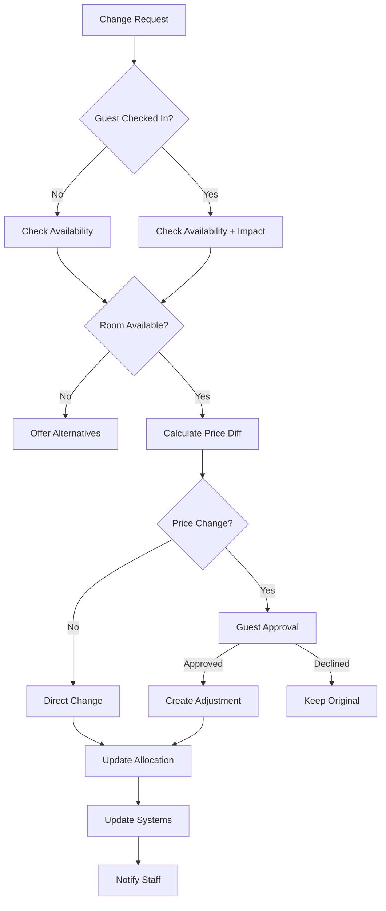

# ROOM ALLOCATION & MANAGEMENT MODULE

## 1. BUSINESS OVERVIEW

### 1.1 Purpose
The Room Allocation module manages the critical process of assigning physical rooms to confirmed bookings, ensuring optimal room utilization and guest satisfaction.

### 1.2 Key Business Requirements
- **Mandatory Room Assignment**: All confirmed bookings (with deposit or confirmation) must be assigned a specific room
- **Assignment Deadline**: Room must be assigned at least 1 hour before check-in time
- **Early Warning**: System alerts if booking not assigned 24 hours before check-in
- **Flexibility**: Allow room/room type changes with automatic price adjustments
- **Visual Management**: Monthly grid view showing room availability and status

### 1.3 Room Assignment Statuses
- `unassigned`: Booking confirmed but no room assigned
- `pre_assigned`: Room tentatively assigned (can be changed)
- `assigned`: Room firmly assigned (close to check-in)
- `locked`: Room assignment locked (guest checked in)

---

## 2. DATA STRUCTURE

### 2.1 Database Schema

```sql
-- Room allocation table
CREATE TABLE room_allocations (
    id UUID PRIMARY KEY DEFAULT gen_random_uuid(),
    booking_id UUID REFERENCES bookings(id) NOT NULL,
    room_id UUID REFERENCES rooms(id) NOT NULL,
    
    -- Assignment details
    assignment_type VARCHAR(20) NOT NULL,
    -- 'auto', 'manual', 'guest_request', 'upgrade', 'downgrade'
    assignment_status VARCHAR(20) NOT NULL,
    -- 'pre_assigned', 'assigned', 'locked'
    
    -- Date range for this allocation
    check_in_date DATE NOT NULL,
    check_out_date DATE NOT NULL,
    nights_count INTEGER GENERATED ALWAYS AS 
        (check_out_date - check_in_date) STORED,
    
    -- Price adjustments if room different from original booking
    original_room_type_id UUID REFERENCES room_types(id),
    original_rate DECIMAL(12,2),
    allocated_rate DECIMAL(12,2),
    rate_difference DECIMAL(12,2) GENERATED ALWAYS AS 
        (allocated_rate - original_rate) STORED,
    
    -- Assignment tracking
    assigned_at TIMESTAMP,
    assigned_by UUID REFERENCES users(id),
    assignment_reason TEXT,
    
    -- Change history
    previous_room_id UUID REFERENCES rooms(id),
    changed_at TIMESTAMP,
    changed_by UUID REFERENCES users(id),
    change_reason TEXT,
    
    -- Preferences and notes
    guest_preferences TEXT,
    internal_notes TEXT,
    
    -- Status flags
    is_vip BOOLEAN DEFAULT false,
    is_guaranteed BOOLEAN DEFAULT false, -- Cannot be moved
    requires_inspection BOOLEAN DEFAULT false,
    
    created_at TIMESTAMP DEFAULT NOW(),
    updated_at TIMESTAMP DEFAULT NOW(),
    
    -- Ensure no double booking
    EXCLUDE USING gist (
        room_id WITH =,
        daterange(check_in_date, check_out_date) WITH &&
    ) WHERE (assignment_status != 'cancelled')
);

-- Room allocation history
CREATE TABLE room_allocation_history (
    id UUID PRIMARY KEY DEFAULT gen_random_uuid(),
    allocation_id UUID REFERENCES room_allocations(id),
    booking_id UUID REFERENCES bookings(id),
    
    -- Change details
    action VARCHAR(20) NOT NULL,
    -- 'created', 'room_changed', 'date_changed', 'cancelled'
    
    -- Before and after states
    previous_room_id UUID REFERENCES rooms(id),
    new_room_id UUID REFERENCES rooms(id),
    previous_dates DATERANGE,
    new_dates DATERANGE,
    
    -- Price impact
    price_adjustment DECIMAL(12,2),
    
    -- Metadata
    changed_by UUID REFERENCES users(id),
    change_reason TEXT,
    changed_at TIMESTAMP DEFAULT NOW()
);

-- Room blocking (for maintenance, VIP, etc.)
CREATE TABLE room_blocks (
    id UUID PRIMARY KEY DEFAULT gen_random_uuid(),
    room_id UUID REFERENCES rooms(id),
    
    -- Block period
    start_date DATE NOT NULL,
    end_date DATE NOT NULL,
    
    -- Block details
    block_type VARCHAR(20) NOT NULL,
    -- 'maintenance', 'renovation', 'vip_hold', 'long_stay', 'staff'
    block_reason TEXT,
    
    -- Status
    is_active BOOLEAN DEFAULT true,
    can_override BOOLEAN DEFAULT false,
    override_level VARCHAR(20), -- 'manager', 'admin'
    
    -- Metadata
    created_by UUID REFERENCES users(id),
    created_at TIMESTAMP DEFAULT NOW(),
    released_at TIMESTAMP,
    released_by UUID REFERENCES users(id)
);

-- Allocation rules and preferences
CREATE TABLE allocation_rules (
    id UUID PRIMARY KEY DEFAULT gen_random_uuid(),
    rule_name VARCHAR(100) NOT NULL,
    rule_type VARCHAR(20) NOT NULL,
    -- 'room_type', 'floor', 'feature', 'guest_type'
    
    -- Conditions
    conditions JSONB NOT NULL,
    -- {
    --   "guest_type": "vip",
    --   "min_nights": 3,
    --   "booking_source": "direct"
    -- }
    
    -- Actions
    actions JSONB NOT NULL,
    -- {
    --   "preferred_floors": [2, 3],
    --   "required_features": ["sea_view", "balcony"],
    --   "avoid_rooms": ["101", "102"]
    -- }
    
    -- Priority and status
    priority INTEGER DEFAULT 0,
    is_active BOOLEAN DEFAULT true,
    
    created_at TIMESTAMP DEFAULT NOW()
);

-- Allocation alerts and notifications
CREATE TABLE allocation_alerts (
    id UUID PRIMARY KEY DEFAULT gen_random_uuid(),
    booking_id UUID REFERENCES bookings(id),
    alert_type VARCHAR(50) NOT NULL,
    -- 'unassigned_24h', 'unassigned_1h', 'conflict', 'upgrade_available'
    
    -- Alert details
    alert_message TEXT NOT NULL,
    severity VARCHAR(20) NOT NULL, -- 'info', 'warning', 'critical'
    
    -- Status
    is_resolved BOOLEAN DEFAULT false,
    resolved_at TIMESTAMP,
    resolved_by UUID REFERENCES users(id),
    resolution_notes TEXT,
    
    -- Notifications
    notified_users UUID[],
    notification_sent_at TIMESTAMP,
    
    created_at TIMESTAMP DEFAULT NOW()
);

-- Indexes for performance
CREATE INDEX idx_room_allocations_booking ON room_allocations(booking_id);
CREATE INDEX idx_room_allocations_room ON room_allocations(room_id);
CREATE INDEX idx_room_allocations_dates ON room_allocations(check_in_date, check_out_date);
CREATE INDEX idx_room_allocations_status ON room_allocations(assignment_status);
CREATE INDEX idx_room_blocks_room ON room_blocks(room_id);
CREATE INDEX idx_room_blocks_dates ON room_blocks(start_date, end_date);
CREATE INDEX idx_allocation_alerts_booking ON allocation_alerts(booking_id);
CREATE INDEX idx_allocation_alerts_unresolved ON allocation_alerts(is_resolved) 
    WHERE is_resolved = false;
```

---

## 3. API ENDPOINTS

### 3.1 Room Assignment Operations

#### `POST /api/allocations/assign-room`
**Description:** Assign a specific room to a booking
```json
{
  "booking_id": "uuid",
  "room_id": "uuid",
  "assignment_type": "manual",
  "assignment_reason": "Guest requested room 301",
  "is_guaranteed": false
}
```

**Business Logic:**
1. Verify booking is confirmed (has deposit or approved)
2. Check room availability for entire stay period
3. Calculate any rate differences if room type changed
4. Create allocation record
5. Update booking with room details
6. Clear any unassigned alerts
7. Log assignment history

**Response:**
```json
{
  "allocation_id": "uuid",
  "room_assigned": {
    "room_number": "301",
    "room_type": "Deluxe",
    "floor": 3
  },
  "price_adjustment": {
    "original_rate": 1500000,
    "new_rate": 1800000,
    "difference": 300000,
    "total_difference": 1500000 // for 5 nights
  },
  "status": "assigned"
}
```

#### `POST /api/allocations/auto-assign`
**Description:** Automatically assign rooms to unassigned bookings
```json
{
  "date_range": {
    "from": "2024-01-20",
    "to": "2024-01-25"
  },
  "assignment_strategy": "optimize_occupancy",
  // Options: 'optimize_occupancy', 'group_by_type', 'vip_first'
  "respect_preferences": true
}
```

**Business Logic:**
```python
def auto_assign_rooms(date_range, strategy):
    # 1. Get all unassigned bookings in date range
    unassigned = get_unassigned_bookings(date_range)
    
    # 2. Sort by priority
    if strategy == 'vip_first':
        unassigned.sort(key=lambda x: (x.is_vip, x.check_in_date))
    else:
        unassigned.sort(key=lambda x: x.check_in_date)
    
    # 3. For each booking, find best room
    assignments = []
    for booking in unassigned:
        available_rooms = find_available_rooms(
            booking.check_in_date,
            booking.check_out_date,
            booking.room_type_id
        )
        
        if respect_preferences:
            room = select_best_room(available_rooms, booking.preferences)
        else:
            room = available_rooms[0]
        
        if room:
            assignment = assign_room(booking, room)
            assignments.append(assignment)
    
    return assignments
```

#### `PUT /api/allocations/{id}/change-room`
**Description:** Change room assignment for a booking
```json
{
  "new_room_id": "uuid",
  "change_reason": "Guest requested quieter room",
  "apply_charges": true
}
```

**Business Logic:**
1. Verify booking not yet checked in (or get approval)
2. Check new room availability
3. Calculate price difference
4. If apply_charges, create adjustment invoice
5. Update allocation record
6. Log change in history
7. Notify relevant staff

#### `GET /api/allocations/monthly-grid`
**Description:** Get room allocation grid for a month
**Parameters:**
- `month`: 2024-01 (required)
- `room_types`: ["uuid1", "uuid2"] (optional)
- `floors`: [1, 2, 3] (optional)

**Response:**
```json
{
  "month": "2024-01",
  "days_in_month": 31,
  "rooms": [
    {
      "room_id": "uuid",
      "room_number": "101",
      "room_type": "Standard",
      "floor": 1,
      "daily_status": [
        {
          "date": "2024-01-01",
          "status": "occupied",
          "booking_id": "uuid",
          "guest_name": "John Doe",
          "is_arrival": true,
          "is_departure": false
        },
        {
          "date": "2024-01-02",
          "status": "occupied",
          "booking_id": "uuid",
          "guest_name": "John Doe",
          "is_arrival": false,
          "is_departure": false
        },
        {
          "date": "2024-01-03",
          "status": "available"
        },
        {
          "date": "2024-01-04",
          "status": "blocked",
          "block_reason": "maintenance"
        }
        // ... rest of month
      ]
    }
    // ... more rooms
  ],
  "summary": {
    "total_rooms": 20,
    "daily_occupancy": [
      {
        "date": "2024-01-01",
        "occupied": 15,
        "available": 3,
        "blocked": 2,
        "occupancy_rate": 75
      }
      // ... each day
    ]
  }
}
```

### 3.2 Alert Management

#### `GET /api/allocations/alerts/unassigned`
**Description:** Get all unassigned booking alerts
```json
{
  "alerts": [
    {
      "alert_id": "uuid",
      "booking_id": "uuid",
      "booking_code": "BK202401201234",
      "guest_name": "John Doe",
      "check_in_date": "2024-01-21",
      "check_in_time": "14:00",
      "hours_until_checkin": 18,
      "alert_level": "warning", // or "critical" if < 1 hour
      "room_type_requested": "Deluxe",
      "available_rooms": ["301", "302", "305"]
    }
  ],
  "summary": {
    "total_unassigned": 5,
    "critical": 1, // < 1 hour
    "warning": 2,  // < 24 hours
    "info": 2      // > 24 hours
  }
}
```

#### `POST /api/allocations/alerts/bulk-resolve`
**Description:** Bulk resolve alerts by auto-assigning rooms
```json
{
  "alert_ids": ["uuid1", "uuid2"],
  "action": "auto_assign",
  "notes": "Bulk assignment before check-in rush"
}
```

### 3.3 Room Blocking

#### `POST /api/allocations/blocks/create`
**Description:** Block room(s) for specific period
```json
{
  "room_ids": ["uuid1", "uuid2"],
  "date_range": {
    "start": "2024-01-25",
    "end": "2024-01-27"
  },
  "block_type": "maintenance",
  "reason": "Deep cleaning and AC repair",
  "can_override": false
}
```

#### `DELETE /api/allocations/blocks/{id}/release`
**Description:** Release room block
```json
{
  "release_reason": "Maintenance completed early"
}
```

### 3.4 Reporting & Analytics

#### `GET /api/allocations/reports/optimization`
**Description:** Room allocation optimization report
```json
{
  "period": {
    "from": "2024-01-01",
    "to": "2024-01-31"
  },
  "metrics": {
    "average_assignment_time": "48 hours before check-in",
    "auto_assignment_rate": 65,
    "manual_assignment_rate": 35,
    "room_change_rate": 8,
    "unassigned_alerts": 12,
    "late_assignments": 3 // < 1 hour before check-in
  },
  "room_utilization": {
    "most_used_rooms": [
      {"room": "201", "nights": 28, "utilization": 90.3}
    ],
    "least_used_rooms": [
      {"room": "105", "nights": 10, "utilization": 32.3}
    ]
  },
  "recommendations": [
    {
      "type": "maintenance",
      "message": "Room 105 has low utilization, consider scheduling maintenance"
    },
    {
      "type": "pricing",
      "message": "Rooms 301-305 have 95% utilization, consider price increase"
    }
  ]
}
```

---

## 4. BUSINESS WORKFLOWS

### 4.1 Room Assignment Timeline

```mermaid
graph LR
    A[Booking Created] --> B[Deposit Paid]
    B --> C[Status: Confirmed]
    C --> D{Auto-assign enabled?}
    D -->|Yes| E[Pre-assign Room]
    D -->|No| F[Wait for Manual]
    
    E --> G[T-24h Check]
    F --> G
    
    G -->|Unassigned| H[⚠️ Warning Alert]
    G -->|Assigned| I[Monitor]
    
    H --> J[Manual Assignment]
    
    I --> K[T-1h Check]
    J --> K
    
    K -->|Unassigned| L[🚨 Critical Alert]
    K -->|Assigned| M[Ready for Check-in]
    
    L --> N[Emergency Assignment]
    N --> M
    
    M --> O[Guest Check-in]
    O --> P[Room Locked]
```



### 4.2 Room Change Process



### 4.3 Alert Escalation Matrix

| Time Until Check-in | Alert Level | Actions | Notifications |
|-------------------|------------|---------|---------------|
| > 48 hours | Info | Display in dashboard | None |
| 24-48 hours | Info | Suggest assignment | Front Desk |
| 12-24 hours | Warning | Require assignment | Front Desk + Supervisor |
| 6-12 hours | Warning | Auto-assign prompt | All relevant staff |
| 1-6 hours | Critical | Force assignment | Manager + Front Desk |
| < 1 hour | Critical | Emergency protocol | All hands alert |

---

## 5. VISUAL MANAGEMENT

### 5.1 Monthly Grid View Components

```typescript
interface RoomGridView {
  // Visual indicators
  statusColors: {
    available: '#4CAF50',      // Green
    occupied: '#2196F3',       // Blue
    arriving: '#FF9800',       // Orange
    departing: '#9C27B0',      // Purple
    blocked: '#F44336',        // Red
    maintenance: '#795548',    // Brown
    pre_assigned: '#FFC107'    // Amber
  };
  
  // Cell information
  cellDisplay: {
    primary: 'guest_name' | 'booking_code' | 'status',
    secondary: 'nights_remaining' | 'room_rate',
    icons: {
      vip: '⭐',
      long_stay: '🏠',
      group: '👥',
      notes: '📝'
    }
  };
  
  // Interactive features
  interactions: {
    hover: 'Show full booking details',
    click: 'Open booking/allocation modal',
    drag_drop: 'Move booking to different room/date',
    right_click: 'Context menu with quick actions'
  };
}
```

### 5.2 Grid View Features

1. **Filters**
   - Room type
   - Floor
   - Status
   - Features (sea view, balcony, etc.)

2. **Quick Actions**
   - Assign room (drag & drop)
   - Change room
   - Block/unblock room
   - Add notes

3. **Visual Alerts**
   - Blinking for unassigned bookings
   - Red border for conflicts
   - Yellow highlight for pending actions

4. **Summary Statistics**
   - Daily occupancy rate
   - Available rooms by type
   - Upcoming arrivals/departures
   - Maintenance schedule

---

## 6. AUTOMATION RULES

### 6.1 Auto-Assignment Algorithm

```python
class RoomAutoAssignment:
    def __init__(self):
        self.rules = load_allocation_rules()
    
    def assign_room(self, booking):
        # 1. Get guest preferences
        preferences = self.extract_preferences(booking)
        
        # 2. Find available rooms
        available = self.get_available_rooms(
            booking.check_in,
            booking.check_out,
            booking.room_type_id
        )
        
        # 3. Score each room
        scored_rooms = []
        for room in available:
            score = self.calculate_room_score(room, booking, preferences)
            scored_rooms.append((room, score))
        
        # 4. Sort by score and select best
        scored_rooms.sort(key=lambda x: x[1], reverse=True)
        
        if scored_rooms:
            best_room = scored_rooms[0][0]
            return self.create_allocation(booking, best_room)
        
        return None
    
    def calculate_room_score(self, room, booking, preferences):
        score = 100  # Base score
        
        # Apply preference matching
        if preferences.get('floor') == room.floor:
            score += 20
        
        if preferences.get('quiet') and room.is_quiet_zone:
            score += 15
        
        if preferences.get('near_elevator') and room.near_elevator:
            score += 10
        
        # Apply business rules
        if booking.is_vip and room.is_premium:
            score += 30
        
        if booking.nights > 7 and room.is_corner_room:
            score += 15
        
        # Penalize frequently used rooms (distribute wear)
        usage_rate = self.get_room_usage_rate(room.id, days=30)
        if usage_rate > 0.8:
            score -= 20
        
        return score
```

### 6.2 Conflict Resolution

```python
def resolve_allocation_conflict(conflict):
    """
    Handle double-booking or resource conflicts
    """
    priority_rules = [
        ('is_vip', 100),
        ('nights_count', 10),  # Longer stays get priority
        ('booking_date', 5),   # Earlier bookings get priority
        ('is_direct', 20),     # Direct bookings over OTA
    ]
    
    # Calculate priority scores
    bookings = conflict['affected_bookings']
    for booking in bookings:
        booking.priority_score = calculate_priority(booking, priority_rules)
    
    # Sort by priority
    bookings.sort(key=lambda x: x.priority_score, reverse=True)
    
    # Keep highest priority, relocate others
    keep_booking = bookings[0]
    relocate_bookings = bookings[1:]
    
    for booking in relocate_bookings:
        alternative_room = find_alternative_room(booking)
        if alternative_room:
            reallocate_room(booking, alternative_room)
            notify_reallocation(booking)
```

---

## 7. INTEGRATION POINTS

### 7.1 With Booking Module
- Trigger pre-assignment on booking confirmation
- Update room allocation on booking modification
- Release room on booking cancellation

### 7.2 With Billing Module
- Calculate room change charges
- Apply upgrades/downgrades to invoices
- Track room-specific charges

### 7.3 With Housekeeping Module
- Update cleaning schedules based on allocations
- Priority cleaning for arriving guests
- Special preparation for VIP rooms

### 7.4 With Front Desk Operations
- Real-time room status for walk-ins
- Quick room changes during check-in
- Handle early arrivals/late departures

---

## 8. PERFORMANCE CONSIDERATIONS

### 8.1 Optimization Strategies

1. **Caching**
   - Cache monthly grid data (TTL: 5 minutes)
   - Cache available rooms per date
   - Pre-calculate occupancy rates

2. **Database Optimization**
   - Partial indexes for common queries
   - Materialized views for reports
   - Table partitioning by month

3. **Batch Operations**
   - Bulk assignment processing
   - Scheduled alert generation
   - Async notification sending

### 8.2 Scalability Metrics

```yaml
performance_targets:
  room_assignment: < 500ms
  grid_view_load: < 2s for 100 rooms
  availability_check: < 200ms
  bulk_assignment: < 10s for 50 bookings
  alert_generation: < 5s for 500 bookings
```

---

## 9. MONITORING & ALERTS

### 9.1 Key Metrics Dashboard

```javascript
const monitoringMetrics = {
  real_time: {
    unassigned_bookings: getCurrentUnassigned(),
    critical_alerts: getCriticalAlerts(),
    rooms_available_today: getAvailableRooms(),
    pending_arrivals: getTodayArrivals()
  },
  
  daily: {
    assignment_rate: getAssignmentRate(),
    average_lead_time: getAverageAssignmentLeadTime(),
    room_changes: getRoomChangeCount(),
    conflicts_resolved: getConflictCount()
  },
  
  alerts: {
    unassigned_threshold: 10,  // Alert if > 10 unassigned
    critical_threshold: 3,     // Page if > 3 critical
    conflict_threshold: 1      // Immediate attention
  }
};
```

### 9.2 Automated Actions

1. **Scheduled Jobs**
   - Every hour: Check for unassigned bookings
   - Every 4 hours: Run auto-assignment for next 48h
   - Daily at 10 AM: Send assignment summary report
   - Daily at 6 PM: Generate next-day arrival list

2. **Triggered Actions**
   - On booking confirmation → Pre-assign if rules match
   - On payment received → Upgrade to better room if available
   - On VIP flag → Assign premium room automatically
   - On group booking → Assign adjacent rooms

---

## 10. USER INTERFACE REQUIREMENTS

### 10.1 Room Grid Interface

```typescript
interface RoomGridUI {
  // Main grid component
  grid: {
    type: 'calendar_grid',
    rows: Room[],
    columns: Date[],
    cell_height: '40px',
    cell_width: '120px',
    scrollable: true,
    sticky_headers: true
  };
  
  // Drag and drop functionality
  dragDrop: {
    enabled: true,
    validation: 'real_time',
    preview: 'ghost_cell',
    restrictions: [
      'no_overlap',
      'same_room_type',
      'availability_check'
    ]
  };
  
  // Right-click context menu
  contextMenu: {
    items: [
      'View Booking',
      'Change Room',
      'Add Note',
      'Block Room',
      'Print Registration'
    ]
  };
  
  // Keyboard shortcuts
  shortcuts: {
    'Ctrl+A': 'Auto-assign all',
    'Ctrl+F': 'Find room',
    'Ctrl+B': 'Block selected',
    'Space': 'Toggle details',
    'Enter': 'Open booking'
  };
}
```

### 10.2 Mobile Responsiveness

For mobile devices, provide:
- Simplified list view instead of grid
- Swipe actions for common operations
- Touch-friendly interface elements
- Progressive disclosure of information
- Offline capability for viewing (not editing)