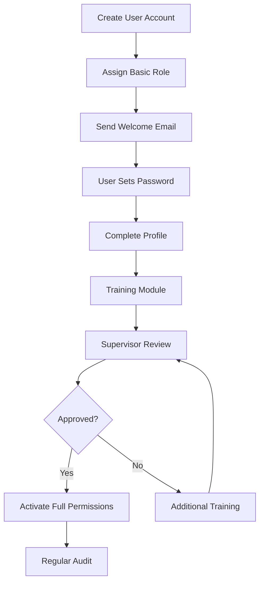

# USER MANAGEMENT & PERMISSION SYSTEM

## 1. OVERVIEW

### 1.1 Purpose
The User Management module provides comprehensive user administration and role-based access control (RBAC) for the homestay management system, ensuring secure access and proper authorization across all modules.

### 1.2 Key Features
- **User Lifecycle Management**: Create, update, block, delete users
- **Authentication & Security**: Password management, 2FA, session control
- **Role-Based Access Control**: Flexible permission system by screen and API
- **Audit Trail**: Complete logging of user actions and access
- **Multi-tenant Support**: User isolation by property/branch

### 1.3 Security Principles
- **Least Privilege**: Users get minimum required permissions
- **Separation of Duties**: Critical actions require multiple approvals
- **Defense in Depth**: Multiple security layers
- **Zero Trust**: Verify every request

---

## 2. DATABASE SCHEMA

### 2.1 Core User Tables

```sql
-- Users table
CREATE TABLE users (
    id UUID PRIMARY KEY DEFAULT gen_random_uuid(),
    username VARCHAR(50) UNIQUE NOT NULL,
    email VARCHAR(255) UNIQUE NOT NULL,
    phone VARCHAR(20) UNIQUE,
    
    -- Personal information
    full_name VARCHAR(200) NOT NULL,
    display_name VARCHAR(100),
    avatar_url TEXT,
    date_of_birth DATE,
    gender VARCHAR(10),
    
    -- Authentication
    password_hash VARCHAR(255) NOT NULL,
    password_salt VARCHAR(255) NOT NULL,
    password_updated_at TIMESTAMP,
    require_password_change BOOLEAN DEFAULT false,
    
    -- Multi-factor authentication
    mfa_enabled BOOLEAN DEFAULT false,
    mfa_secret VARCHAR(255),
    mfa_backup_codes TEXT[],
    
    -- Account status
    status VARCHAR(20) DEFAULT 'active',
    -- 'active', 'inactive', 'blocked', 'suspended', 'deleted'
    status_reason TEXT,
    
    -- Employment information
    employee_id VARCHAR(50) UNIQUE,
    department VARCHAR(100),
    position VARCHAR(100),
    hire_date DATE,
    
    -- Access control
    is_super_admin BOOLEAN DEFAULT false,
    can_access_all_properties BOOLEAN DEFAULT false,
    default_property_id UUID REFERENCES properties(id),
    
    -- Session management
    last_login_at TIMESTAMP,
    last_login_ip INET,
    last_activity_at TIMESTAMP,
    login_attempts INTEGER DEFAULT 0,
    locked_until TIMESTAMP,
    
    -- Metadata
    created_by UUID REFERENCES users(id),
    created_at TIMESTAMP DEFAULT NOW(),
    updated_by UUID REFERENCES users(id),
    updated_at TIMESTAMP DEFAULT NOW(),
    deleted_at TIMESTAMP,
    
    -- Indexes
    CHECK (email ~* '^[A-Za-z0-9._%+-]+@[A-Za-z0-9.-]+\.[A-Z|a-z]{2,}$')
);

-- Roles table
CREATE TABLE roles (
    id UUID PRIMARY KEY DEFAULT gen_random_uuid(),
    role_code VARCHAR(50) UNIQUE NOT NULL,
    role_name VARCHAR(100) NOT NULL,
    description TEXT,
    
    -- Role hierarchy
    parent_role_id UUID REFERENCES roles(id),
    level INTEGER DEFAULT 0,
    
    -- Role type
    role_type VARCHAR(20) DEFAULT 'custom',
    -- 'system', 'predefined', 'custom'
    
    -- Status
    is_active BOOLEAN DEFAULT true,
    is_system BOOLEAN DEFAULT false, -- Cannot be modified/deleted
    
    -- Metadata
    created_at TIMESTAMP DEFAULT NOW(),
    updated_at TIMESTAMP DEFAULT NOW()
);

-- User roles assignment
CREATE TABLE user_roles (
    id UUID PRIMARY KEY DEFAULT gen_random_uuid(),
    user_id UUID REFERENCES users(id) ON DELETE CASCADE,
    role_id UUID REFERENCES roles(id) ON DELETE CASCADE,
    
    -- Assignment scope
    property_id UUID REFERENCES properties(id),
    department VARCHAR(100),
    
    -- Validity period
    valid_from DATE DEFAULT CURRENT_DATE,
    valid_to DATE,
    
    -- Assignment details
    assigned_by UUID REFERENCES users(id),
    assigned_at TIMESTAMP DEFAULT NOW(),
    assignment_reason TEXT,
    
    -- Status
    is_active BOOLEAN DEFAULT true,
    
    UNIQUE(user_id, role_id, property_id)
);

-- Permissions table
CREATE TABLE permissions (
    id UUID PRIMARY KEY DEFAULT gen_random_uuid(),
    permission_code VARCHAR(100) UNIQUE NOT NULL,
    permission_name VARCHAR(200) NOT NULL,
    description TEXT,
    
    -- Permission categorization
    module VARCHAR(50) NOT NULL,
    -- 'booking', 'billing', 'room', 'pos', 'inventory', 'report', 'admin'
    resource VARCHAR(100) NOT NULL,
    -- 'bookings', 'invoices', 'rooms', 'products', 'users', etc.
    action VARCHAR(50) NOT NULL,
    -- 'create', 'read', 'update', 'delete', 'approve', 'void', 'export'
    
    -- Permission type
    permission_type VARCHAR(20) DEFAULT 'api',
    -- 'api', 'screen', 'feature', 'data'
    
    -- UI mapping
    screen_id VARCHAR(100), -- Frontend screen/component ID
    api_endpoint VARCHAR(255), -- Backend API endpoint
    
    -- Risk level
    risk_level VARCHAR(20) DEFAULT 'low',
    -- 'low', 'medium', 'high', 'critical'
    
    -- Status
    is_active BOOLEAN DEFAULT true,
    
    created_at TIMESTAMP DEFAULT NOW()
);

-- Role permissions mapping
CREATE TABLE role_permissions (
    id UUID PRIMARY KEY DEFAULT gen_random_uuid(),
    role_id UUID REFERENCES roles(id) ON DELETE CASCADE,
    permission_id UUID REFERENCES permissions(id) ON DELETE CASCADE,
    
    -- Permission modifiers
    can_grant BOOLEAN DEFAULT false, -- Can grant this permission to others
    has_approval_limit BOOLEAN DEFAULT false,
    approval_limit DECIMAL(12,2),
    
    -- Conditions
    conditions JSONB,
    -- {
    --   "time_restriction": {"from": "08:00", "to": "18:00"},
    --   "ip_whitelist": ["192.168.1.0/24"],
    --   "require_approval": true,
    --   "max_daily_operations": 100
    -- }
    
    created_at TIMESTAMP DEFAULT NOW(),
    
    UNIQUE(role_id, permission_id)
);

-- User direct permissions (override role permissions)
CREATE TABLE user_permissions (
    id UUID PRIMARY KEY DEFAULT gen_random_uuid(),
    user_id UUID REFERENCES users(id) ON DELETE CASCADE,
    permission_id UUID REFERENCES permissions(id) ON DELETE CASCADE,
    
    -- Permission grant type
    grant_type VARCHAR(20) DEFAULT 'allow',
    -- 'allow', 'deny' (deny takes precedence)
    
    -- Temporary permission
    valid_from TIMESTAMP DEFAULT NOW(),
    valid_to TIMESTAMP,
    
    -- Grant details
    granted_by UUID REFERENCES users(id),
    granted_at TIMESTAMP DEFAULT NOW(),
    grant_reason TEXT,
    
    UNIQUE(user_id, permission_id)
);

-- User sessions
CREATE TABLE user_sessions (
    id UUID PRIMARY KEY DEFAULT gen_random_uuid(),
    user_id UUID REFERENCES users(id) ON DELETE CASCADE,
    
    -- Session details
    session_token VARCHAR(255) UNIQUE NOT NULL,
    refresh_token VARCHAR(255) UNIQUE,
    
    -- Device information
    device_id VARCHAR(100),
    device_type VARCHAR(50),
    device_name VARCHAR(100),
    browser VARCHAR(100),
    os VARCHAR(100),
    
    -- Network information
    ip_address INET,
    user_agent TEXT,
    
    -- Session validity
    created_at TIMESTAMP DEFAULT NOW(),
    expires_at TIMESTAMP NOT NULL,
    last_activity_at TIMESTAMP DEFAULT NOW(),
    
    -- Session status
    is_active BOOLEAN DEFAULT true,
    revoked_at TIMESTAMP,
    revoked_by UUID REFERENCES users(id),
    revoke_reason VARCHAR(100)
);

-- Password history
CREATE TABLE password_history (
    id UUID PRIMARY KEY DEFAULT gen_random_uuid(),
    user_id UUID REFERENCES users(id) ON DELETE CASCADE,
    password_hash VARCHAR(255) NOT NULL,
    
    created_at TIMESTAMP DEFAULT NOW(),
    
    -- Prevent password reuse
    CHECK (created_at > NOW() - INTERVAL '1 year')
);

-- User activity logs
CREATE TABLE user_activity_logs (
    id UUID PRIMARY KEY DEFAULT gen_random_uuid(),
    user_id UUID REFERENCES users(id),
    
    -- Activity details
    activity_type VARCHAR(50) NOT NULL,
    -- 'login', 'logout', 'password_change', 'permission_change', 'data_access', 'data_modify'
    activity_description TEXT,
    
    -- Context
    module VARCHAR(50),
    resource VARCHAR(100),
    resource_id UUID,
    action VARCHAR(50),
    
    -- Request details
    ip_address INET,
    user_agent TEXT,
    request_method VARCHAR(10),
    request_path VARCHAR(255),
    request_body JSONB,
    response_status INTEGER,
    
    -- Result
    success BOOLEAN DEFAULT true,
    error_message TEXT,
    
    -- Metadata
    created_at TIMESTAMP DEFAULT NOW(),
    
    -- Partitioning by month for performance
    PRIMARY KEY (id, created_at)
) PARTITION BY RANGE (created_at);

-- Create monthly partitions for activity logs
CREATE TABLE user_activity_logs_2024_01 PARTITION OF user_activity_logs
    FOR VALUES FROM ('2024-01-01') TO ('2024-02-01');

-- Indexes for performance
CREATE INDEX idx_users_status ON users(status);
CREATE INDEX idx_users_email ON users(email);
CREATE INDEX idx_user_roles_user ON user_roles(user_id);
CREATE INDEX idx_user_roles_role ON user_roles(role_id);
CREATE INDEX idx_role_permissions_role ON role_permissions(role_id);
CREATE INDEX idx_user_permissions_user ON user_permissions(user_id);
CREATE INDEX idx_user_sessions_token ON user_sessions(session_token);
CREATE INDEX idx_user_sessions_user ON user_sessions(user_id);
CREATE INDEX idx_activity_logs_user ON user_activity_logs(user_id);
CREATE INDEX idx_activity_logs_created ON user_activity_logs(created_at);
```

---

## 3. API ENDPOINTS

### 3.1 User Management

#### `POST /api/users/create`
**Description:** Create new user account
**Required Permission:** `admin.users.create`
```json
{
  "username": "john.smith",
  "email": "john.smith@homestay.com",
  "full_name": "John Smith",
  "phone": "0901234567",
  "employee_id": "EMP001",
  "department": "Front Desk",
  "position": "Receptionist",
  "roles": [
    {
      "role_id": "uuid",
      "property_id": "uuid"
    }
  ],
  "temporary_password": "Welcome123!",
  "require_password_change": true,
  "send_welcome_email": true
}
```

**Business Logic:**
```python
def create_user(user_data):
    # 1. Validate input
    validate_email(user_data.email)
    validate_phone(user_data.phone)
    validate_username(user_data.username)
    
    # 2. Check uniqueness
    if user_exists(email=user_data.email):
        raise ValidationError("Email already registered")
    
    # 3. Generate secure password
    if user_data.temporary_password:
        password = user_data.temporary_password
    else:
        password = generate_secure_password()
    
    password_hash, salt = hash_password(password)
    
    # 4. Create user record
    user = User.create(
        **user_data,
        password_hash=password_hash,
        password_salt=salt,
        status='active',
        require_password_change=True
    )
    
    # 5. Assign roles
    for role_assignment in user_data.roles:
        assign_role(user.id, role_assignment)
    
    # 6. Send welcome email
    if user_data.send_welcome_email:
        send_welcome_email(user, password)
    
    # 7. Log activity
    log_activity('user_created', user.id, created_by=current_user)
    
    return user
```

#### `PUT /api/users/{id}/update`
**Description:** Update user information
**Required Permission:** `admin.users.update`
```json
{
  "full_name": "John Smith Jr.",
  "phone": "0909876543",
  "department": "Management",
  "position": "Supervisor",
  "avatar_url": "https://..."
}
```

#### `POST /api/users/{id}/block`
**Description:** Block user account
**Required Permission:** `admin.users.block`
```json
{
  "reason": "Security violation - multiple failed login attempts",
  "duration_hours": 24,
  "notify_user": true
}
```

**Business Logic:**
```python
def block_user(user_id, reason, duration_hours=None):
    user = get_user(user_id)
    
    # 1. Update user status
    user.status = 'blocked'
    user.status_reason = reason
    
    if duration_hours:
        user.locked_until = datetime.now() + timedelta(hours=duration_hours)
    
    # 2. Revoke all active sessions
    revoke_all_sessions(user_id, reason="User blocked")
    
    # 3. Send notification
    notify_user_blocked(user, reason)
    
    # 4. Log activity
    log_security_event('user_blocked', user_id, reason)
    
    return user
```

#### `POST /api/users/{id}/reset-password`
**Description:** Reset user password
**Required Permission:** `admin.users.reset_password`
```json
{
  "method": "admin_reset", // or "email_link", "temporary"
  "new_password": "TempPass123!",
  "require_change": true,
  "notify_user": true
}
```

#### `DELETE /api/users/{id}`
**Description:** Soft delete user account
**Required Permission:** `admin.users.delete`
```json
{
  "reassign_data_to": "uuid", // Transfer ownership of data
  "confirmation": "DELETE_USER_john.smith"
}
```

### 3.2 Role Management

#### `POST /api/roles/create`
**Description:** Create new role
**Required Permission:** `admin.roles.create`
```json
{
  "role_code": "FRONT_DESK_MANAGER",
  "role_name": "Front Desk Manager",
  "description": "Manages front desk operations",
  "parent_role_id": "uuid", // Inherit permissions from parent
  "permissions": [
    {
      "permission_id": "uuid",
      "conditions": {
        "time_restriction": {
          "from": "06:00",
          "to": "22:00"
        }
      }
    }
  ]
}
```

#### `GET /api/roles/{id}/permissions`
**Description:** Get all permissions for a role
**Response:**
```json
{
  "role": {
    "id": "uuid",
    "role_name": "Front Desk Manager"
  },
  "permissions": {
    "booking": {
      "screen_access": [
        {
          "screen": "booking_calendar",
          "actions": ["view", "create", "edit"]
        },
        {
          "screen": "booking_management",
          "actions": ["view", "create", "edit", "cancel"]
        }
      ],
      "api_access": [
        {
          "endpoint": "/api/bookings",
          "methods": ["GET", "POST", "PUT"]
        },
        {
          "endpoint": "/api/bookings/*/check-in",
          "methods": ["POST"]
        }
      ]
    },
    "billing": {
      "screen_access": [
        {
          "screen": "invoice_list",
          "actions": ["view"]
        }
      ],
      "api_access": [
        {
          "endpoint": "/api/invoices",
          "methods": ["GET"]
        }
      ]
    }
  }
}
```

### 3.3 Permission Assignment

#### `POST /api/users/{id}/assign-role`
**Description:** Assign role to user
**Required Permission:** `admin.users.assign_role`
```json
{
  "role_id": "uuid",
  "property_id": "uuid",
  "valid_from": "2024-01-01",
  "valid_to": "2024-12-31",
  "reason": "Promotion to supervisor"
}
```

#### `POST /api/users/{id}/grant-permission`
**Description:** Grant direct permission to user
**Required Permission:** `admin.users.grant_permission`
```json
{
  "permission_id": "uuid",
  "grant_type": "allow", // or "deny"
  "valid_from": "2024-01-01T08:00:00Z",
  "valid_to": "2024-01-07T18:00:00Z",
  "reason": "Temporary access for audit period"
}
```

### 3.4 Authentication & Session

#### `POST /api/auth/login`
**Description:** User login
```json
{
  "username": "john.smith", // or email
  "password": "password123",
  "device_id": "device-uuid",
  "remember_me": true
}
```

**Business Logic:**
```python
def login(credentials):
    # 1. Find user
    user = find_user(credentials.username)
    if not user:
        log_failed_login(credentials.username)
        return error("Invalid credentials")
    
    # 2. Check account status
    if user.status == 'blocked':
        return error("Account blocked")
    
    if user.locked_until and user.locked_until > now():
        return error(f"Account locked until {user.locked_until}")
    
    # 3. Verify password
    if not verify_password(credentials.password, user.password_hash):
        user.login_attempts += 1
        if user.login_attempts >= MAX_LOGIN_ATTEMPTS:
            block_user(user.id, "Too many failed attempts", 1)
        return error("Invalid credentials")
    
    # 4. Check MFA if enabled
    if user.mfa_enabled:
        return {
            "status": "mfa_required",
            "mfa_token": generate_mfa_token(user.id)
        }
    
    # 5. Create session
    session = create_session(user, credentials.device_id)
    
    # 6. Update user
    user.last_login_at = now()
    user.last_login_ip = get_client_ip()
    user.login_attempts = 0
    
    # 7. Load permissions
    permissions = load_user_permissions(user.id)
    
    return {
        "user": user,
        "session_token": session.token,
        "refresh_token": session.refresh_token,
        "permissions": permissions
    }
```

#### `POST /api/auth/logout`
**Description:** User logout
```json
{
  "session_token": "token",
  "logout_all_devices": false
}
```

#### `POST /api/auth/refresh`
**Description:** Refresh session token
```json
{
  "refresh_token": "refresh_token"
}
```

### 3.5 User Activity & Audit

#### `GET /api/users/{id}/activity-log`
**Description:** Get user activity history
**Required Permission:** `admin.users.view_activity`
```json
{
  "activities": [
    {
      "timestamp": "2024-01-20T10:15:30Z",
      "activity_type": "login",
      "ip_address": "192.168.1.100",
      "device": "Chrome on Windows",
      "success": true
    },
    {
      "timestamp": "2024-01-20T10:16:00Z",
      "activity_type": "data_access",
      "module": "booking",
      "action": "view",
      "resource": "booking/BK202401201234",
      "success": true
    }
  ]
}
```

---

## 4. PERMISSION SYSTEM

### 4.1 Permission Structure

```typescript
interface PermissionStructure {
  // Module-based permissions
  modules: {
    booking: {
      screens: ['calendar', 'management', 'reports'],
      actions: ['view', 'create', 'edit', 'delete', 'approve'],
      data_access: ['all', 'own', 'department', 'property']
    },
    billing: {
      screens: ['invoices', 'payments', 'reports'],
      actions: ['view', 'create', 'edit', 'void', 'refund'],
      approval_limits: {
        discount: 1000000,
        refund: 500000
      }
    },
    pos: {
      screens: ['terminal', 'shifts', 'reports'],
      actions: ['sale', 'void', 'discount', 'close_shift'],
      restrictions: {
        max_discount_percent: 20,
        void_time_limit: 30 // minutes
      }
    }
  };
  
  // API endpoint permissions
  api_permissions: {
    pattern: '/api/module/resource/action',
    methods: ['GET', 'POST', 'PUT', 'DELETE'],
    conditions: ['time', 'ip', 'property']
  };
}
```

### 4.2 Predefined Roles

```sql
-- Insert predefined roles
INSERT INTO roles (role_code, role_name, description, role_type, is_system) VALUES
('SUPER_ADMIN', 'Super Administrator', 'Full system access', 'system', true),
('PROPERTY_MANAGER', 'Property Manager', 'Manage entire property', 'predefined', false),
('FRONT_DESK_SUPERVISOR', 'Front Desk Supervisor', 'Supervise front desk', 'predefined', false),
('RECEPTIONIST', 'Receptionist', 'Handle check-in/out', 'predefined', false),
('CASHIER', 'Cashier', 'Handle POS transactions', 'predefined', false),
('HOUSEKEEPER', 'Housekeeper', 'Room cleaning management', 'predefined', false),
('ACCOUNTANT', 'Accountant', 'Financial management', 'predefined', false),
('AUDITOR', 'Auditor', 'Read-only access to all', 'predefined', false);
```

### 4.3 Permission Matrix

| Role | Booking | Billing | POS | Room | Inventory | Reports | Admin |
|------|---------|---------|-----|------|-----------|---------|-------|
| Super Admin | Full | Full | Full | Full | Full | Full | Full |
| Property Manager | Full | Full | Full | Full | Full | Full | Limited |
| Front Desk Supervisor | Full | View/Edit | No | Full | View | View | No |
| Receptionist | Create/Edit | View | No | View/Assign | No | Limited | No |
| Cashier | View | Create | Full | No | View | POS Only | No |
| Accountant | View | Full | View | No | View | Full | No |
| Auditor | View | View | View | View | View | View | No |

### 4.4 Screen-Level Permissions

```javascript
// Frontend permission check
const ScreenPermissions = {
  // Booking module screens
  'booking.calendar': {
    view: ['RECEPTIONIST', 'SUPERVISOR', 'MANAGER'],
    create: ['RECEPTIONIST', 'SUPERVISOR', 'MANAGER'],
    edit: ['SUPERVISOR', 'MANAGER'],
    delete: ['MANAGER']
  },
  
  'booking.check_in': {
    view: ['RECEPTIONIST', 'SUPERVISOR', 'MANAGER'],
    process: ['RECEPTIONIST', 'SUPERVISOR', 'MANAGER']
  },
  
  // Billing module screens
  'billing.invoices': {
    view: ['RECEPTIONIST', 'ACCOUNTANT', 'MANAGER'],
    create: ['ACCOUNTANT', 'MANAGER'],
    edit: ['ACCOUNTANT', 'MANAGER'],
    void: ['MANAGER']
  },
  
  // POS module screens
  'pos.terminal': {
    view: ['CASHIER', 'SUPERVISOR', 'MANAGER'],
    sale: ['CASHIER', 'SUPERVISOR', 'MANAGER'],
    void: ['SUPERVISOR', 'MANAGER'],
    discount: ['CASHIER', 'SUPERVISOR', 'MANAGER']
  },
  
  // Admin screens
  'admin.users': {
    view: ['MANAGER', 'SUPER_ADMIN'],
    create: ['SUPER_ADMIN'],
    edit: ['SUPER_ADMIN'],
    delete: ['SUPER_ADMIN']
  }
};
```

### 4.5 API-Level Permissions

```python
# Backend permission decorator
def require_permission(permission_code, data_scope='all'):
    def decorator(func):
        def wrapper(request, *args, **kwargs):
            user = request.user
            
            # Check if user has permission
            if not has_permission(user, permission_code):
                return forbidden("Insufficient permissions")
            
            # Check data scope
            if data_scope == 'own':
                # Filter to user's own data
                kwargs['user_filter'] = user.id
            elif data_scope == 'department':
                # Filter to department data
                kwargs['department_filter'] = user.department
            elif data_scope == 'property':
                # Filter to property data
                kwargs['property_filter'] = user.property_id
            
            # Log access
            log_api_access(user, permission_code, request)
            
            return func(request, *args, **kwargs)
        return wrapper
    return decorator

# Usage example
@require_permission('booking.view', data_scope='property')
def get_bookings(request, property_filter=None):
    return Booking.filter(property_id=property_filter)
```

---

## 5. SECURITY FEATURES

### 5.1 Password Policy

```python
class PasswordPolicy:
    MIN_LENGTH = 8
    MAX_LENGTH = 128
    REQUIRE_UPPERCASE = True
    REQUIRE_LOWERCASE = True
    REQUIRE_DIGIT = True
    REQUIRE_SPECIAL = True
    SPECIAL_CHARS = "!@#$%^&*()_+-=[]{}|;:,.<>?"
    
    # Password expiry
    EXPIRY_DAYS = 90
    WARNING_DAYS = 7
    
    # Password history
    HISTORY_COUNT = 5  # Cannot reuse last 5 passwords
    
    def validate(self, password, user=None):
        errors = []
        
        if len(password) < self.MIN_LENGTH:
            errors.append(f"Minimum {self.MIN_LENGTH} characters")
        
        if self.REQUIRE_UPPERCASE and not any(c.isupper() for c in password):
            errors.append("At least one uppercase letter")
        
        if self.REQUIRE_LOWERCASE and not any(c.islower() for c in password):
            errors.append("At least one lowercase letter")
        
        if self.REQUIRE_DIGIT and not any(c.isdigit() for c in password):
            errors.append("At least one digit")
        
        if self.REQUIRE_SPECIAL and not any(c in self.SPECIAL_CHARS for c in password):
            errors.append("At least one special character")
        
        # Check password history
        if user and self.is_password_reused(user.id, password):
            errors.append("Cannot reuse recent passwords")
        
        # Check common passwords
        if self.is_common_password(password):
            errors.append("Password is too common")
        
        return errors
```

### 5.2 Multi-Factor Authentication (MFA)

```python
class MFAService:
    def enable_mfa(self, user_id):
        """Enable MFA for user"""
        user = get_user(user_id)
        
        # Generate secret
        secret = pyotp.random_base32()
        user.mfa_secret = encrypt(secret)
        
        # Generate backup codes
        backup_codes = [generate_code() for _ in range(10)]
        user.mfa_backup_codes = encrypt_list(backup_codes)
        
        # Generate QR code
        totp_uri = pyotp.totp.TOTP(secret).provisioning_uri(
            name=user.email,
            issuer_name='Homestay System'
        )
        
        qr_code = generate_qr_code(totp_uri)
        
        return {
            'secret': secret,
            'qr_code': qr_code,
            'backup_codes': backup_codes
        }
    
    def verify_mfa(self, user_id, code):
        """Verify MFA code"""
        user = get_user(user_id)
        
        if not user.mfa_enabled:
            return False
        
        # Check TOTP code
        secret = decrypt(user.mfa_secret)
        totp = pyotp.TOTP(secret)
        
        if totp.verify(code, valid_window=1):
            return True
        
        # Check backup codes
        if code in decrypt_list(user.mfa_backup_codes):
            # Remove used backup code
            remove_backup_code(user, code)
            return True
        
        return False
```

### 5.3 Session Management

```python
class SessionManager:
    SESSION_TIMEOUT = 30  # minutes
    MAX_CONCURRENT_SESSIONS = 3
    
    def create_session(self, user, device_info):
        # Check concurrent sessions
        active_sessions = get_active_sessions(user.id)
        
        if len(active_sessions) >= self.MAX_CONCURRENT_SESSIONS:
            # Revoke oldest session
            revoke_session(active_sessions[0].id)
        
        # Create new session
        session = {
            'user_id': user.id,
            'session_token': generate_token(),
            'refresh_token': generate_token(),
            'device_id': device_info.get('device_id'),
            'expires_at': datetime.now() + timedelta(minutes=self.SESSION_TIMEOUT),
            'ip_address': get_client_ip(),
            'user_agent': device_info.get('user_agent')
        }
        
        save_session(session)
        return session
    
    def validate_session(self, session_token):
        session = get_session(session_token)
        
        if not session or not session.is_active:
            return None
        
        if session.expires_at < datetime.now():
            revoke_session(session.id)
            return None
        
        # Extend session
        session.last_activity_at = datetime.now()
        session.expires_at = datetime.now() + timedelta(minutes=self.SESSION_TIMEOUT)
        
        return session
```

### 5.4 IP Whitelisting

```python
class IPRestriction:
    def check_ip_access(self, user, ip_address):
        # Get user's IP restrictions
        restrictions = get_user_ip_restrictions(user.id)
        
        if not restrictions:
            return True  # No restrictions
        
        # Check if IP is whitelisted
        for restriction in restrictions:
            if self.ip_in_range(ip_address, restriction.ip_range):
                return True
        
        # Log unauthorized access attempt
        log_security_event('unauthorized_ip_access', user.id, ip_address)
        
        return False
    
    def ip_in_range(self, ip, ip_range):
        """Check if IP is in CIDR range"""
        import ipaddress
        
        try:
            network = ipaddress.ip_network(ip_range)
            ip_addr = ipaddress.ip_address(ip)
            return ip_addr in network
        except:
            return False
```

---

## 6. USER INTERFACE

### 6.1 User Management Screen

```typescript
interface UserManagementUI {
  // User list view
  list: {
    columns: [
      'username',
      'full_name',
      'email',
      'roles',
      'status',
      'last_login',
      'actions'
    ],
    filters: {
      status: ['active', 'inactive', 'blocked'],
      role: 'dropdown',
      property: 'dropdown',
      search: 'text'
    },
    bulk_actions: [
      'activate',
      'deactivate',
      'reset_password',
      'export'
    ]
  };
  
  // User form
  form: {
    sections: [
      {
        title: 'Basic Information',
        fields: ['username', 'email', 'full_name', 'phone']
      },
      {
        title: 'Employment',
        fields: ['employee_id', 'department', 'position', 'hire_date']
      },
      {
        title: 'Access Control',
        fields: ['roles', 'properties', 'permissions']
      }
    ]
  };
  
  // Permission matrix view
  permission_matrix: {
    display: 'tree_grid',
    groupBy: 'module',
    columns: ['screen', 'view', 'create', 'edit', 'delete', 'approve'],
    editable: true,
    bulk_assign: true
  };
}
```

### 6.2 Role Assignment Interface

```typescript
interface RoleAssignmentUI {
  // Visual role hierarchy
  hierarchy: {
    type: 'tree_view',
    expandable: true,
    drag_drop: true,
    show_permissions_count: true
  };
  
  // Permission assignment
  permission_assignment: {
    left_panel: 'available_permissions',
    right_panel: 'assigned_permissions',
    transfer_buttons: true,
    search: true,
    group_by: ['module', 'screen', 'api']
  };
  
  // Conditions editor
  conditions: {
    time_restriction: {
      type: 'time_range',
      format: '24h'
    },
    ip_restriction: {
      type: 'ip_list',
      validation: 'cidr'
    },
    approval_limit: {
      type: 'currency',
      currency: 'VND'
    }
  };
}
```

---

## 7. INTEGRATION

### 7.1 With Other Modules

```python
class PermissionMiddleware:
    """Middleware to check permissions for all requests"""
    
    def process_request(self, request):
        # Skip for public endpoints
        if request.path in PUBLIC_ENDPOINTS:
            return None
        
        # Validate session
        session = validate_session(request.headers.get('Authorization'))
        if not session:
            return unauthorized("Invalid session")
        
        # Load user and permissions
        user = get_user(session.user_id)
        permissions = load_user_permissions(user.id)
        
        # Check endpoint permission
        required_permission = get_endpoint_permission(request.path, request.method)
        
        if required_permission and not has_permission(user, required_permission):
            return forbidden("Insufficient permissions")
        
        # Attach user to request
        request.user = user
        request.permissions = permissions
        
        return None
```

### 7.2 Frontend Permission Check

```javascript
// React permission component
const PermissionGate = ({ required, children, fallback = null }) => {
  const { user, permissions } = useAuth();
  
  const hasPermission = (required) => {
    if (!user) return false;
    
    // Super admin has all permissions
    if (user.is_super_admin) return true;
    
    // Check specific permission
    if (typeof required === 'string') {
      return permissions.includes(required);
    }
    
    // Check multiple permissions (AND)
    if (Array.isArray(required)) {
      return required.every(p => permissions.includes(p));
    }
    
    // Check screen and action
    if (required.screen && required.action) {
      const screenPermission = `${required.screen}.${required.action}`;
      return permissions.includes(screenPermission);
    }
    
    return false;
  };
  
  if (!hasPermission(required)) {
    return fallback;
  }
  
  return children;
};

// Usage
<PermissionGate required="booking.create">
  <Button onClick={createBooking}>Create Booking</Button>
</PermissionGate>
```

---

## 8. MONITORING & ALERTS

### 8.1 Security Monitoring

```python
class SecurityMonitor:
    def monitor_suspicious_activity(self):
        """Monitor for suspicious user activity"""
        
        alerts = []
        
        # Multiple failed login attempts
        failed_logins = get_failed_logins(window='5m', threshold=5)
        for user in failed_logins:
            alerts.append({
                'type': 'failed_login',
                'severity': 'high',
                'user': user,
                'action': 'auto_block'
            })
        
        # Unusual access patterns
        unusual_access = detect_unusual_access_patterns()
        for pattern in unusual_access:
            alerts.append({
                'type': 'unusual_access',
                'severity': 'medium',
                'details': pattern
            })
        
        # Privilege escalation attempts
        priv_escalation = detect_privilege_escalation()
        for attempt in priv_escalation:
            alerts.append({
                'type': 'privilege_escalation',
                'severity': 'critical',
                'details': attempt
            })
        
        # Process alerts
        for alert in alerts:
            process_security_alert(alert)
```

### 8.2 Audit Reports

```sql
-- Daily security report
CREATE VIEW daily_security_report AS
SELECT 
    DATE(created_at) as date,
    COUNT(CASE WHEN activity_type = 'login' THEN 1 END) as login_count,
    COUNT(CASE WHEN activity_type = 'failed_login' THEN 1 END) as failed_login_count,
    COUNT(CASE WHEN activity_type = 'permission_denied' THEN 1 END) as permission_denied_count,
    COUNT(CASE WHEN activity_type = 'data_export' THEN 1 END) as data_export_count,
    COUNT(DISTINCT user_id) as unique_users,
    COUNT(DISTINCT ip_address) as unique_ips
FROM user_activity_logs
WHERE created_at >= CURRENT_DATE - INTERVAL '30 days'
GROUP BY DATE(created_at)
ORDER BY date DESC;
```

---

## 9. BEST PRACTICES

### 9.1 Security Guidelines

1. **Password Management**
   - Enforce strong password policy
   - Regular password rotation
   - No password sharing
   - Use password managers

2. **Session Security**
   - Short session timeouts
   - Secure session tokens
   - Device fingerprinting
   - Geographic verification

3. **Access Control**
   - Principle of least privilege
   - Regular permission audits
   - Time-based restrictions
   - Approval workflows

4. **Monitoring**
   - Real-time alerts
   - Audit trail review
   - Anomaly detection
   - Compliance reporting

### 9.2 User Onboarding Process



---

## 10. COMPLIANCE & REGULATIONS

### 10.1 Data Privacy

- GDPR compliance for EU users
- Personal data encryption
- Right to be forgotten
- Data portability
- Consent management

### 10.2 Audit Requirements

- 7-year data retention
- Tamper-proof audit logs
- Regular security assessments
- Compliance reporting
- Access certifications